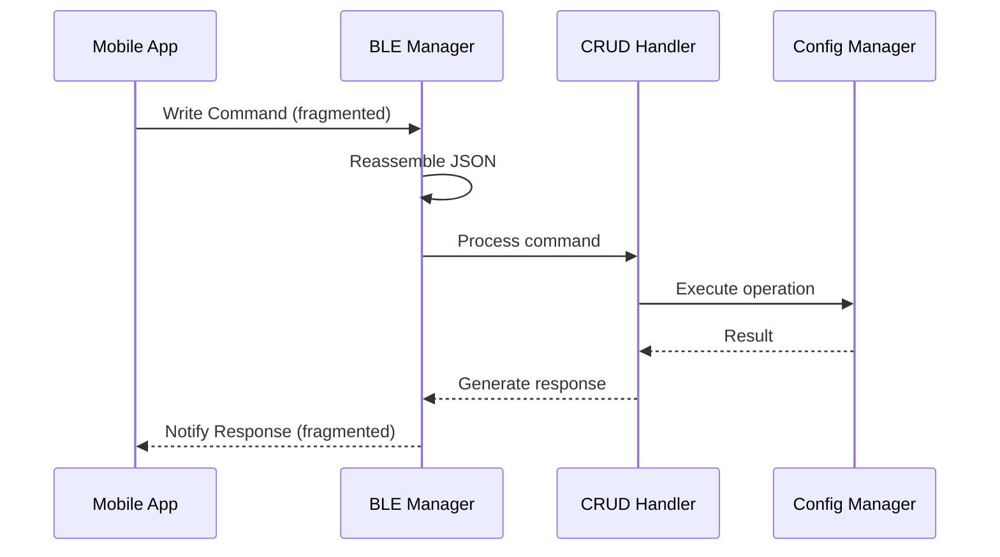
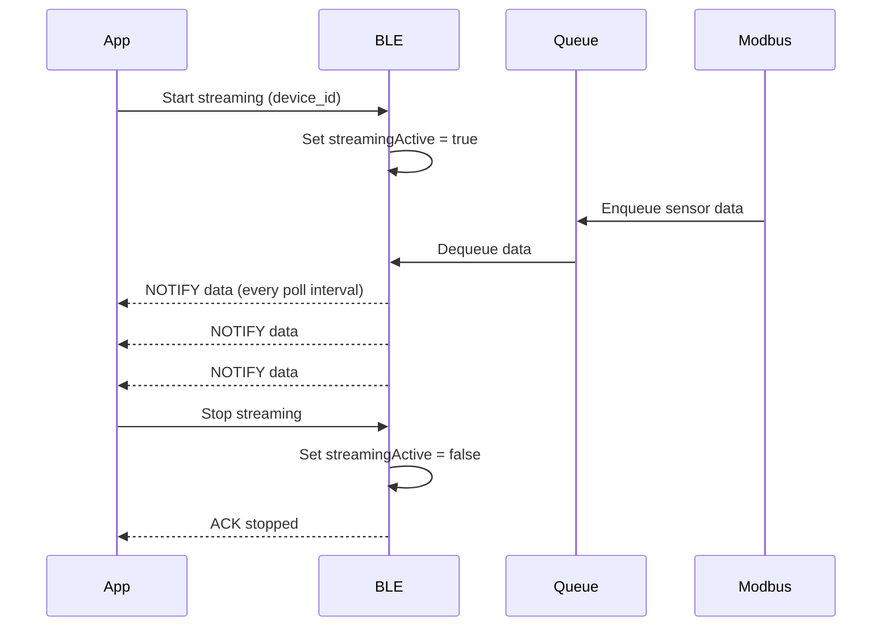

# API Reference

**SRT-MGATE-1210 Modbus IIoT Gateway**
BLE CRUD API Documentation

[Home](../../README.md) > [Documentation](../README.md) > API Reference

**Version:** 2.5.34 (December 10, 2025)
**Developer:** Kemal
**Last Updated:** December 10, 2025

> **What's New in v2.5.34:**
> - ✅ **Memory Safety Fix** - Fixed critical PSRAM allocator mismatch bugs
> - ✅ **Network Failover Task** - Automatic reconnection and failover (v2.5.33)
> - ✅ **Centralized Product Config** - All identity settings in `ProductConfig.h` (v2.5.32)
> - ✅ **BLE Name Format** - `MGate-1210(P)-XXXX` (POE) or `MGate-1210-XXXX` (Non-POE)
> - See [BLE_GATEWAY_IDENTITY.md](BLE_GATEWAY_IDENTITY.md) for full documentation
>
> **Previous Highlights:**
> - v2.5.31: Multi-gateway support, unique BLE names from MAC address
> - v2.5.30: OTA buffer optimization (32KB for faster downloads)
> - v2.5.11: Private GitHub repo OTA support
> - v2.5.10: OTA signature bug fix
> - v2.3.x: BLE fixes, ModbusTCP optimization, Backup/Restore, Factory Reset
>
> See [VERSION_HISTORY.md](../Changelog/VERSION_HISTORY.md) for complete changelog.

---

## Table of Contents

- [Overview](#overview)
- [Command Structure](#command-structure)
- [Device Operations](#device-operations)
- [Register Operations](#register-operations)
- [Configuration Operations](#configuration-operations)
- [Data Streaming](#data-streaming)
- [Batch Operations](#batch-operations)
- [System Operations](#system-operations)
- [Response Format](#response-format)
- [Error Codes](#error-codes)
- [Code Examples](#code-examples)

---

## 🔍 Overview

The SRT-MGATE-1210 gateway provides a **JSON-based CRUD API** over **BLE** for configuration and real-time data access.

### Key Features

- ✅ **CRUD Operations**: Create, Read, Update, Delete for devices and registers
- ✅ **Batch Operations**: Execute multiple commands in a single transaction
- ✅ **Priority Queue**: High/Normal/Low priority command execution
- ✅ **Real-time Streaming**: Live sensor data over BLE notifications
- ✅ **Fragmentation**: Automatic handling of large JSON payloads (up to 200KB)
- ✅ **Atomic Transactions**: All-or-nothing batch execution
- ✅ **Backup & Restore**: Complete configuration backup/restore system
- ✅ **Factory Reset**: One-command device reset with server config
- ✅ **Device Control**: Enable/disable devices with health metrics

### Communication Flow



### 📚 Specialized API Documentation

For detailed documentation on advanced BLE features, see:

| Feature | Documentation | Description |
|---------|---------------|-------------|
| **Gateway Identity** | [BLE_GATEWAY_IDENTITY.md](BLE_GATEWAY_IDENTITY.md) | Multi-gateway support, unique BLE names, mobile app integration |
| **Backup & Restore** | [BLE_BACKUP_RESTORE.md](BLE_BACKUP_RESTORE.md) | Complete configuration backup/restore system via BLE |
| **Factory Reset** | [BLE_FACTORY_RESET.md](BLE_FACTORY_RESET.md) | One-command device reset to factory defaults |
| **Device Control** | [BLE_DEVICE_CONTROL.md](BLE_DEVICE_CONTROL.md) | Enable/disable devices with health metrics tracking |
| **OTA Update** | [BLE_OTA_API.md](BLE_OTA_API.md) | Over-the-air firmware update via BLE |
| **Production Mode** | [BLE_PRODUCTION_MODE.md](BLE_PRODUCTION_MODE.md) | Switch between development and production mode |

> **💡 New in v2.5.32:** BLE Name Format Changed to `MGate-1210(P)-XXXX` (POE variant) or `MGate-1210-XXXX` (Non-POE variant). Each gateway has a unique 4-character UID from MAC address. See [BLE_GATEWAY_IDENTITY.md](BLE_GATEWAY_IDENTITY.md) for mobile app integration guide.

---

## 📝 Command Structure

All commands follow a consistent JSON structure:

```json
{
  "op": "create|read|update|delete|control|system|batch",
  "type": "device|register|server|logging|data|status|metrics",
  "device_id": "string (optional)",
  "register_id": "string (optional)",
  "config": { },
  "priority": "high|normal|low (optional)"
}
```

**Note:** For advanced `control` and `system` operations, see [Specialized API Documentation](#-specialized-api-documentation).

### Common Fields

| Field         | Type   | Required      | Description                            |
| ------------- | ------ | ------------- | -------------------------------------- |
| `op`          | string | ✅ Yes         | Operation type                         |
| `type`        | string | ✅ Yes         | Resource type                          |
| `device_id`   | string | ⚠️ Conditional | Required for device-specific ops       |
| `register_id` | string | ⚠️ Conditional | Required for register ops              |
| `config`      | object | ⚠️ Conditional | Configuration data (for create/update) |
| `priority`    | string | ❌ No          | Command priority (default: normal)     |

### Priority Levels

Commands can be prioritized for execution order:

| Priority   | Use Case                          | Queue Behavior  |
| ---------- | --------------------------------- | --------------- |
| **high**   | Critical system commands          | Processed first |
| **normal** | Standard configuration changes    | Default order   |
| **low**    | Bulk operations, background tasks | Processed last  |

---

## 🔧 Device Operations

### Create Device

Create a new Modbus device configuration.

**Request:**
```json
{
  "op": "create",
  "type": "device",
  "config": {
    "device_name": "Temperature Sensor",
    "protocol": "RTU",
    "slave_id": 1,
    "timeout": 3000,
    "retry_count": 3,
    "refresh_rate_ms": 1000,
    "serial_port": 1,
    "baud_rate": 9600,
    "data_bits": 8,
    "stop_bits": 1,
    "parity": "None"
  }
}
```

**Config Fields (RTU):**

| Field             | Type    | Required | Default | Description                  |
| ----------------- | ------- | -------- | ------- | ---------------------------- |
| `device_name`     | string  | ✅ Yes    | -       | Device identifier            |
| `protocol`        | string  | ✅ Yes    | -       | `"RTU"` or `"TCP"`           |
| `slave_id`        | integer | ✅ Yes    | -       | Modbus slave address (1-247) |
| `timeout`         | integer | ❌ No     | 3000    | Response timeout (ms)        |
| `retry_count`     | integer | ❌ No     | 3       | Max retry attempts           |
| `refresh_rate_ms` | integer | ❌ No     | 1000    | Polling interval (ms)        |
| `serial_port`     | integer | ✅ Yes    | -       | `1` or `2` (for RTU)         |
| `baud_rate`       | integer | ❌ No     | 9600    | Baudrate (1200-115200)       |
| `data_bits`       | integer | ❌ No     | 8       | Data bits (7 or 8)           |
| `stop_bits`       | integer | ❌ No     | 1       | Stop bits (1 or 2)           |
| `parity`          | string  | ❌ No     | "None"  | `"None"`, `"Even"`, `"Odd"`  |

**Config Fields (TCP):**

| Field             | Type    | Required | Default | Description                      |
| ----------------- | ------- | -------- | ------- | -------------------------------- |
| `device_name`     | string  | ✅ Yes    | -       | Device identifier                |
| `protocol`        | string  | ✅ Yes    | -       | `"TCP"`                          |
| `slave_id`        | integer | ✅ Yes    | -       | Modbus unit ID (1-247)           |
| `ip_address`      | string  | ✅ Yes    | -       | Device IP (e.g., "192.168.1.10") |
| `port`            | integer | ❌ No     | 502     | Modbus TCP port                  |
| `timeout`         | integer | ❌ No     | 3000    | Response timeout (ms)            |
| `retry_count`     | integer | ❌ No     | 3       | Max retry attempts               |
| `refresh_rate_ms` | integer | ❌ No     | 1000    | Polling interval (ms)            |

**Response (v2.1.1+):**
```json
{
  "status": "ok",
  "device_id": "D7A3F2",
  "data": {
    "device_id": "D7A3F2",
    "device_name": "Temperature Sensor",
    "protocol": "RTU",
    "slave_id": 1,
    "timeout": 3000,
    "retry_count": 3,
    "refresh_rate_ms": 1000,
    "serial_port": 1,
    "baud_rate": 9600,
    "data_bits": 8,
    "stop_bits": 1,
    "parity": "None",
    "registers": []
  }
}
```

**Benefits:**
- ✅ No need for additional `read device` API call
- ✅ Immediate UI update with created device data
- ✅ Validate that device was created with correct config

**Error Response:**
```json
{
  "status": "error",
  "code": "ERR_CONFIG_SAVE_FAILED",
  "message": "Device creation failed"
}
```

---

### Read Device

Retrieve a device configuration.

**Request:**
```json
{
  "op": "read",
  "type": "device",
  "device_id": "D7A3F2"
}
```

**Response:**
```json
{
  "status": "ok",
  "data": {
    "device_id": "D7A3F2",
    "device_name": "Temperature Sensor",
    "protocol": "RTU",
    "slave_id": 1,
    "timeout": 3000,
    "retry_count": 3,
    "refresh_rate_ms": 1000,
    "serial_port": 1,
    "baud_rate": 9600,
    "data_bits": 8,
    "stop_bits": 1,
    "parity": "None"
  }
}
```

---

### List All Devices

Get a list of all configured devices with full details.

**Request:**
```json
{
  "op": "read",
  "type": "devices"
}
```

**Response:**
```json
{
  "status": "ok",
  "devices": [
    {
      "device_id": "D7A3F2",
      "device_name": "Temperature Sensor",
      "protocol": "RTU",
      "slave_id": 1,
      "serial_port": 1,
      "baud_rate": 9600
    },
    {
      "device_id": "D8B4C1",
      "device_name": "Pressure Transmitter",
      "protocol": "TCP",
      "slave_id": 2,
      "ip_address": "192.168.1.10",
      "port": 502
    }
  ]
}
```

---

### List Devices Summary

Get a compact summary of all devices (minimal fields).

**Request:**
```json
{
  "op": "read",
  "type": "devices_summary"
}
```

**Response:**
```json
{
  "status": "ok",
  "devices_summary": [
    {
      "device_id": "D7A3F2",
      "device_name": "Temperature Sensor",
      "protocol": "RTU",
      "slave_id": 1,
      "register_count": 5
    },
    {
      "device_id": "D8B4C1",
      "device_name": "Pressure Transmitter",
      "protocol": "TCP",
      "slave_id": 2,
      "register_count": 12
    }
  ]
}
```

---

### List All Devices With Registers

**⭐ NEW API:** Get all devices with their complete register configurations in a single call.

**Use Case:** Perfect for hierarchical UI (Device → Registers selection) in MQTT Customize Mode.

**Request (Full Details):**
```json
{
  "op": "read",
  "type": "devices_with_registers"
}
```

**Request (Minimal - Optimized for large datasets):**
```json
    {
      "op": "read",
      "type": "devices_with_registers",
      "minimal": true
    }
```

**Parameters:**

| Field     | Type    | Required | Default | Description                                                                        |
| --------- | ------- | -------- | ------- | ---------------------------------------------------------------------------------- |
| `minimal` | boolean | No       | `false` | If `true`, returns only `register_id` and `register_name` (⚡ ~70% smaller payload) |
| `page`    | integer | No       | -       | Page number (0-indexed). If provided, enables pagination (v2.5.12+)                |
| `limit`   | integer | No       | `10`    | Items per page (default 10 when `page` is specified) (v2.5.12+)                    |

#### 📄 Pagination Support (v2.5.12+)

For large device configurations (e.g., 70 devices × 70 registers), use pagination to reduce payload size and improve BLE reliability.

**Request (Paginated):**
```json
{
  "op": "read",
  "type": "devices_with_registers",
  "page": 0,
  "limit": 5,
  "minimal": true
}
```

**Response (Paginated):**
```json
{
  "status": "ok",
  "total_count": 70,
  "page": 0,
  "limit": 5,
  "total_pages": 14,
  "devices": [
    {"device_id": "device_1", "device_name": "Device 1", "registers": [...]},
    {"device_id": "device_2", "device_name": "Device 2", "registers": [...]},
    {"device_id": "device_3", "device_name": "Device 3", "registers": [...]},
    {"device_id": "device_4", "device_name": "Device 4", "registers": [...]},
    {"device_id": "device_5", "device_name": "Device 5", "registers": [...]}
  ]
}
```

**Pagination Response Fields:**

| Field         | Type    | Description                                |
| ------------- | ------- | ------------------------------------------ |
| `total_count` | integer | Total devices in database                  |
| `page`        | integer | Current page number (echo of request)      |
| `limit`       | integer | Items per page (echo of request)           |
| `total_pages` | integer | Total number of pages                      |
| `devices`     | array   | Array of devices for current page ONLY     |

**Pagination Example (70 devices, 5 per page = 14 pages):**
```
Page 0:  {"page": 0, "limit": 5}  → devices 0-4
Page 1:  {"page": 1, "limit": 5}  → devices 5-9
Page 2:  {"page": 2, "limit": 5}  → devices 10-14
...
Page 13: {"page": 13, "limit": 5} → devices 65-69
Page 14: {"page": 14, "limit": 5} → devices [] (empty, beyond data)
```

**Edge Cases:**

| Case | Request | Response |
|------|---------|----------|
| Page beyond data | `{"page": 100, "limit": 5}` | `{"devices": [], "total_count": 70, ...}` (empty array, not error) |
| Last page partial | `{"page": 13, "limit": 5}` with 70 devices | Returns 5 devices (65-69) |
| No pagination | `{"type": "devices_with_registers"}` | Returns ALL devices, no pagination fields |

**Backward Compatibility:**
- Request WITHOUT `page`/`limit` → Returns ALL devices (no pagination fields)
- Request WITH `page`/`limit` → Returns paginated response with metadata

**Response (Full Details - `minimal=false`):**
```json
{
  "status": "ok",
  "devices": [
    {
      "device_id": "DEVICE_001",
      "device_name": "Temperature & Humidity Sensor",
      "protocol": "TCP",
      "ip_address": "192.168.1.100",
      "port": 502,
      "slave_id": 1,
      "refresh_rate_ms": 1000,
      "registers": [
        {
          "register_id": "temp_room_1",
          "register_name": "Temperature Room 1",
          "address": 4001,
          "data_type": "FLOAT32_BE",
          "function_code": "holding",
          "unit": "°C",
          "description": "Suhu ruangan 1",
          "scale": 1.0,
          "offset": 0.0,
          "register_index": 1
        },
        {
          "register_id": "humidity_room_1",
          "register_name": "Humidity Room 1",
          "address": 4003,
          "data_type": "UINT16",
          "function_code": "holding",
          "unit": "%",
          "description": "Kelembaban ruangan 1",
          "scale": 1.0,
          "offset": 0.0,
          "register_index": 2
        }
      ]
    },
    {
      "device_id": "DEVICE_003",
      "device_name": "Power Meter (3-Phase)",
      "protocol": "TCP",
      "ip_address": "192.168.1.102",
      "port": 502,
      "slave_id": 3,
      "refresh_rate_ms": 1000,
      "registers": [
        {
          "register_id": "voltage_l1",
          "register_name": "Voltage L1",
          "address": 4112,
          "data_type": "FLOAT32_BE",
          "function_code": "holding",
          "unit": "V",
          "description": "Tegangan fase L1",
          "scale": 1.0,
          "offset": 0.0,
          "register_index": 1
        },
        {
          "register_id": "current_l1",
          "register_name": "Current L1",
          "address": 4114,
          "data_type": "FLOAT32_BE",
          "function_code": "holding",
          "unit": "A",
          "description": "Arus fase L1",
          "scale": 1.0,
          "offset": 0.0,
          "register_index": 2
        }
      ]
    }
  ]
}
```

**Response (Minimal - `minimal=true`):**
```json
{
  "status": "ok",
  "devices": [
    {
      "device_id": "DEVICE_001",
      "device_name": "Temperature & Humidity Sensor",
      "registers": [
        {
          "register_id": "temp_room_1",
          "register_name": "Temperature Room 1"
        },
        {
          "register_id": "humidity_room_1",
          "register_name": "Humidity Room 1"
        }
      ]
    },
    {
      "device_id": "DEVICE_003",
      "device_name": "Power Meter (3-Phase)",
      "registers": [
        {
          "register_id": "voltage_l1",
          "register_name": "Voltage L1"
        },
        {
          "register_id": "current_l1",
          "register_name": "Current L1"
        }
      ]
    }
  ]
}
```

**Performance Comparison (100 Registers):**

| Mode             | Payload Size | Fields per Register | BLE Packets (~512 bytes) | Transmission Time |
| ---------------- | ------------ | ------------------- | ------------------------ | ----------------- |
| **Full Details** | ~21KB        | 10 fields           | ~41 packets              | ~4 seconds ⚠️      |
| **Minimal**      | ~6KB ✅       | 2 fields            | ~12 packets              | ~1.2 seconds ✅    |

**Savings:** ~71% smaller payload, 3.3x faster transmission!

**Benefits:**
- ✅ **Single API call** instead of N+1 queries (1 for devices + N for each device's registers)
- ✅ **Performance:** Reduces BLE transmission overhead significantly
- ✅ **Perfect for UI:** Directly usable for hierarchical Device → Registers selection widget
- ✅ **MQTT Customize Mode:** Get all data needed for register selection in one shot

**Typical Usage:**
```javascript
// Mobile App - MQTT Customize Mode Setup
async function loadDevicesForMqttConfig() {
  // Use minimal=true for better performance with large datasets
  const response = await ble.sendCommand({
    op: "read",
    type: "devices_with_registers",
    minimal: true  // ⚡ 71% smaller payload for 100 registers
  });

  // Response contains everything needed for UI
  const devices = response.devices;

  // Render hierarchical selection
  devices.forEach(device => {
    renderDeviceCard(device.device_id, device.device_name);
    device.registers.forEach(reg => {
      // Only register_id and register_name available in minimal mode
      renderRegisterCheckbox(reg.register_id, reg.register_name);
    });
  });
}
```

**Recommendation:**
- ✅ Use `minimal=true` for **MQTT Customize Mode** (only needs `register_id` and `register_name`)
- ✅ Use `minimal=false` for **detailed register view** (needs all fields like address, data_type, unit, etc.)

---

### Update Device

Modify an existing device configuration.

**Request:**
```json
{
  "op": "update",
  "type": "device",
  "device_id": "D7A3F2",
  "config": {
    "device_name": "Temp Sensor 01",
    "baud_rate": 19200,
    "refresh_rate_ms": 500
  }
}
```

**Notes:**
- Only include fields you want to change
- Dynamic baudrate switching supported (1200-115200)
- Works for both RTU and TCP devices

**Response (v2.1.1+):**
```json
{
  "status": "ok",
  "device_id": "D7A3F2",
  "message": "Device updated",
  "data": {
    "device_id": "D7A3F2",
    "device_name": "Temp Sensor 01",
    "protocol": "RTU",
    "slave_id": 1,
    "timeout": 3000,
    "retry_count": 3,
    "refresh_rate_ms": 500,
    "serial_port": 1,
    "baud_rate": 19200,
    "data_bits": 8,
    "stop_bits": 1,
    "parity": "None",
    "registers": [...]
  }
}
```

**Benefits:**
- ✅ Returns full updated device state
- ✅ Verify configuration changes applied correctly
- ✅ No need for additional `read device` call

---

### Delete Device

Remove a device and all its registers.

**Request:**
```json
{
  "op": "delete",
  "type": "device",
  "device_id": "D7A3F2"
}
```

**Response (v2.1.1+):**
```json
{
  "status": "ok",
  "device_id": "D7A3F2",
  "message": "Device deleted",
  "deleted_data": {
    "device_id": "D7A3F2",
    "device_name": "Temperature Sensor",
    "protocol": "RTU",
    "slave_id": 1,
    "timeout": 3000,
    "retry_count": 3,
    "refresh_rate_ms": 1000,
    "serial_port": 1,
    "baud_rate": 9600,
    "registers": [...]
  }
}
```

**Benefits:**
- ✅ Returns device data before deletion
- ✅ Useful for confirmation dialogs
- ✅ Enables undo functionality
- ✅ Audit logging of deleted resources

**Warning:** This operation also deletes all registers associated with the device.

---

## 📊 Register Operations

### Create Register

Add a new register to an existing device.

**Request:**
```json
{
  "op": "create",
  "type": "register",
  "device_id": "D7A3F2",
  "config": {
    "register_name": "temperature",
    "address": 0,
    "function_code": "holding",
    "data_type": "FLOAT32_BE",
    "scale": 1.0,
    "offset": 0.0,
    "unit": "°C",
    "refresh_rate_ms": 1000
  }
}
```

**Config Fields:**

| Field             | Type    | Required | Default  | Description                                    |
| ----------------- | ------- | -------- | -------- | ---------------------------------------------- |
| `register_name`   | string  | ✅ Yes    | -        | Register identifier                            |
| `address`         | integer | ✅ Yes    | -        | Modbus address (0-65535)                       |
| `function_code`   | string  | ✅ Yes    | -        | `"holding"`, `"input"`, `"coil"`, `"discrete"` |
| `data_type`       | string  | ✅ Yes    | -        | See [Data Types](#supported-data-types)        |
| `scale`           | float   | ❌ No     | 1.0      | Multiplier for raw value                       |
| `offset`          | float   | ❌ No     | 0.0      | Offset added after scaling                     |
| `unit`            | string  | ❌ No     | ""       | Measurement unit                               |
| `refresh_rate_ms` | integer | ❌ No     | (device) | Override device refresh rate                   |

**Supported Data Types:**

<details>
<summary>16-bit Types (Single Register)</summary>

- `INT16` - Signed 16-bit integer
- `UINT16` - Unsigned 16-bit integer
- `BOOL` - Boolean (0 or 1)
</details>

<details>
<summary>32-bit Types (2 Registers)</summary>

**Integers:**
- `INT32_BE` - Big-endian signed (ABCD)
- `INT32_LE` - Little-endian signed (DCBA)
- `INT32_BE_BS` - Big-endian with byte swap (BADC)
- `INT32_LE_BS` - Little-endian with word swap (CDAB)
- `UINT32_BE` - Big-endian unsigned (ABCD)
- `UINT32_LE` - Little-endian unsigned (DCBA)
- `UINT32_BE_BS` - Big-endian with byte swap (BADC)
- `UINT32_LE_BS` - Little-endian with word swap (CDAB)

**Floats:**
- `FLOAT32_BE` - Big-endian IEEE 754 (ABCD)
- `FLOAT32_LE` - Little-endian IEEE 754 (DCBA)
- `FLOAT32_BE_BS` - Big-endian with byte swap (BADC)
- `FLOAT32_LE_BS` - Little-endian with word swap (CDAB)
</details>

<details>
<summary>64-bit Types (4 Registers)</summary>

**Integers:**
- `INT64_BE` - Big-endian signed (ABCDEFGH)
- `INT64_LE` - Little-endian signed (HGFEDCBA)
- `INT64_BE_BS` - Big-endian with byte swap (BADCFEHG)
- `INT64_LE_BS` - Little-endian with word swap (CDABGHEF)
- `UINT64_BE` - Big-endian unsigned (ABCDEFGH)
- `UINT64_LE` - Little-endian unsigned (HGFEDCBA)
- `UINT64_BE_BS` - Big-endian with byte swap (BADCFEHG)
- `UINT64_LE_BS` - Little-endian with word swap (CDABGHEF)

**Doubles:**
- `DOUBLE64_BE` - Big-endian IEEE 754 (ABCDEFGH)
- `DOUBLE64_LE` - Little-endian IEEE 754 (HGFEDCBA)
- `DOUBLE64_BE_BS` - Big-endian with byte swap (BADCFEHG)
- `DOUBLE64_LE_BS` - Little-endian with word swap (CDABGHEF)
</details>

**Response (v2.1.1+):**
```json
{
  "status": "ok",
  "device_id": "D7A3F2",
  "register_id": "R3C8D1",
  "data": {
    "register_id": "R3C8D1",
    "register_name": "temperature",
    "address": 0,
    "function_code": "holding",
    "data_type": "FLOAT32_BE",
    "scale": 1.0,
    "offset": 0.0,
    "unit": "°C",
    "refresh_rate_ms": 1000,
    "register_index": 0
  }
}
```

**Benefits:**
- ✅ Returns full created register configuration
- ✅ No need for additional `read register` call
- ✅ Immediate UI update

---

### Read Register

Retrieve a register configuration.

**Request:**
```json
{
  "op": "read",
  "type": "register",
  "device_id": "D7A3F2",
  "register_id": "R3C8D1"
}
```

**Response:**
```json
{
  "status": "ok",
  "data": {
    "register_id": "R3C8D1",
    "register_name": "temperature",
    "address": 0,
    "function_code": "holding",
    "data_type": "FLOAT32_BE",
    "scale": 1.0,
    "offset": 0.0,
    "unit": "°C",
    "refresh_rate_ms": 1000
  }
}
```

---

### List Registers

Get all registers for a device.

**Request:**
```json
{
  "op": "read",
  "type": "registers",
  "device_id": "D7A3F2"
}
```

**Response:**
```json
{
  "status": "ok",
  "registers": [
    {
      "register_id": "R3C8D1",
      "register_name": "temperature",
      "address": 0,
      "data_type": "FLOAT32_BE",
      "unit": "°C"
    },
    {
      "register_id": "R4D9E2",
      "register_name": "humidity",
      "address": 2,
      "data_type": "UINT16",
      "unit": "%"
    }
  ]
}
```

---

### List Registers Summary

Get a compact summary of device registers.

**Request:**
```json
{
  "op": "read",
  "type": "registers_summary",
  "device_id": "D7A3F2"
}
```

**Response:**
```json
{
  "status": "ok",
  "registers_summary": [
    {
      "register_id": "R3C8D1",
      "register_name": "temperature"
    },
    {
      "register_id": "R4D9E2",
      "register_name": "humidity"
    }
  ]
}
```

---

### Update Register

Modify an existing register configuration.

**Request:**
```json
{
  "op": "update",
  "type": "register",
  "device_id": "D7A3F2",
  "register_id": "R3C8D1",
  "config": {
    "scale": 0.1,
    "offset": -40.0,
    "refresh_rate_ms": 500
  }
}
```

**Response (v2.1.1+):**
```json
{
  "status": "ok",
  "device_id": "D7A3F2",
  "register_id": "R3C8D1",
  "message": "Register updated",
  "data": {
    "register_id": "R3C8D1",
    "register_name": "temperature",
    "address": 0,
    "function_code": "holding",
    "data_type": "FLOAT32_BE",
    "scale": 0.1,
    "offset": -40.0,
    "unit": "°C",
    "refresh_rate_ms": 500,
    "register_index": 0
  }
}
```

**Benefits:**
- ✅ Returns full updated register state
- ✅ Verify calibration changes applied
- ✅ No additional API call needed

---

### Delete Register

Remove a register from a device.

**Request:**
```json
{
  "op": "delete",
  "type": "register",
  "device_id": "D7A3F2",
  "register_id": "R3C8D1"
}
```

**Response (v2.1.1+):**
```json
{
  "status": "ok",
  "device_id": "D7A3F2",
  "register_id": "R3C8D1",
  "message": "Register deleted",
  "deleted_data": {
    "register_id": "R3C8D1",
    "register_name": "temperature",
    "address": 0,
    "function_code": "holding",
    "data_type": "FLOAT32_BE",
    "scale": 1.0,
    "offset": 0.0,
    "unit": "°C",
    "refresh_rate_ms": 1000,
    "register_index": 0
  }
}
```

**Benefits:**
- ✅ Returns register data before deletion
- ✅ Useful for undo functionality
- ✅ Audit trail of deleted configuration

---

## ⚙️ Configuration Operations

### Read Server Configuration

Get the current server and network configuration.

**Request:**
```json
{
  "op": "read",
  "type": "server_config"
}
```

**Response:**
```json
{
  "status": "ok",
  "config": {
    "mqtt_config": {
      "enabled": true,
      "broker_address": "demo.thingsboard.io",
      "broker_port": 1883,
      "client_id": "esp32_device",
      "username": "device_token",
      "password": "device_password",
      "keep_alive": 60,
      "clean_session": true,
      "use_tls": false,
      "publish_mode": "default",
      "default_mode": {
        "enabled": true,
        "topic_publish": "v1/devices/me/telemetry",
        "topic_subscribe": "device/control",
        "interval": 5,
        "interval_unit": "s"
      },
      "customize_mode": {
        "enabled": false,
        "custom_topics": []
      }
    },
    "http_config": {
      "enabled": false,
      "endpoint_url": "https://api.example.com/data",
      "method": "POST",
      "body_format": "json",
      "timeout": 5000,
      "retry": 3,
      "interval": 5,
      "interval_unit": "s"
    },
    "communication": {
      "mode": "ETH"
    },
    "wifi": {
      "enabled": true,
      "ssid": "MyNetwork",
      "password": "********"
    },
    "ethernet": {
      "enabled": true,
      "use_dhcp": true,
      "static_ip": "192.168.1.100",
      "gateway": "192.168.1.1",
      "subnet": "255.255.255.0"
    }
  }
}
```

---

### Update Server Configuration

Modify server and network settings, including MQTT publish modes.

#### Example 1: Update MQTT Default Mode

**Request:**
```json
{
  "op": "update",
  "type": "server_config",
  "config": {
    "mqtt_config": {
      "enabled": true,
      "broker_address": "mqtt.example.com",
      "broker_port": 1883,
      "publish_mode": "default",
      "default_mode": {
        "enabled": true,
        "topic_publish": "devices/gateway_001/telemetry",
        "interval": 10,
        "interval_unit": "s"
      }
    }
  }
}
```

#### Example 2: Update MQTT Customize Mode

**Request:**
```json
{
  "op": "update",
  "type": "server_config",
  "config": {
    "mqtt_config": {
      "enabled": true,
      "broker_address": "mqtt.example.com",
      "broker_port": 1883,
      "publish_mode": "customize",
      "customize_mode": {
        "enabled": true,
        "custom_topics": [
          {
            "topic": "sensor/temperature",
            "registers": ["temp_room_1", "temp_room_2", "humidity_room_1"],
            "interval": 5,
            "interval_unit": "s"
          },
          {
            "topic": "power/meter",
            "registers": ["voltage_l1", "current_l1", "power_total"],
            "interval": 10,
            "interval_unit": "s"
          }
        ]
      }
    }
  }
}
```

#### Example 3: Update HTTP Configuration (v2.2.0+)

**Request:**
```json
{
  "op": "update",
  "type": "server_config",
  "config": {
    "protocol": "http",
    "http_config": {
      "enabled": true,
      "endpoint_url": "https://api.example.com/iot/data",
      "method": "POST",
      "body_format": "json",
      "timeout": 5000,
      "retry": 3,
      "interval": 10,
      "interval_unit": "s",
      "headers": {
        "Authorization": "Bearer your_token_here",
        "Content-Type": "application/json"
      }
    }
  }
}
```

**What's New in v2.2.0:**
- ✅ `http_config.interval` - HTTP transmission interval (moved from root-level `data_interval`)
- ✅ `http_config.interval_unit` - Interval unit: `"ms"`, `"s"`, or `"m"`
- ❌ ~~`data_interval`~~ - **REMOVED** (breaking change from v2.1.1)

**Migration from v2.1.1:**
```json
// OLD (v2.1.1 - no longer supported):
{
  "config": {
    "data_interval": {"value": 10, "unit": "s"},  // ❌ Removed
    "http_config": {"enabled": true, "endpoint_url": "..."}
  }
}

// NEW (v2.2.0+):
{
  "config": {
    "http_config": {
      "enabled": true,
      "endpoint_url": "...",
      "interval": 10,           // ✅ Moved here
      "interval_unit": "s"      // ✅ Moved here
    }
  }
}
```

---

**Key Fields:**

| Field           | Type   | Description                                      |
| --------------- | ------ | ------------------------------------------------ |
| `mqtt_config.*` | object | MQTT configuration (see MQTT_PUBLISH_MODES.md)   |
| `http_config.*` | object | HTTP-specific settings (v2.2.0: includes interval) |
| `communication.*` | object | Communication mode (WiFi/Ethernet)             |
| `wifi.*`        | object | WiFi settings                                    |
| `ethernet.*`    | object | Ethernet settings                                |
| `protocol`      | string | `"mqtt"` or `"http"`                             |
| `publish_mode`  | string | `"default"` or `"customize"` (MQTT only)         |
| `registers`     | array  | Array of register_id (String) for customize mode |
| `interval`      | int    | Publish/transmission interval value              |
| `interval_unit` | string | `"ms"`, `"s"`, or `"m"`                          |

**Response:**
```json
{
  "status": "ok",
  "message": "Server configuration updated. Device will restart in 5s."
}
```

**Notes:**
- ⚠️  **Device ALWAYS restarts** 5 seconds after server_config update
- **IMPORTANT:** `registers` field uses `register_id` (String), not `register_index` (int)
- **v2.2.0 Breaking Change:** `data_interval` removed from root level, HTTP now uses `http_config.interval`
- MQTT intervals are mode-specific (`default_mode.interval` or `customize_mode.custom_topics[].interval`)
- See [MQTT_PUBLISH_MODES_DOCUMENTATION.md](MQTT_PUBLISH_MODES_DOCUMENTATION.md) for detailed MQTT configuration

---

### Read Logging Configuration

Get the current logging settings.

**Request:**
```json
{
  "op": "read",
  "type": "logging_config"
}
```

**Response:**
```json
{
  "status": "ok",
  "config": {
    "log_level": "INFO",
    "enable_ble_logs": true,
    "enable_modbus_logs": true,
    "enable_network_logs": true,
    "enable_system_logs": true
  }
}
```

---

### Update Logging Configuration

Modify logging settings.

**Request:**
```json
{
  "op": "update",
  "type": "logging_config",
  "config": {
    "log_level": "DEBUG",
    "enable_modbus_logs": false
  }
}
```

**Log Levels:**
- `ERROR` - Errors only
- `WARN` - Warnings and errors
- `INFO` - Informational messages (default)
- `DEBUG` - Detailed debug logs
- `TRACE` - All logs including verbose output

**Response:**
```json
{
  "status": "ok",
  "message": "Logging configuration updated"
}
```

---

## 📡 Data Streaming

### Start Streaming

Begin real-time data streaming for a specific device.

**Request:**
```json
{
  "op": "read",
  "type": "data",
  "device_id": "D7A3F2"
}
```

**Response (initial):**
```json
{
  "status": "ok",
  "message": "Data streaming started for device: D7A3F2"
}
```

**Data Notifications (continuous):**
```json
{
  "status": "data",
  "data": {
    "device_id": "D7A3F2",
    "timestamp": 1704067200,
    "registers": {
      "temperature": 25.6,
      "humidity": 60.2,
      "pressure": 1013.25
    }
  }
}
```

**Flow:**


---

### Stop Streaming

Stop data streaming.

**Request:**
```json
{
  "op": "read",
  "type": "data",
  "device_id": "stop"
}
```

**Response:**
```json
{
  "status": "ok",
  "message": "Data streaming stopped"
}
```

**Race Condition Prevention:**
1. Set `streamingActive` flag to false
2. Clear stream queue
3. Wait for in-flight transmissions to complete (max 10s)
4. Send stop acknowledgment

---

## 📦 Batch Operations

Execute multiple commands in a single transaction.

### Sequential Batch

Commands executed in order, continues on failure.

**Request:**
```json
{
  "op": "batch",
  "mode": "sequential",
  "commands": [
    {
      "op": "create",
      "type": "device",
      "config": {
        "device_name": "Device 1",
        "protocol": "RTU",
        "slave_id": 1,
        "serial_port": 1
      }
    },
    {
      "op": "create",
      "type": "register",
      "device_id": "D7A3F2",
      "config": {
        "register_name": "temperature",
        "address": 0,
        "function_code": "holding",
        "data_type": "FLOAT32_BE"
      }
    }
  ]
}
```

**Response:**
```json
{
  "status": "ok",
  "message": "Batch operation completed",
  "completed": 2,
  "failed": 0,
  "total": 2
}
```

---

### Atomic Batch

All-or-nothing transaction. If any command fails, all changes are rolled back.

**Request:**
```json
{
  "op": "batch",
  "mode": "atomic",
  "commands": [
    {
      "op": "update",
      "type": "device",
      "device_id": "D7A3F2",
      "config": {
        "refresh_rate_ms": 500
      }
    },
    {
      "op": "update",
      "type": "register",
      "device_id": "D7A3F2",
      "register_id": "R3C8D1",
      "config": {
        "refresh_rate_ms": 500
      }
    }
  ]
}
```

**Response (success):**
```json
{
  "status": "ok",
  "message": "Atomic batch operation completed",
  "completed": 2,
  "total": 2
}
```

**Response (failure):**
```json
{
  "status": "error",
  "message": "ATOMIC batch failed: Command 1 failed",
  "completed": 0,
  "failed": 1,
  "total": 2
}
```

**Key Differences:**

| Mode           | Rollback | Continue on Failure | Use Case                                |
| -------------- | -------- | ------------------- | --------------------------------------- |
| **sequential** | ❌ No     | ✅ Yes               | Bulk operations, partial success OK     |
| **atomic**     | ✅ Yes    | ❌ No                | Critical config changes, all-or-nothing |

---

## 🔍 System Operations

### Basic System Operations

#### Get System Status

Retrieve system health and metrics.

**Request:**
```json
{
  "op": "read",
  "type": "status"
}
```

**Response:**
```json
{
  "status": "ok",
  "system": {
    "uptime": 3600,
    "free_heap": 102400,
    "free_psram": 6291456,
    "cpu_freq": 240,
    "chip_model": "ESP32-S3",
    "flash_size": 16777216,
    "psram_size": 8388608
  },
  "network": {
    "wifi_connected": true,
    "wifi_rssi": -65,
    "ip_address": "192.168.1.100",
    "ethernet_connected": false
  },
  "modbus": {
    "rtu_running": true,
    "tcp_running": true,
    "devices_configured": 5,
    "registers_configured": 12
  },
  "ble": {
    "connected": true,
    "advertising": false
  }
}
```

---

#### Get Metrics

Retrieve BLE transmission metrics.

**Request:**
```json
{
  "op": "read",
  "type": "metrics"
}
```

**Response:**
```json
{
  "status": "ok",
  "metrics": {
    "total_commands": 127,
    "successful_commands": 125,
    "failed_commands": 2,
    "total_fragments_sent": 543,
    "total_bytes_sent": 12489,
    "average_fragment_size": 23,
    "uptime_seconds": 3600
  }
}
```

---

### Advanced System Operations

For advanced configuration management and device control, see the specialized documentation:

| Operation Type | Documentation | Description |
|----------------|---------------|-------------|
| **`op: "system"`** | [BLE_BACKUP_RESTORE.md](BLE_BACKUP_RESTORE.md) | Backup/restore complete configuration (up to 200KB) |
| **`op: "system"`** | [BLE_FACTORY_RESET.md](BLE_FACTORY_RESET.md) | Factory reset device to defaults |
| **`op: "control"`** | [BLE_DEVICE_CONTROL.md](BLE_DEVICE_CONTROL.md) | Enable/disable devices with health metrics |

**Example Operations:**
- **Backup Configuration**: `{"op":"system","type":"backup_config"}`
- **Restore Configuration**: `{"op":"system","type":"restore_config","config":{...}}`
- **Factory Reset**: `{"op":"system","type":"factory_reset"}`
- **Enable Device**: `{"op":"control","type":"enable_device","device_id":"D7A3F2"}`
- **Disable Device**: `{"op":"control","type":"disable_device","device_id":"D7A3F2"}`

> **💡 New in v2.3.x:** These advanced operations provide enterprise-grade configuration management and device control capabilities.

---

## ✅ Response Format

### Success Response

Standard success response structure:

```json
{
  "status": "ok",
  "message": "Operation completed successfully",
  "data": { }
}
```

**Fields:**
- `status`: Always `"ok"` for success
- `message`: Human-readable success message (optional)
- `data`: Response payload (varies by operation)

---

### Error Response

Standard error response structure:

```json
{
  "status": "error",
  "code": "ERR_DEVICE_NOT_FOUND",
  "message": "Device not found",
  "details": { }
}
```

**Fields:**
- `status`: Always `"error"` for failures
- `code`: Error code identifier
- `message`: Human-readable error description
- `details`: Additional error context (optional)

---

## ⚠️ Error Codes

| Code                     | HTTP Equiv | Description               |
| ------------------------ | ---------- | ------------------------- |
| `ERR_INVALID_JSON`       | 400        | Malformed JSON command    |
| `ERR_MISSING_FIELD`      | 400        | Required field missing    |
| `ERR_INVALID_OP`         | 400        | Unsupported operation     |
| `ERR_INVALID_TYPE`       | 400        | Unsupported resource type |
| `ERR_DEVICE_NOT_FOUND`   | 404        | Device ID doesn't exist   |
| `ERR_REGISTER_NOT_FOUND` | 404        | Register ID doesn't exist |
| `ERR_CONFIG_SAVE_FAILED` | 500        | SPIFFS write error        |
| `ERR_CONFIG_LOAD_FAILED` | 500        | SPIFFS read error         |
| `ERR_TIMEOUT`            | 504        | Operation timeout         |
| `ERR_MEMORY_ALLOCATION`  | 500        | Out of memory             |
| `ERR_BATCH_FAILED`       | 500        | Batch operation failed    |

---

## 💻 Code Examples

### JavaScript (Web Bluetooth API)

<details>
<summary>Click to expand JavaScript example</summary>

```javascript
// BLE Service UUIDs
const SERVICE_UUID = '12345678-1234-1234-1234-123456789abc';
const COMMAND_CHAR_UUID = '12345678-1234-1234-1234-123456789abd';
const RESPONSE_CHAR_UUID = '12345678-1234-1234-1234-123456789abe';

// Connect to gateway
async function connectToGateway() {
  const device = await navigator.bluetooth.requestDevice({
    filters: [{ namePrefix: 'MGate-1210' }],  // v2.5.32+: MGate-1210(P)-XXXX or MGate-1210-XXXX
    optionalServices: [SERVICE_UUID]
  });

  const server = await device.gatt.connect();
  const service = await server.getPrimaryService(SERVICE_UUID);

  const commandChar = await service.getCharacteristic(COMMAND_CHAR_UUID);
  const responseChar = await service.getCharacteristic(RESPONSE_CHAR_UUID);

  // Listen for responses
  await responseChar.startNotifications();
  responseChar.addEventListener('characteristicvaluechanged', handleResponse);

  return { commandChar, responseChar };
}

// Send command
async function sendCommand(commandChar, command) {
  const json = JSON.stringify(command);
  const encoder = new TextEncoder();
  const data = encoder.encode(json);

  // BLE fragmentation handled by gateway
  await commandChar.writeValue(data);
}

// Handle response
let responseBuffer = [];
function handleResponse(event) {
  const value = event.target.value;
  const decoder = new TextDecoder();

  // Check if fragmented
  if (value.byteLength >= 5) {
    const fragNum = value.getUint8(0);
    const totalFrags = value.getUint16(1, true);
    const payloadLen = value.getUint16(3, true);

    const payload = decoder.decode(value.buffer.slice(5, 5 + payloadLen));
    responseBuffer[fragNum] = payload;

    // Check if complete
    if (responseBuffer.filter(x => x).length === totalFrags) {
      const completeJson = responseBuffer.join('');
      const response = JSON.parse(completeJson);
      console.log('Response:', response);
      responseBuffer = [];
    }
  }
}

// Example: Create device
const { commandChar } = await connectToGateway();
await sendCommand(commandChar, {
  op: 'create',
  type: 'device',
  config: {
    device_name: 'Temperature Sensor',
    protocol: 'RTU',
    slave_id: 1,
    serial_port: 1,
    baud_rate: 9600
  }
});
```

</details>

### Python (Bleak Library)

<details>
<summary>Click to expand Python example</summary>

```python
import asyncio
import json
from bleak import BleakClient, BleakScanner

# BLE UUIDs
SERVICE_UUID = "12345678-1234-1234-1234-123456789abc"
COMMAND_CHAR_UUID = "12345678-1234-1234-1234-123456789abd"
RESPONSE_CHAR_UUID = "12345678-1234-1234-1234-123456789abe"

# Response buffer
response_buffer = []

def handle_response(sender, data):
    """Handle fragmented BLE responses"""
    global response_buffer

    if len(data) >= 5:
        frag_num = data[0]
        total_frags = int.from_bytes(data[1:3], 'little')
        payload_len = int.from_bytes(data[3:5], 'little')

        payload = data[5:5+payload_len].decode('utf-8')
        response_buffer.append((frag_num, payload))

        # Check if complete
        if len(response_buffer) == total_frags:
            # Sort by fragment number
            response_buffer.sort(key=lambda x: x[0])
            complete_json = ''.join([p for _, p in response_buffer])
            response = json.loads(complete_json)
            print(f"Response: {response}")
            response_buffer = []

async def send_command(client, command):
    """Send JSON command to gateway"""
    json_str = json.dumps(command)
    data = json_str.encode('utf-8')
    await client.write_gatt_char(COMMAND_CHAR_UUID, data)

async def main():
    # Scan for gateway
    devices = await BleakScanner.discover()
    gateway = next((d for d in devices if d.name and d.name.startswith("MGate-1210")), None)  # v2.5.32+

    if not gateway:
        print("Gateway not found")
        return

    # Connect
    async with BleakClient(gateway.address) as client:
        # Subscribe to notifications
        await client.start_notify(RESPONSE_CHAR_UUID, handle_response)

        # Example: List all devices
        await send_command(client, {
            "op": "read",
            "type": "devices_summary"
        })

        await asyncio.sleep(2)  # Wait for response

        # Example: Create register
        await send_command(client, {
            "op": "create",
            "type": "register",
            "device_id": "D7A3F2",
            "config": {
                "register_name": "temperature",
                "address": 0,
                "function_code": "holding",
                "data_type": "FLOAT32_BE",
                "unit": "°C"
            }
        })

        await asyncio.sleep(2)

if __name__ == "__main__":
    asyncio.run(main())
```

</details>

### Flutter (flutter_blue_plus)

<details>
<summary>Click to expand Flutter example</summary>

```dart
import 'dart:convert';
import 'dart:typed_data';
import 'package:flutter_blue_plus/flutter_blue_plus.dart';

class SuriotaGateway {
  static const String SERVICE_UUID = "12345678-1234-1234-1234-123456789abc";
  static const String COMMAND_CHAR_UUID = "12345678-1234-1234-1234-123456789abd";
  static const String RESPONSE_CHAR_UUID = "12345678-1234-1234-1234-123456789abe";

  BluetoothDevice? device;
  BluetoothCharacteristic? commandChar;
  BluetoothCharacteristic? responseChar;
  List<String> responseBuffer = [];

  // Scan and connect
  Future<void> connect() async {
    FlutterBluePlus.startScan(timeout: Duration(seconds: 4));

    var subscription = FlutterBluePlus.scanResults.listen((results) {
      for (ScanResult r in results) {
        if (r.device.name.startsWith("MGate-1210")) {  // v2.5.32+: MGate-1210(P)-XXXX
          device = r.device;
          FlutterBluePlus.stopScan();
        }
      }
    });

    await Future.delayed(Duration(seconds: 4));
    subscription.cancel();

    if (device == null) {
      throw Exception("Gateway not found");
    }

    await device!.connect();
    List<BluetoothService> services = await device!.discoverServices();

    for (var service in services) {
      if (service.uuid.toString() == SERVICE_UUID) {
        for (var char in service.characteristics) {
          if (char.uuid.toString() == COMMAND_CHAR_UUID) {
            commandChar = char;
          } else if (char.uuid.toString() == RESPONSE_CHAR_UUID) {
            responseChar = char;
            await char.setNotifyValue(true);
            char.value.listen(_handleResponse);
          }
        }
      }
    }
  }

  // Send command
  Future<void> sendCommand(Map<String, dynamic> command) async {
    String json = jsonEncode(command);
    List<int> bytes = utf8.encode(json);
    await commandChar!.write(bytes, withoutResponse: false);
  }

  // Handle response
  void _handleResponse(List<int> value) {
    if (value.length >= 5) {
      int fragNum = value[0];
      int totalFrags = ByteData.sublistView(Uint8List.fromList(value), 1, 3)
          .getUint16(0, Endian.little);
      int payloadLen = ByteData.sublistView(Uint8List.fromList(value), 3, 5)
          .getUint16(0, Endian.little);

      String payload = utf8.decode(value.sublist(5, 5 + payloadLen));

      if (responseBuffer.length <= fragNum) {
        responseBuffer.length = fragNum + 1;
      }
      responseBuffer[fragNum] = payload;

      if (responseBuffer.where((x) => x != null).length == totalFrags) {
        String completeJson = responseBuffer.join('');
        Map<String, dynamic> response = jsonDecode(completeJson);
        print('Response: $response');
        responseBuffer.clear();
      }
    }
  }

  // Example usage
  Future<void> createDevice() async {
    await sendCommand({
      "op": "create",
      "type": "device",
      "config": {
        "device_name": "Temperature Sensor",
        "protocol": "RTU",
        "slave_id": 1,
        "serial_port": 1,
        "baud_rate": 9600
      }
    });
  }
}
```

</details>

---

## Related Documentation

### Advanced BLE Features
- **[Backup & Restore System](BLE_BACKUP_RESTORE.md)** - Complete configuration backup/restore via BLE
- **[Factory Reset](BLE_FACTORY_RESET.md)** - One-command device reset to factory defaults
- **[Device Control](BLE_DEVICE_CONTROL.md)** - Enable/disable devices with health metrics

### Technical Guides
- [Hardware Specifications](../Technical_Guides/HARDWARE.md) - GPIO pinout and electrical specs
- [Protocol Documentation](../Technical_Guides/PROTOCOL.md) - BLE and Modbus protocol details
- [MQTT Publish Modes](../Technical_Guides/MQTT_PUBLISH_MODES_DOCUMENTATION.md) - MQTT publish modes (Default & Customize)
- [Logging System](../Technical_Guides/LOGGING.md) - Debug log reference
- [Troubleshooting Guide](../Technical_Guides/TROUBLESHOOTING.md) - Common issues and solutions

### Getting Started
- [Best Practices](../BEST_PRACTICES.md) - Production deployment guidelines
- [Quick Start Guide](../QUICKSTART.md) - Get started in 5 minutes

---

**Document Version:** 1.4 (Updated)
**Last Updated:** December 10, 2025
**Firmware Version:** 2.5.34
**Developer:** Kemal

[← Back to Documentation Index](../README.md) | [↑ Top](#api-reference)

**© 2025 PT Surya Inovasi Prioritas (SURIOTA) - R&D Team**
*For technical support: support@suriota.com*
