# 📊 SRT-MGATE-1210 Configuration Calculator & Optimization Guide

**Version:** 2.3.6
**Last Updated:** November 23, 2025
**Author:** Kemal (SURIOTA R&D Team)
**AI Assistant:** Claude Code (Anthropic)
**Document Status:** ✅ Production Ready

---

## 📋 Table of Contents

- [📊 SRT-MGATE-1210 Configuration Calculator \& Optimization Guide](#-srt-mgate-1210-configuration-calculator--optimization-guide)
  - [📋 Table of Contents](#-table-of-contents)
  - [🎯 Introduction](#-introduction)
    - [🎓 Who Should Use This Guide?](#-who-should-use-this-guide)
    - [📊 What You'll Learn](#-what-youll-learn)
  - [⚡ Quick Reference](#-quick-reference)
    - [Default Values Summary](#default-values-summary)
    - [Quick Calculation Formulas](#quick-calculation-formulas)
  - [🔧 Technical Constraints](#-technical-constraints)
    - [Hardware Limitations](#hardware-limitations)
    - [Software Constraints](#software-constraints)
    - [Network Limitations](#network-limitations)
  - [📝 Configuration Parameters Explained](#-configuration-parameters-explained)
    - [Device Settings](#device-settings)
      - [1. **Timeout** (ms)](#1-timeout-ms)
      - [2. **Retry Count**](#2-retry-count)
      - [3. **Refresh Rate** (ms)](#3-refresh-rate-ms)
    - [MQTT Settings](#mqtt-settings)
      - [1. **MQTT Publish Interval** (Default Mode)](#1-mqtt-publish-interval-default-mode)
      - [2. **MQTT Publish Interval** (Customize Mode)](#2-mqtt-publish-interval-customize-mode)
    - [Register Settings](#register-settings)
  - [🎲 Scenario-Based Calculations](#-scenario-based-calculations)
    - [Scenario A: 1 Device, 5 Registers (RTU)](#scenario-a-1-device-5-registers-rtu)
      - [Configuration](#configuration)
      - [Calculation Breakdown](#calculation-breakdown)
      - [Performance Metrics](#performance-metrics)
    - [Scenario B: 1 Device, 5 Registers (TCP)](#scenario-b-1-device-5-registers-tcp)
      - [Configuration](#configuration-1)
      - [Calculation Breakdown](#calculation-breakdown-1)
      - [Performance Comparison: RTU vs TCP](#performance-comparison-rtu-vs-tcp)
    - [Scenario C: 1 Device, 10 Registers (RTU)](#scenario-c-1-device-10-registers-rtu)
      - [Configuration](#configuration-2)
      - [Calculation Breakdown](#calculation-breakdown-2)
    - [Scenario D: 1 Device, 25 Registers (TCP)](#scenario-d-1-device-25-registers-tcp)
      - [Configuration](#configuration-3)
      - [Calculation Breakdown](#calculation-breakdown-3)
    - [Scenario E: 1 Device, 50 Registers (RTU)](#scenario-e-1-device-50-registers-rtu)
      - [Configuration](#configuration-4)
      - [Calculation Breakdown](#calculation-breakdown-4)
    - [Scenario F: 2 Devices, 10 Registers Each (Mixed RTU+TCP)](#scenario-f-2-devices-10-registers-each-mixed-rtutcp)
      - [Configuration](#configuration-5)
      - [Calculation Breakdown](#calculation-breakdown-5)
    - [Scenario G: 5 Devices, 10 Registers Each (All RTU)](#scenario-g-5-devices-10-registers-each-all-rtu)
      - [Configuration](#configuration-6)
      - [Calculation Breakdown](#calculation-breakdown-6)
    - [Scenario H: 10 Devices, 5 Registers Each (Mixed RTU+TCP)](#scenario-h-10-devices-5-registers-each-mixed-rtutcp)
      - [Configuration Summary](#configuration-summary)
      - [Calculation Breakdown](#calculation-breakdown-7)
    - [Scenario I: Maximum Load (10 Devices, 50 Registers Each)](#scenario-i-maximum-load-10-devices-50-registers-each)
      - [Configuration](#configuration-7)
      - [Calculation Breakdown](#calculation-breakdown-8)
      - [Maximum Capacity Guidelines](#maximum-capacity-guidelines)
  - [🎯 Optimization Strategies](#-optimization-strategies)
    - [Memory Optimization](#memory-optimization)
      - [1. **DRAM vs PSRAM Allocation**](#1-dram-vs-psram-allocation)
    - [Network Bandwidth Optimization](#network-bandwidth-optimization)
      - [1. **MQTT Payload Sizing**](#1-mqtt-payload-sizing)
      - [2. **MQTT QoS Selection**](#2-mqtt-qos-selection)
    - [Real-Time Responsiveness](#real-time-responsiveness)
      - [1. **Alarm Detection Latency**](#1-alarm-detection-latency)
      - [2. **Register-Level Prioritization**](#2-register-level-prioritization)
  - [📐 Calculation Formulas](#-calculation-formulas)
    - [Modbus RTU Timing](#modbus-rtu-timing)
      - [1. **Character Transmission Time**](#1-character-transmission-time)
      - [2. **Frame Transmission Time**](#2-frame-transmission-time)
      - [3. **Inter-Frame Delay (t3.5)**](#3-inter-frame-delay-t35)
      - [4. **Complete Polling Cycle**](#4-complete-polling-cycle)
      - [5. **Minimum Refresh Rate (RTU)**](#5-minimum-refresh-rate-rtu)
    - [Modbus TCP Timing](#modbus-tcp-timing)
      - [1. **TCP Round-Trip Time**](#1-tcp-round-trip-time)
      - [2. **Complete TCP Cycle**](#2-complete-tcp-cycle)
      - [3. **Minimum Refresh Rate (TCP)**](#3-minimum-refresh-rate-tcp)
    - [Queue Sizing](#queue-sizing)
      - [1. **Queue Fill Rate**](#1-queue-fill-rate)
      - [2. **Time to Queue Full**](#2-time-to-queue-full)
      - [3. **Safe Operation Criteria**](#3-safe-operation-criteria)
    - [MQTT Publish Interval](#mqtt-publish-interval)
      - [1. **Based on Single Device**](#1-based-on-single-device)
      - [2. **Based on Queue Safety**](#2-based-on-queue-safety)
      - [3. **Based on Network Bandwidth**](#3-based-on-network-bandwidth)
  - [🎨 Visual Diagrams](#-visual-diagrams)
    - [Data Flow Architecture](#data-flow-architecture)
    - [Timing Relationships](#timing-relationships)
    - [Queue Management](#queue-management)
  - [🔍 Troubleshooting](#-troubleshooting)
    - [Issue 1: Queue Overflow](#issue-1-queue-overflow)
    - [Issue 2: Device Timeout](#issue-2-device-timeout)
    - [Issue 3: MQTT Not Publishing](#issue-3-mqtt-not-publishing)
    - [Issue 4: BLE Timeout During Large Backup](#issue-4-ble-timeout-during-large-backup)
    - [Issue 5: High Memory Usage](#issue-5-high-memory-usage)
  - [📚 References](#-references)
    - [Official Documentation](#official-documentation)
    - [Related Tools](#related-tools)
    - [Online Calculators](#online-calculators)
  - [📞 Support](#-support)
    - [Getting Help](#getting-help)
  - [📄 Copyright \& License](#-copyright--license)

---

## 🎯 Introduction

This document provides **comprehensive calculation guidelines** for configuring the SRT-MGATE-1210 ESP32-S3 Industrial IoT Gateway. It covers:

- ✅ **Timing calculations** for Modbus RTU and TCP devices
- ✅ **MQTT publish interval optimization**
- ✅ **Queue sizing** for various device/register combinations
- ✅ **Memory constraints** and optimization strategies
- ✅ **Network bandwidth** considerations
- ✅ **Real-world deployment scenarios** (5 to 500 registers)

### 🎓 Who Should Use This Guide?

- **System Integrators**: Deploying gateways in industrial environments
- **Field Engineers**: Commissioning and troubleshooting installations
- **Solution Architects**: Designing IoT infrastructure
- **Firmware Developers**: Understanding timing constraints

### 📊 What You'll Learn

By the end of this guide, you'll be able to:

1. Calculate optimal **timeout values** for Modbus devices
2. Determine appropriate **refresh rates** based on register count
3. Configure **MQTT publish intervals** to match data generation rates
4. Avoid **queue overflow** and **memory exhaustion**
5. Optimize for **real-time responsiveness** vs **network efficiency**

---

## ⚡ Quick Reference

### Default Values Summary

| Parameter                 | Default Value | Valid Range   | Unit      |
| ------------------------- | ------------- | ------------- | --------- |
| **Device Timeout**        | 5000          | 1000 - 30000  | ms        |
| **Retry Count**           | 3             | 1 - 10        | count     |
| **Device Refresh Rate**   | 5000          | 1000 - 60000  | ms        |
| **MQTT Publish Interval** | 5000          | 1000 - 300000 | ms        |
| **MQTT QoS**              | 1             | 0, 1, 2       | level     |
| **MQTT Keep-Alive**       | 120           | 30 - 300      | seconds   |
| **Max Queue Size**        | 1000          | N/A (fixed)   | items     |
| **Max Registers/Publish** | 100           | N/A (fixed)   | registers |

### Quick Calculation Formulas

```
🔹 Minimum Device Refresh Rate (RTU):
   = (Registers × 100ms) + 500ms

🔹 Minimum Device Refresh Rate (TCP):
   = (Registers × 50ms) + 200ms

🔹 Recommended MQTT Publish Interval:
   = Device Refresh Rate × 1.5
   (or at least 3× faster than refresh rate)

🔹 Queue Capacity Check:
   Queue Fill Rate = (Registers × Devices) / (MQTT Interval / 1000)
   Safe if: Queue Fill Rate < 50 items/sec

🔹 Maximum Devices per Gateway:
   = 1000 / (Registers per Device × Publish Frequency)
   Where Publish Frequency = 1000 / MQTT Interval (in seconds)
```

---

## 🔧 Technical Constraints

### Hardware Limitations

| Component       | Specification                          | Impact                            |
| --------------- | -------------------------------------- | --------------------------------- |
| **CPU**         | Dual-core Xtensa LX7 @ 240MHz          | Limits concurrent device polling  |
| **DRAM**        | 512KB internal SRAM (~300KB available) | Critical for real-time operations |
| **PSRAM**       | 8MB external PSRAM                     | Used for large buffers, caches    |
| **RS485 Ports** | 2 × Isolated (1200-115200 baud)        | Limits RTU device count per port  |
| **Ethernet**    | W5500 10/100 Mbps                      | Network bandwidth ceiling         |
| **WiFi**        | 802.11 b/g/n (2.4GHz)                  | Lower bandwidth than Ethernet     |
| **Flash**       | 16MB                                   | Firmware + config storage         |

### Software Constraints

| Constraint                   | Value             | Description                  |
| ---------------------------- | ----------------- | ---------------------------- |
| **Max Queue Size**           | 1000 items        | Data queue capacity          |
| **Max Registers/Publish**    | 100 registers     | MQTT single publish limit    |
| **Stream Queue Size**        | 50 items          | Real-time BLE streaming      |
| **FreeRTOS Tasks**           | 11+ tasks         | Concurrent task overhead     |
| **Modbus Timeout (default)** | 5000 ms           | Per-device read timeout      |
| **Max Consecutive Timeouts** | 3                 | Auto-disable threshold       |
| **Recovery Interval**        | 300000 ms (5 min) | Auto-recovery retry interval |

### Network Limitations

| Protocol       | Constraint   | Value                                        |
| -------------- | ------------ | -------------------------------------------- |
| **MQTT**       | Keep-Alive   | 120 seconds                                  |
| **MQTT**       | Max Payload  | ~8KB (broker dependent)                      |
| **MQTT**       | QoS Overhead | QoS 0: minimal, QoS 1: ACK, QoS 2: handshake |
| **BLE**        | MTU          | 23-512 bytes (negotiated)                    |
| **BLE**        | Max Response | 200KB (firmware limit)                       |
| **Modbus RTU** | Baudrate     | 1200-115200 bps                              |
| **Modbus TCP** | Port         | 502 (standard)                               |

---

## 📝 Configuration Parameters Explained

### Device Settings

#### 1. **Timeout** (ms)

**Purpose:** Maximum time to wait for Modbus device response before declaring timeout.

**Calculation:**

```
Timeout = (Expected Response Time × 3) + Network Latency

For RTU:
  Expected Response Time = (Frame Size × 10 bits × 1000) / Baudrate
  Network Latency = 500ms (cable propagation + processing)

For TCP:
  Expected Response Time = 50-200ms (device dependent)
  Network Latency = 100-500ms (network conditions)
```

**Recommended Values:**

| Device Type | Baud Rate | Registers | Recommended Timeout |
| ----------- | --------- | --------- | ------------------- |
| RTU         | 9600      | 1-10      | 3000 ms             |
| RTU         | 9600      | 11-25     | 5000 ms             |
| RTU         | 9600      | 26-50     | 8000 ms             |
| RTU         | 19200+    | Any       | 2000-3000 ms        |
| TCP         | N/A       | 1-25      | 2000 ms             |
| TCP         | N/A       | 26-50     | 3000 ms             |

**⚠️ Warning:** Setting timeout too low causes false timeouts. Setting too high delays error detection.

---

#### 2. **Retry Count**

**Purpose:** Number of retry attempts before auto-disabling device.

**Recommended Values:**

| Scenario                        | Retry Count | Rationale                                           |
| ------------------------------- | ----------- | --------------------------------------------------- |
| **Production (stable network)** | 3           | Default, balance detection speed vs false positives |
| **Testing/Commissioning**       | 5           | More forgiving during setup                         |
| **Critical devices**            | 1           | Fast failure detection                              |
| **Unreliable network**          | 5-10        | Tolerate transient issues                           |

**Formula:**

```
Auto-Disable Time = (Timeout × Retry Count) + (Refresh Rate × Retry Count)

Example:
  Timeout = 5000ms
  Retry Count = 3
  Refresh Rate = 5000ms

  Auto-Disable Time = (5000 × 3) + (5000 × 3) = 30 seconds
```

---

#### 3. **Refresh Rate** (ms)

**Purpose:** How often to poll the device for new data.

**Calculation Method:**

**Method 1: Based on Register Count (Conservative)**

```
RTU Refresh Rate = (Register Count × 100ms) + 500ms
TCP Refresh Rate = (Register Count × 50ms) + 200ms
```

**Method 2: Based on Data Update Frequency (Optimized)**

```
Refresh Rate = (1000 / Desired Samples Per Second)

Examples:
  1 sample/sec = 1000ms
  2 samples/sec = 500ms
  10 samples/sec = 100ms (requires fast device)
```

**Recommended Values:**

| Register Count | RTU (9600 baud) | RTU (19200+ baud) | TCP     |
| -------------- | --------------- | ----------------- | ------- |
| 1-5            | 2000 ms         | 1000 ms           | 1000 ms |
| 6-10           | 3000 ms         | 1500 ms           | 1500 ms |
| 11-25          | 5000 ms         | 2500 ms           | 2000 ms |
| 26-50          | 8000 ms         | 4000 ms           | 3000 ms |

**⚠️ Critical Rules:**

- ✅ Refresh Rate **MUST** be ≥ (Timeout + 500ms)
- ✅ Refresh Rate **SHOULD** be ≥ MQTT Publish Interval / Number of Devices
- ✅ Refresh Rate × Total Devices **SHOULD** be ≤ 60 seconds (avoid queue overflow)

---

### MQTT Settings

#### 1. **MQTT Publish Interval** (Default Mode)

**Purpose:** How often to publish accumulated data to MQTT broker.

**Calculation:**

```
MQTT Publish Interval = MAX(Device Refresh Rates) × Safety Factor

Safety Factor:
  - 1.5× for single device
  - 2× for 2-5 devices
  - 3× for 6+ devices

Minimum: 1000ms (1 second)
Maximum: 300000ms (5 minutes)
Recommended: 5000ms (5 seconds) for most scenarios
```

**Scenario-Based Recommendations:**

| Scenario             | Devices | Registers/Device | Recommended Interval | Rationale         |
| -------------------- | ------- | ---------------- | -------------------- | ----------------- |
| Real-time monitoring | 1-2     | 5-10             | 2000-3000 ms         | Fast updates      |
| Normal operations    | 3-5     | 10-25            | 5000-10000 ms        | Balanced          |
| Low bandwidth        | 5-10    | 25-50            | 15000-30000 ms       | Reduce traffic    |
| Data logging only    | Any     | Any              | 60000-300000 ms      | Minimize overhead |

#### 2. **MQTT Publish Interval** (Customize Mode)

**Purpose:** Individual register-level publish control (advanced).

**Use Cases:**

- Different registers need different update frequencies
- Critical registers need faster updates
- Non-critical registers can be slower

**Example:**

```json
{
  "registers": [
    {
      "register_name": "Temperature",
      "refresh_rate_ms": 1000, // Fast update
      "mqtt_publish_interval": 2000 // Publish every 2 seconds
    },
    {
      "register_name": "Daily_Counter",
      "refresh_rate_ms": 60000, // Slow update
      "mqtt_publish_interval": 300000 // Publish every 5 minutes
    }
  ]
}
```

**⚠️ Warning:** Customize mode increases complexity. Only use when default mode insufficient.

---

### Register Settings

Registers inherit timing from device-level settings unless explicitly overridden.

**Register-Level Refresh Rate Override:**

```json
{
  "register_name": "High_Speed_Counter",
  "refresh_rate_ms": 500, // Override: faster than device default
  "address": 100,
  "function_code": 3,
  "data_type": "UINT32_ABCD"
}
```

**Use Cases for Override:**

- High-speed counters (need fast sampling)
- Slow-changing values (can be slower than device default)
- Critical alarms (need immediate detection)

---

## 🎲 Scenario-Based Calculations

### Scenario A: 1 Device, 5 Registers (RTU)

**Use Case:** Simple temperature monitoring (1× PT100 sensor with 5 data points)

#### Configuration

**Device Settings:**

```json
{
  "device_name": "Temperature Sensor",
  "protocol": "RTU",
  "slave_id": 1,
  "serial_port": 1,
  "baud_rate": 9600,
  "timeout": 3000, // ← 3 seconds
  "retry_count": 3, // ← 3 retries
  "refresh_rate_ms": 2000, // ← 2 seconds
  "enabled": true,
  "registers": [
    {
      "register_name": "Temp_Ch1",
      "address": 0,
      "function_code": 3,
      "data_type": "FLOAT32_ABCD"
    },
    {
      "register_name": "Temp_Ch2",
      "address": 2,
      "function_code": 3,
      "data_type": "FLOAT32_ABCD"
    },
    {
      "register_name": "Temp_Ch3",
      "address": 4,
      "function_code": 3,
      "data_type": "FLOAT32_ABCD"
    },
    {
      "register_name": "Temp_Ch4",
      "address": 6,
      "function_code": 3,
      "data_type": "FLOAT32_ABCD"
    },
    {
      "register_name": "Temp_Ch5",
      "address": 8,
      "function_code": 3,
      "data_type": "FLOAT32_ABCD"
    }
  ]
}
```

**MQTT Settings (Default Mode):**

```json
{
  "protocol": "mqtt",
  "data_interval_ms": 3000 // ← 3 seconds (1.5× refresh rate)
}
```

**MQTT Settings (Customize Mode):**

```json
{
  "protocol": "mqtt",
  "mqtt": {
    "publish_interval_ms": 3000 // ← Same as default mode
  }
}
```

#### Calculation Breakdown

**1. Timeout Calculation:**

```
Expected Response Time (RTU 9600 baud, 5 registers):
  Frame Size ≈ 17 bytes (standard Modbus RTU frame for 5× FLOAT32)
  Transmission Time = (17 bytes × 10 bits × 1000) / 9600 = 17.7ms
  Device Processing = ~50ms
  Total Expected = 67.7ms

Timeout = Expected × 3 + Latency
        = 67.7ms × 3 + 500ms
        = 703ms

Recommended: Round up to 3000ms (safe margin for network issues)
```

**2. Refresh Rate Calculation:**

```
Method 1 (Conservative):
  Refresh Rate = (5 registers × 100ms) + 500ms = 1000ms

Method 2 (Optimized for 0.5Hz sampling):
  Refresh Rate = 1000ms / 0.5 = 2000ms

Chosen: 2000ms (balanced)
```

**3. MQTT Publish Interval:**

```
Publish Interval = Refresh Rate × 1.5
                 = 2000ms × 1.5
                 = 3000ms
```

**4. Queue Usage:**

```
Data Generation Rate = 5 registers / 2 seconds = 2.5 items/sec
MQTT Consumption Rate = 5 registers / 3 seconds = 1.67 items/sec

Queue Fill Rate = 2.5 - 1.67 = 0.83 items/sec
Queue Will Fill In = 1000 / 0.83 = 1204 seconds (20 minutes)

✅ SAFE: Queue won't overflow in normal operation
```

#### Performance Metrics

| Metric               | Value                        | Status                                   |
| -------------------- | ---------------------------- | ---------------------------------------- |
| **Data Latency**     | 2-3 seconds                  | ✅ Acceptable for temperature monitoring |
| **Network Overhead** | ~200 bytes/3s = 67 bytes/sec | ✅ Very low                              |
| **Memory Usage**     | ~5KB (negligible)            | ✅ No concern                            |
| **CPU Usage**        | <1%                          | ✅ Minimal                               |

---

### Scenario B: 1 Device, 5 Registers (TCP)

**Use Case:** PLC monitoring (1× Schneider/Siemens PLC with 5 holding registers)

#### Configuration

**Device Settings:**

```json
{
  "device_name": "PLC Controller",
  "protocol": "TCP",
  "ip_address": "192.168.1.100",
  "port": 502,
  "slave_id": 1,
  "timeout": 2000, // ← 2 seconds (faster than RTU)
  "retry_count": 3,
  "refresh_rate_ms": 1000, // ← 1 second (faster than RTU)
  "enabled": true,
  "registers": [
    {
      "register_name": "Motor_Speed",
      "address": 0,
      "function_code": 3,
      "data_type": "UINT16"
    },
    {
      "register_name": "Motor_Current",
      "address": 1,
      "function_code": 3,
      "data_type": "UINT16"
    },
    {
      "register_name": "Motor_Voltage",
      "address": 2,
      "function_code": 3,
      "data_type": "UINT16"
    },
    {
      "register_name": "Motor_Power",
      "address": 3,
      "function_code": 3,
      "data_type": "UINT16"
    },
    {
      "register_name": "Motor_Status",
      "address": 4,
      "function_code": 3,
      "data_type": "UINT16"
    }
  ]
}
```

**MQTT Settings:**

```json
{
  "protocol": "mqtt",
  "data_interval_ms": 1500 // ← 1.5 seconds (1.5× refresh rate)
}
```

#### Calculation Breakdown

**1. Timeout Calculation:**

```
Expected Response Time (TCP, 5 registers):
  Network Round-Trip = 10-50ms (LAN)
  Device Processing = 20-100ms
  Total Expected = 30-150ms

Timeout = Expected × 3 + Network Latency
        = 150ms × 3 + 200ms
        = 650ms

Recommended: Round up to 2000ms (safe margin)
```

**2. Refresh Rate:**

```
TCP is faster than RTU:
  Recommended = (5 registers × 50ms) + 200ms = 450ms

Chosen: 1000ms (1Hz sampling for motor monitoring)
```

**3. MQTT Publish Interval:**

```
Publish Interval = 1000ms × 1.5 = 1500ms
```

#### Performance Comparison: RTU vs TCP

| Metric            | RTU (Scenario A) | TCP (Scenario B) | Improvement |
| ----------------- | ---------------- | ---------------- | ----------- |
| **Timeout**       | 3000 ms          | 2000 ms          | 33% faster  |
| **Refresh Rate**  | 2000 ms          | 1000 ms          | 50% faster  |
| **MQTT Interval** | 3000 ms          | 1500 ms          | 50% faster  |
| **Data Latency**  | 2-3 sec          | 1-1.5 sec        | 2× faster   |

**✅ Result:** TCP provides **2× lower latency** for same register count.

---

### Scenario C: 1 Device, 10 Registers (RTU)

**Use Case:** Energy meter monitoring (1× power meter with 10 electrical parameters)

#### Configuration

**Device Settings:**

```json
{
  "device_name": "Power Meter",
  "protocol": "RTU",
  "slave_id": 1,
  "serial_port": 1,
  "baud_rate": 9600,
  "timeout": 4000, // ← 4 seconds (more registers)
  "retry_count": 3,
  "refresh_rate_ms": 3000, // ← 3 seconds
  "enabled": true,
  "registers": [
    {
      "register_name": "Voltage_L1",
      "address": 0,
      "function_code": 3,
      "data_type": "FLOAT32_ABCD"
    },
    {
      "register_name": "Voltage_L2",
      "address": 2,
      "function_code": 3,
      "data_type": "FLOAT32_ABCD"
    },
    {
      "register_name": "Voltage_L3",
      "address": 4,
      "function_code": 3,
      "data_type": "FLOAT32_ABCD"
    },
    {
      "register_name": "Current_L1",
      "address": 6,
      "function_code": 3,
      "data_type": "FLOAT32_ABCD"
    },
    {
      "register_name": "Current_L2",
      "address": 8,
      "function_code": 3,
      "data_type": "FLOAT32_ABCD"
    },
    {
      "register_name": "Current_L3",
      "address": 10,
      "function_code": 3,
      "data_type": "FLOAT32_ABCD"
    },
    {
      "register_name": "Power_Total",
      "address": 12,
      "function_code": 3,
      "data_type": "FLOAT32_ABCD"
    },
    {
      "register_name": "Power_Factor",
      "address": 14,
      "function_code": 3,
      "data_type": "FLOAT32_ABCD"
    },
    {
      "register_name": "Frequency",
      "address": 16,
      "function_code": 3,
      "data_type": "FLOAT32_ABCD"
    },
    {
      "register_name": "Energy_Total",
      "address": 18,
      "function_code": 3,
      "data_type": "FLOAT32_ABCD"
    }
  ]
}
```

**MQTT Settings:**

```json
{
  "protocol": "mqtt",
  "data_interval_ms": 5000 // ← 5 seconds (safer for 10 registers)
}
```

#### Calculation Breakdown

**1. Timeout:**

```
Frame Size ≈ 29 bytes (10× FLOAT32 registers)
Transmission Time = (29 × 10 × 1000) / 9600 = 30.2ms
Expected Response = 30.2ms + 100ms = 130.2ms

Timeout = 130.2ms × 3 + 500ms = 890ms
Recommended: 4000ms (large safety margin)
```

**2. Refresh Rate:**

```
Conservative = (10 × 100ms) + 500ms = 1500ms
Chosen: 3000ms (0.33Hz sampling, adequate for energy monitoring)
```

**3. MQTT Interval:**

```
Publish Interval = 3000ms × 1.67 ≈ 5000ms
```

**4. Scaling Analysis:**

| Registers | Timeout     | Refresh Rate | MQTT Interval |
| --------- | ----------- | ------------ | ------------- |
| 5         | 3000 ms     | 2000 ms      | 3000 ms       |
| **10**    | **4000 ms** | **3000 ms**  | **5000 ms**   |
| 25        | 5000 ms     | 5000 ms      | 8000 ms       |
| 50        | 8000 ms     | 8000 ms      | 12000 ms      |

**Pattern:** Timeout and intervals increase ~linearly with register count.

---

### Scenario D: 1 Device, 25 Registers (TCP)

**Use Case:** Advanced PLC with multiple process variables

#### Configuration

**Device Settings:**

```json
{
  "device_name": "Process Controller",
  "protocol": "TCP",
  "ip_address": "192.168.1.100",
  "port": 502,
  "slave_id": 1,
  "timeout": 3000, // ← 3 seconds
  "retry_count": 3,
  "refresh_rate_ms": 2000, // ← 2 seconds
  "enabled": true
}
```

**MQTT Settings:**

```json
{
  "protocol": "mqtt",
  "data_interval_ms": 3000 // ← 3 seconds
}
```

#### Calculation Breakdown

**1. Timeout:**

```
TCP Response (25 registers) = 100-200ms
Timeout = 200ms × 3 + 200ms = 800ms
Recommended: 3000ms
```

**2. Refresh Rate:**

```
Conservative = (25 × 50ms) + 200ms = 1450ms
Chosen: 2000ms
```

**3. Queue Check:**

```
Data Generation = 25 registers / 2s = 12.5 items/sec
MQTT Consumption = 25 registers / 3s = 8.33 items/sec
Queue Fill Rate = 12.5 - 8.33 = 4.17 items/sec

Queue Full In = 1000 / 4.17 = 240 seconds (4 minutes)

✅ SAFE: Adequate margin
```

---

### Scenario E: 1 Device, 50 Registers (RTU)

**Use Case:** Comprehensive SCADA monitoring (single device with maximum registers)

#### Configuration

**Device Settings:**

```json
{
  "device_name": "SCADA Master",
  "protocol": "RTU",
  "slave_id": 1,
  "serial_port": 1,
  "baud_rate": 19200, // ← Higher baudrate required!
  "timeout": 5000, // ← 5 seconds
  "retry_count": 3,
  "refresh_rate_ms": 8000, // ← 8 seconds
  "enabled": true
}
```

**MQTT Settings:**

```json
{
  "protocol": "mqtt",
  "data_interval_ms": 12000 // ← 12 seconds
}
```

#### Calculation Breakdown

**1. Why 19200 Baud?**

```
At 9600 baud:
  Frame Size = 53 bytes (50 registers)
  Transmission = (53 × 10 × 1000) / 9600 = 55.2ms
  Total Cycle = 55.2ms + Processing = ~100ms

At 19200 baud:
  Transmission = (53 × 10 × 1000) / 19200 = 27.6ms
  Total Cycle = 27.6ms + Processing = ~60ms

✅ 19200 baud reduces cycle time by 40%
```

**2. Refresh Rate:**

```
Conservative (19200 baud) = (50 × 75ms) + 500ms = 4250ms
Recommended: 8000ms (allows other tasks to run)
```

**3. MQTT Interval:**

```
Publish Interval = 8000ms × 1.5 = 12000ms (12 seconds)
```

**4. Critical Consideration:**

⚠️ **Warning:** 50 registers is near the practical limit for single-device RTU polling.

**Recommendations:**

- Use **19200+ baud** (not 9600)
- Consider **splitting into 2 devices** (25 registers each)
- Use **TCP instead of RTU** if possible (faster)
- Increase **MQTT interval** to 15-20 seconds if needed

---

### Scenario F: 2 Devices, 10 Registers Each (Mixed RTU+TCP)

**Use Case:** Hybrid deployment (1× RTU sensor + 1× TCP PLC)

#### Configuration

**Device 1 (RTU):**

```json
{
  "device_id": "D_RTU_01",
  "device_name": "Flow Meter",
  "protocol": "RTU",
  "slave_id": 1,
  "serial_port": 1,
  "baud_rate": 9600,
  "timeout": 4000,
  "retry_count": 3,
  "refresh_rate_ms": 3000,
  "enabled": true
}
```

**Device 2 (TCP):**

```json
{
  "device_id": "D_TCP_01",
  "device_name": "PLC Controller",
  "protocol": "TCP",
  "ip_address": "192.168.1.100",
  "port": 502,
  "slave_id": 1,
  "timeout": 2000,
  "retry_count": 3,
  "refresh_rate_ms": 1500,
  "enabled": true
}
```

**MQTT Settings:**

```json
{
  "protocol": "mqtt",
  "data_interval_ms": 6000 // ← 6 seconds (2× slowest refresh rate)
}
```

#### Calculation Breakdown

**1. Refresh Rate Selection:**

```
RTU (slower): 3000ms
TCP (faster): 1500ms

MQTT Interval must accommodate slowest device:
  Minimum = 3000ms (RTU refresh)
  Recommended = 3000ms × 2 = 6000ms
```

**2. Queue Analysis:**

```
Total Registers = 10 + 10 = 20 registers

Data Generation:
  RTU: 10 registers / 3s = 3.33 items/sec
  TCP: 10 registers / 1.5s = 6.67 items/sec
  Total = 10 items/sec

MQTT Consumption = 20 registers / 6s = 3.33 items/sec

Queue Fill Rate = 10 - 3.33 = 6.67 items/sec
Queue Full In = 1000 / 6.67 = 150 seconds (2.5 minutes)

✅ ACCEPTABLE: Queue won't overflow if MQTT connection stable
```

**3. Optimization Options:**

**Option A: Keep separate refresh rates (current)**

- Pros: Each device polled at optimal rate
- Cons: Slightly higher queue usage

**Option B: Synchronize refresh rates**

```json
{
  "RTU_refresh_rate_ms": 3000,
  "TCP_refresh_rate_ms": 3000, // ← Slow down TCP to match RTU
  "mqtt_interval_ms": 5000
}
```

- Pros: Lower queue usage, simpler synchronization
- Cons: TCP device polled slower than necessary

**Recommendation:** Use **Option A** (current) for maximum responsiveness.

---

### Scenario G: 5 Devices, 10 Registers Each (All RTU)

**Use Case:** Multi-sensor deployment (5× RTU sensors on 2 ports)

#### Configuration

**Port 1 (3 devices):**

```json
[
  {
    "device_id": "D_RTU_01",
    "slave_id": 1,
    "serial_port": 1,
    "baud_rate": 9600,
    "refresh_rate_ms": 5000
  },
  {
    "device_id": "D_RTU_02",
    "slave_id": 2,
    "serial_port": 1,
    "baud_rate": 9600,
    "refresh_rate_ms": 5000
  },
  {
    "device_id": "D_RTU_03",
    "slave_id": 3,
    "serial_port": 1,
    "baud_rate": 9600,
    "refresh_rate_ms": 5000
  }
]
```

**Port 2 (2 devices):**

```json
[
  {
    "device_id": "D_RTU_04",
    "slave_id": 1,
    "serial_port": 2,
    "baud_rate": 9600,
    "refresh_rate_ms": 5000
  },
  {
    "device_id": "D_RTU_05",
    "slave_id": 2,
    "serial_port": 2,
    "baud_rate": 9600,
    "refresh_rate_ms": 5000
  }
]
```

**MQTT Settings:**

```json
{
  "protocol": "mqtt",
  "data_interval_ms": 10000 // ← 10 seconds
}
```

#### Calculation Breakdown

**1. Serial Port Allocation:**

```
Gateway has 2× RS485 ports:
  Port 1: 3 devices (D_RTU_01, D_RTU_02, D_RTU_03)
  Port 2: 2 devices (D_RTU_04, D_RTU_05)

Each port polls devices sequentially:
  Port 1 Cycle Time = 3 devices × 5000ms = 15 seconds
  Port 2 Cycle Time = 2 devices × 5000ms = 10 seconds

✅ Both ports operate in parallel (FreeRTOS tasks)
```

**2. Queue Sizing:**

```
Total Registers = 5 devices × 10 registers = 50 registers

Data Generation = 50 registers / 5s = 10 items/sec
MQTT Consumption = 50 registers / 10s = 5 items/sec

Queue Fill Rate = 10 - 5 = 5 items/sec
Queue Full In = 1000 / 5 = 200 seconds (3.3 minutes)

✅ SAFE
```

**3. Port Load Balancing:**

| Port   | Devices | Cycle Time | Load                  |
| ------ | ------- | ---------- | --------------------- |
| Port 1 | 3       | 15 sec     | 60% (15s / 25s total) |
| Port 2 | 2       | 10 sec     | 40% (10s / 25s total) |

**Optimization:** Balanced load. Port 1 slightly busier but acceptable.

---

### Scenario H: 10 Devices, 5 Registers Each (Mixed RTU+TCP)

**Use Case:** Large factory deployment (6× RTU + 4× TCP)

#### Configuration Summary

**RTU Devices (6):**

- Port 1: 3 devices (Slave ID 1-3)
- Port 2: 3 devices (Slave ID 1-3)
- Refresh Rate: 3000ms
- Registers: 5 each

**TCP Devices (4):**

- IP: 192.168.1.101-104
- Refresh Rate: 2000ms
- Registers: 5 each

**MQTT Settings:**

```json
{
  "protocol": "mqtt",
  "data_interval_ms": 6000 // ← 6 seconds
}
```

#### Calculation Breakdown

**1. Total Register Count:**

```
RTU: 6 devices × 5 registers = 30 registers
TCP: 4 devices × 5 registers = 20 registers
Total = 50 registers
```

**2. Data Generation Rate:**

```
RTU: 30 registers / 3s = 10 items/sec
TCP: 20 registers / 2s = 10 items/sec
Total = 20 items/sec
```

**3. Queue Analysis:**

```
MQTT Consumption = 50 registers / 6s = 8.33 items/sec

Queue Fill Rate = 20 - 8.33 = 11.67 items/sec
Queue Full In = 1000 / 11.67 = 85.7 seconds (1.4 minutes)

⚠️ MARGINAL: Queue will fill in 1.4 minutes if MQTT disconnects
```

**4. Risk Mitigation:**

**Option 1: Increase MQTT interval to 3-4 seconds**

```json
{
  "data_interval_ms": 3000
}
```

Result: Queue consumption = 16.67 items/sec, Fill Rate = 3.33 items/sec → Full in 5 minutes ✅

**Option 2: Reduce register count per device**

- Use only critical registers
- Archive non-critical data locally

**Option 3: Implement MQTT prioritization**

- Critical devices publish first
- Non-critical devices publish later

**Recommendation:** Use **Option 1** (increase MQTT frequency to 3-4 seconds).

---

### Scenario I: Maximum Load (10 Devices, 50 Registers Each)

**Use Case:** Extreme deployment (stress test)

#### Configuration

**Total Capacity:**

- 10 devices
- 50 registers each
- **500 total registers**

**Device Mix:**

- 6× RTU (3 per port)
- 4× TCP

**Settings:**

```json
{
  "RTU_refresh_rate_ms": 10000, // ← 10 seconds (minimum for 50 registers)
  "TCP_refresh_rate_ms": 6000, // ← 6 seconds
  "mqtt_interval_ms": 15000 // ← 15 seconds
}
```

#### Calculation Breakdown

**1. Data Generation:**

```
RTU: (6 devices × 50 registers) / 10s = 30 items/sec
TCP: (4 devices × 50 registers) / 6s = 33.33 items/sec
Total = 63.33 items/sec
```

**2. Queue Analysis:**

```
MQTT Consumption = 500 registers / 15s = 33.33 items/sec

Queue Fill Rate = 63.33 - 33.33 = 30 items/sec
Queue Full In = 1000 / 30 = 33.3 seconds

❌ CRITICAL: Queue will overflow in 33 seconds!
```

**3. Solutions:**

**Solution A: Increase MQTT Interval (won't help)**

```
Even at 5s MQTT interval:
  Consumption = 100 items/sec
  Fill Rate = 63.33 - 100 = -36.67 items/sec

✅ This works! Queue drains at 36.67 items/sec
```

**Solution B: Reduce Total Registers**

```
Limit to 250 registers (5 devices × 50 registers):
  Generation = 31.67 items/sec
  Consumption (15s) = 16.67 items/sec
  Fill Rate = 15 items/sec
  Queue Full = 66 seconds

✅ Marginal but workable
```

**Solution C: Use Multiple Gateways**

```
Gateway 1: 5 devices (250 registers)
Gateway 2: 5 devices (250 registers)

Each gateway:
  Fill Rate = 15 items/sec
  Queue Full = 66 seconds

✅ BEST SOLUTION for extreme loads
```

#### Maximum Capacity Guidelines

| Scenario         | Max Devices | Max Registers | MQTT Interval | Status                       |
| ---------------- | ----------- | ------------- | ------------- | ---------------------------- |
| **Conservative** | 5           | 250           | 10s           | ✅ Safe                      |
| **Normal**       | 10          | 250           | 5s            | ✅ Safe                      |
| **Aggressive**   | 10          | 500           | 5s            | ✅ Safe (requires fast MQTT) |
| **Extreme**      | 10          | 500           | 15s           | ❌ Overflow risk             |

**Production Recommendation:**

- **Maximum 250-300 registers per gateway**
- **MQTT interval 5-10 seconds**
- **Use multiple gateways for >300 registers**

---

## 🎯 Optimization Strategies

### Memory Optimization

#### 1. **DRAM vs PSRAM Allocation**

**Critical for Large Configurations:**

```cpp
// ConfigManager allocated in PSRAM
void* ptr = heap_caps_malloc(sizeof(ConfigManager), MALLOC_CAP_SPIRAM);
ConfigManager* mgr = new (ptr) ConfigManager();

// Queue buffers in PSRAM
QueueManager uses PSRAM for 1000-item queue
```

**Memory Budget:**

| Component          | DRAM   | PSRAM   |
| ------------------ | ------ | ------- |
| **FreeRTOS Tasks** | 150 KB | 0 KB    |
| **Network Stack**  | 80 KB  | 0 KB    |
| **ConfigManager**  | 5 KB   | 100 KB  |
| **Queue Buffers**  | 10 KB  | 50 KB   |
| **JSON Parsing**   | 20 KB  | 30 KB   |
| **Available**      | ~50 KB | ~7.8 MB |

**Optimization Tips:**

- ✅ Keep DRAM >25KB free (for adaptive BLE chunking)
- ✅ Allocate large objects (>10KB) in PSRAM
- ✅ Clear caches periodically (`configManager->clearCache()`)

---

### Network Bandwidth Optimization

#### 1. **MQTT Payload Sizing**

**Single Register Payload:**

```json
{
  "device_id": "D_RTU_01",
  "register_name": "Temperature",
  "value": 25.6,
  "timestamp": "2025-11-23T10:30:45"
}
```

Size: ~120 bytes

**Batch Payload (10 registers):**

```json
{
  "device_id": "D_RTU_01",
  "registers": [
    {"name": "Temp_1", "value": 25.6},
    {"name": "Temp_2", "value": 26.1},
    ...
  ],
  "timestamp": "2025-11-23T10:30:45"
}
```

Size: ~600 bytes (60 bytes/register)

**Optimization:** Batching reduces overhead by **50%**.

#### 2. **MQTT QoS Selection**

| QoS   | Overhead         | Use Case                          |
| ----- | ---------------- | --------------------------------- |
| **0** | Minimal          | Non-critical data, logging        |
| **1** | Moderate (ACK)   | Standard monitoring (recommended) |
| **2** | High (handshake) | Critical alarms, commands         |

**Recommendation:** Use **QoS 1** for production (balance reliability vs overhead).

---

### Real-Time Responsiveness

#### 1. **Alarm Detection Latency**

**Worst-Case Latency:**

```
Latency = Refresh Rate + MQTT Interval + Network Delay

Example (Scenario A):
  Refresh Rate = 2000ms
  MQTT Interval = 3000ms
  Network Delay = 100ms
  Total = 5100ms (5.1 seconds)
```

**Optimization for Alarms:**

```json
{
  "register_name": "Emergency_Stop",
  "refresh_rate_ms": 500, // ← Fast polling
  "mqtt_publish_interval": 500 // ← Immediate publish
}
```

Result: Alarm latency reduced to **500-600ms**.

#### 2. **Register-Level Prioritization**

```json
{
  "registers": [
    {
      "register_name": "Critical_Alarm",
      "refresh_rate_ms": 500,
      "priority": "high"
    },
    {
      "register_name": "Daily_Counter",
      "refresh_rate_ms": 60000,
      "priority": "low"
    }
  ]
}
```

**BLE CRUD Priority Queue** ensures high-priority operations execute first.

---

## 📐 Calculation Formulas

### Modbus RTU Timing

#### 1. **Character Transmission Time**

```
Char_Time (ms) = (Bits_Per_Char × 1000) / Baudrate

Where:
  Bits_Per_Char = 1 (start) + 8 (data) + 1 (parity/none) + 1 (stop) = 11 bits

Examples:
  9600 baud: (11 × 1000) / 9600 = 1.146 ms/char
  19200 baud: (11 × 1000) / 19200 = 0.573 ms/char
  115200 baud: (11 × 1000) / 115200 = 0.095 ms/char
```

#### 2. **Frame Transmission Time**

```
Frame_Time (ms) = Frame_Size (bytes) × Char_Time

Modbus RTU Frame Size:
  Request: Slave_ID (1) + Function (1) + Start_Addr (2) + Quantity (2) + CRC (2) = 8 bytes
  Response: Slave_ID (1) + Function (1) + Byte_Count (1) + Data (N×2) + CRC (2) = 5 + N×2 bytes

Example (10 registers at 9600 baud):
  Response Size = 5 + 10×2 = 25 bytes
  Frame_Time = 25 × 1.146 = 28.65 ms
```

#### 3. **Inter-Frame Delay (t3.5)**

```
t3.5 = 3.5 × Char_Time

Examples:
  9600 baud: 3.5 × 1.146 = 4.01 ms
  19200 baud: 3.5 × 0.573 = 2.0 ms
  ≥19200 baud: Fixed at 1.75 ms (Modbus spec)
```

#### 4. **Complete Polling Cycle**

```
Cycle_Time = Request_Time + t3.5 + Response_Time + t3.5 + Processing_Time

Example (10 registers at 9600 baud):
  Request_Time = 8 × 1.146 = 9.17 ms
  t3.5 = 4.01 ms
  Response_Time = 25 × 1.146 = 28.65 ms
  Processing_Time = 50 ms (device dependent)

  Total = 9.17 + 4.01 + 28.65 + 4.01 + 50 = 95.84 ms
```

#### 5. **Minimum Refresh Rate (RTU)**

```
Min_Refresh_Rate = Cycle_Time × Safety_Factor

Safety_Factor = 2-3 (account for retries, delays)

Example:
  Cycle_Time = 95.84 ms
  Min_Refresh_Rate = 95.84 × 2 = 191.68 ms

Recommended: Round up to 1000ms minimum (1 second)
```

---

### Modbus TCP Timing

#### 1. **TCP Round-Trip Time**

```
RTT = Network_Latency + Device_Processing

Network Latency (LAN):
  Same Subnet: 1-10 ms
  Routed Network: 10-50 ms

Device Processing:
  Fast PLC: 10-50 ms
  Slow Device: 100-500 ms
```

#### 2. **Complete TCP Cycle**

```
Cycle_Time = RTT + Modbus_Processing

Example (10 registers, fast PLC):
  RTT = 10 ms
  Modbus_Processing = 20 ms
  Total = 30 ms
```

#### 3. **Minimum Refresh Rate (TCP)**

```
Min_Refresh_Rate = Cycle_Time × Safety_Factor

Example:
  Cycle_Time = 30 ms
  Safety_Factor = 3
  Min_Refresh_Rate = 90 ms

Recommended: 500-1000ms minimum (reduce network congestion)
```

---

### Queue Sizing

#### 1. **Queue Fill Rate**

```
Fill_Rate (items/sec) = Generation_Rate - Consumption_Rate

Generation_Rate = Σ(Registers_i / Refresh_Rate_i)
Consumption_Rate = Total_Registers / MQTT_Interval

Example (Scenario F):
  RTU: 10 registers / 3s = 3.33 items/sec
  TCP: 10 registers / 1.5s = 6.67 items/sec
  Generation = 10 items/sec

  Consumption = 20 registers / 6s = 3.33 items/sec

  Fill_Rate = 10 - 3.33 = 6.67 items/sec
```

#### 2. **Time to Queue Full**

```
Time_To_Full (seconds) = Queue_Capacity / Fill_Rate

Example:
  Queue_Capacity = 1000 items
  Fill_Rate = 6.67 items/sec
  Time_To_Full = 1000 / 6.67 = 150 seconds (2.5 minutes)
```

#### 3. **Safe Operation Criteria**

```
✅ SAFE if: Time_To_Full > 5 minutes (300 seconds)
⚠️ MARGINAL if: 2 minutes < Time_To_Full < 5 minutes
❌ UNSAFE if: Time_To_Full < 2 minutes
```

---

### MQTT Publish Interval

#### 1. **Based on Single Device**

```
MQTT_Interval = Refresh_Rate × Factor

Factor:
  1.5× for single device
  2× for 2-5 devices
  3× for 6+ devices
```

#### 2. **Based on Queue Safety**

```
MQTT_Interval = Total_Registers / Target_Consumption_Rate

Target_Consumption_Rate = Generation_Rate × 1.2

Example (50 registers generated at 10 items/sec):
  Target_Consumption = 10 × 1.2 = 12 items/sec
  MQTT_Interval = 50 / 12 = 4.17 seconds

Recommended: 4000ms (4 seconds)
```

#### 3. **Based on Network Bandwidth**

```
MQTT_Interval = Payload_Size / Available_Bandwidth

Example (WiFi 1 Mbps available):
  Payload_Size = 2 KB (50 registers)
  Available_Bandwidth = 1 Mbps = 125 KB/sec
  Min_Interval = 2000 / 125000 = 16 ms

Bandwidth is rarely the bottleneck. Queue sizing is more critical.
```

---

## 🎨 Visual Diagrams

### Data Flow Architecture


---

### Timing Relationships


---

### Queue Management

```mermaid
graph LR
    subgraph "Data Producers (Generation)"
        RTU1[RTU Device 1<br/>10 reg / 3s<br/>3.33 items/s]
        RTU2[RTU Device 2<br/>10 reg / 3s<br/>3.33 items/s]
        TCP1[TCP Device 1<br/>25 reg / 2s<br/>12.5 items/s]
    end

    subgraph "Queue (PSRAM)"
        Q[Data Queue<br/>━━━━━━━━━━<br/>150 / 1000 items<br/>15% full]
    end

    subgraph "Data Consumers (Consumption)"
        MQTT[MQTT Publisher<br/>45 reg / 5s<br/>9 items/s]
        HTTP[HTTP Poster<br/>45 reg / 10s<br/>4.5 items/s]
    end

    RTU1 -->|+3.33 items/s| Q
    RTU2 -->|+3.33 items/s| Q
    TCP1 -->|+12.5 items/s| Q

    Q -->|-9 items/s| MQTT
    Q -->|-4.5 items/s| HTTP

    style Q fill:#ffcc99

    Note1[Generation Rate:<br/>19.16 items/s]
    Note2[Consumption Rate:<br/>13.5 items/s]
    Note3[Fill Rate:<br/>+5.66 items/s<br/>⚠️ Queue fills in 2.9 min]

    Note1 -.-> RTU1
    Note2 -.-> MQTT
    Note3 -.-> Q
```



**Interpretation:**

- ⚠️ Queue filling at 5.66 items/sec
- Will overflow in 2.9 minutes if MQTT disconnects
- **Solution:** Increase MQTT interval to 3-4 seconds

---

## 🔍 Troubleshooting

### Issue 1: Queue Overflow

**Symptoms:**

- Serial log: `[QUEUE] WARNING: Queue near capacity (950/1000)`
- Data loss in MQTT broker
- Memory warnings

**Root Cause:**

- MQTT publish interval too slow
- Too many devices/registers
- MQTT broker unreachable

**Solution:**

```
1. Calculate queue fill rate:
   Fill_Rate = Generation_Rate - Consumption_Rate

2. If Fill_Rate > 5 items/sec:
   - Increase MQTT publish frequency
   - Reduce device refresh rates
   - Reduce number of registers

3. Check MQTT connection:
   - Verify broker reachable
   - Check network stability
   - Monitor MQTT keep-alive
```

---

### Issue 2: Device Timeout

**Symptoms:**

- Serial log: `[RTU] Device D_RTU_01 timeout 3/3`
- Device auto-disabled
- No data from device

**Root Cause:**

- Timeout too short
- Device actually offline
- Baudrate mismatch
- Wiring issues (RTU)

**Solution:**

```
1. Check device configuration:
   - Timeout ≥ 3× expected response time
   - Baudrate matches device
   - Slave ID correct

2. Check physical connection (RTU):
   - RS485 A/B polarity
   - Termination resistor (120Ω)
   - Cable length <1000m

3. Increase timeout:
   Timeout = Current × 2

4. Enable device:
   BLE Command: {"op": "update", "type": "device_control", "device_id": "D_RTU_01", "action": "enable"}
```

---

### Issue 3: MQTT Not Publishing

**Symptoms:**

- Queue filling up
- No data in MQTT broker
- Serial log: `[MQTT] Publish failed`

**Root Cause:**

- MQTT broker unreachable
- Wrong topic/credentials
- Network disconnected

**Solution:**

```
1. Check MQTT connection:
   Serial log: [MQTT] Connected: YES/NO

2. Verify broker settings:
   - Broker address correct
   - Port correct (1883 standard, 8883 TLS)
   - Credentials valid

3. Check network:
   - Ethernet link: UP
   - WiFi RSSI: >-70 dBm
   - Ping broker IP

4. Test manual publish:
   BLE Command: {"op": "read", "type": "mqtt_status"}
```

---

### Issue 4: BLE Timeout During Large Backup

**Symptoms:**

- Mobile app timeout during backup (45+ registers)
- Serial log: `[BLE] ... + LOW DRAM (28KB) = using SMALL chunks (size:100)`

**Root Cause:**

- Low DRAM triggers slow BLE chunking (100 bytes vs 244 bytes)
- Post-restore DRAM exhausted

**Solution:**

```
✅ FIXED in v2.3.6:
   - Threshold lowered to 25KB (was 30KB)
   - 28KB DRAM now triggers fast mode (244 bytes)
   - Post-restore backup: 2.3× faster (3.5s → 1.5s)

If still slow:
   1. Clear caches: configManager->clearCache()
   2. Restart device (frees DRAM)
   3. Update to firmware v2.3.6+
```

---

### Issue 5: High Memory Usage

**Symptoms:**

- Serial log: `[MEM] WARNING: Free DRAM below threshold`
- Slow performance
- Random crashes

**Root Cause:**

- Too many devices/registers
- PSRAM allocation failed
- Memory leak (rare)

**Solution:**

```
1. Check memory stats:
   BLE Command: {"op": "read", "type": "memory_stats"}

2. Reduce configuration:
   - Fewer devices
   - Fewer registers per device
   - Lower MQTT queue size (code change)

3. Clear caches periodically:
   configManager->clearCache()

4. Restart device:
   BLE Command: {"op": "update", "type": "server_config", ...}
   (triggers 10s restart delay)
```

---

## 📚 References

### Official Documentation

1. **Firmware Documentation**

   - [VERSION_HISTORY.md](../Changelog/VERSION_HISTORY.md) - Complete changelog
   - [API.md](../API_Reference/API.md) - BLE CRUD API reference
   - [MODBUS_DATATYPES.md](MODBUS_DATATYPES.md) - 40+ Modbus data types
   - [CLAUDE.md](../../CLAUDE.md) - Comprehensive firmware guide

2. **Modbus Protocol**

   - [Modbus Application Protocol V1.1b3](https://modbus.org/docs/Modbus_Application_Protocol_V1_1b3.pdf)
   - [Modbus over Serial Line V1.02](https://modbus.org/docs/Modbus_over_serial_line_V1_02.pdf)
   - [Modbus FAQ](https://modbus.org/faq.php)

3. **MQTT Protocol**

   - [MQTT Version 3.1.1](https://docs.oasis-open.org/mqtt/mqtt/v3.1.1/mqtt-v3.1.1.html)
   - [HiveMQ MQTT Essentials](https://www.hivemq.com/mqtt-essentials/)
   - [MQTT QoS Explained](https://www.hivemq.com/blog/mqtt-essentials-part-6-mqtt-quality-of-service-levels/)

4. **ESP32-S3 Technical**
   - [ESP32-S3 Datasheet](https://www.espressif.com/sites/default/files/documentation/esp32-s3_datasheet_en.pdf)
   - [ESP32-S3 Technical Reference](https://www.espressif.com/sites/default/files/documentation/esp32-s3_technical_reference_manual_en.pdf)
   - [FreeRTOS Documentation](https://www.freertos.org/Documentation/RTOS_book.html)

### Related Tools

1. **Testing & Simulation**

   - [Testing/Device_Testing/](../../Testing/Device_Testing/) - Python test scripts
   - [Testing/Modbus_Simulators/](../../Testing/Modbus_Simulators/) - RTU/TCP simulators

2. **Configuration Examples**
   - [Testing/Server_Config/](../../Testing/Server_Config/) - MQTT/HTTP examples

### Online Calculators

1. **Modbus RTU Timing Calculator**

   - [Modbus RTU Frame Calculator](https://www.modbustools.com/modbus.html)

2. **Network Bandwidth Calculator**

   - [MQTT Bandwidth Estimator](https://www.hivemq.com/mqtt-bandwidth-calculator/)

3. **Serial Communication Calculator**
   - [RS485 Cable Length vs Baud Rate](https://www.lammertbies.nl/comm/info/RS-485)

---

## 📞 Support

### Getting Help

**For Configuration Questions:**

- 📧 Email: support@suriota.com
- 📱 WhatsApp: +62-XXX-XXXX-XXXX
- 🌐 Website: www.suriota.com

**For Technical Issues:**

- 🐛 GitHub Issues: [SRT-MGATE-1210 Issues](https://github.com/suriota/SRT-MGATE-1210-Firmware/issues)
- 📖 Documentation: [Complete Guide](../../README.md)

**For Firmware Updates:**

- 📦 Latest Release: Check [VERSION_HISTORY.md](../Changelog/VERSION_HISTORY.md)
- 🔄 OTA Updates: Available via BLE configuration

---

## 📄 Copyright & License

**Copyright © 2025 SURIOTA (PT. Suryakencana Inti Teknik)**
**All Rights Reserved.**

**License:** Proprietary - Internal Use Only

**AI Assistant:** This document was created with assistance from **Claude Code (Anthropic)** to ensure technical accuracy and comprehensive coverage.

**Acknowledgments:**

- ESP32-S3 platform by Espressif Systems
- Modbus protocol by Modbus Organization
- MQTT protocol by OASIS
- FreeRTOS by Amazon Web Services

---

**Document Version:** 1.0.0
**Last Updated:** November 23, 2025
**Next Review:** December 23, 2025

---

_Made with ❤️ by SURIOTA R&D Team_
_Empowering Industrial IoT Solutions_
