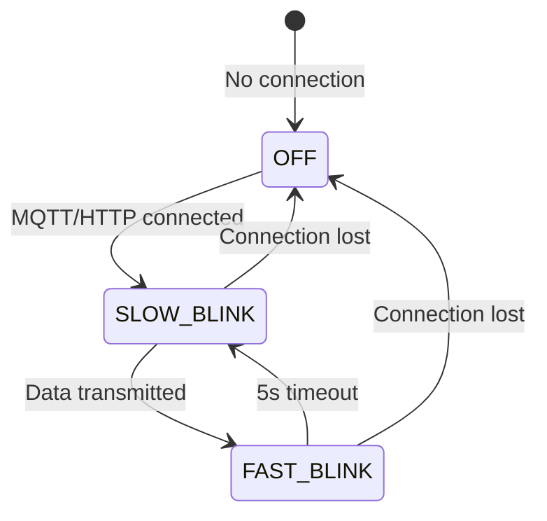
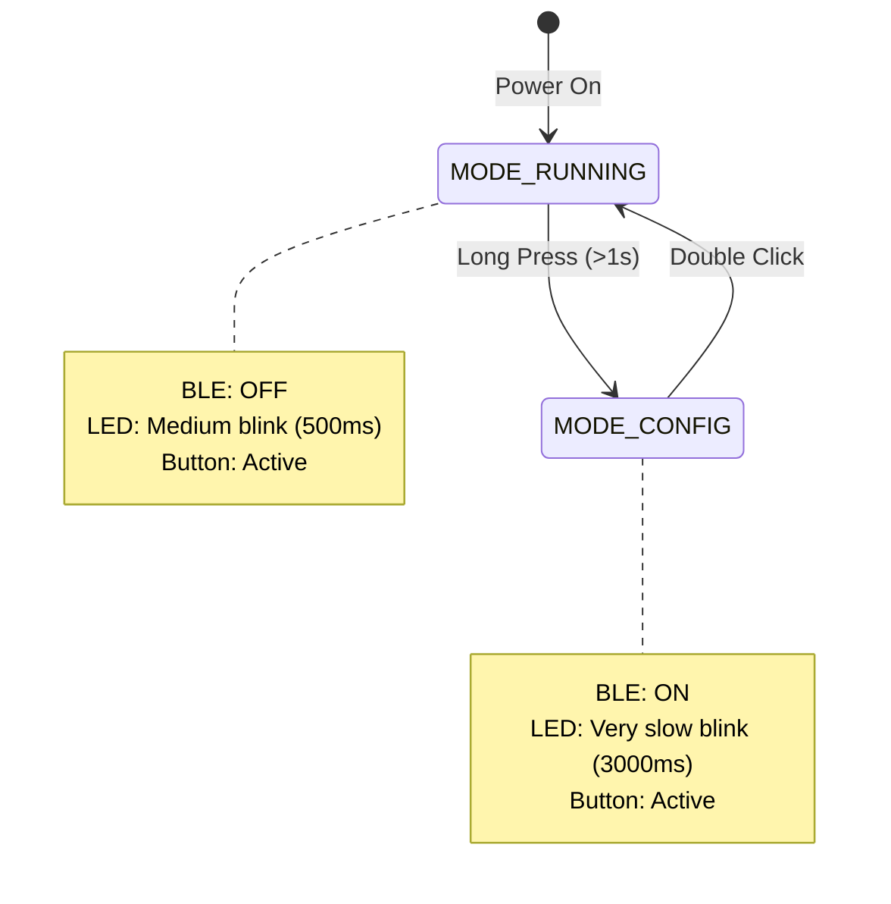

# Hardware Specifications

**SRT-MGATE-1210 Modbus IIoT Gateway**
Hardware Reference Documentation

[Home](../../README.md) > [Documentation](../README.md) > [Technical Guides](README.md) > Hardware Specifications

---

## Table of Contents

- [MCU Specifications](#mcu-specifications)
- [GPIO Pinout](#gpio-pinout)
- [Serial Interfaces](#serial-interfaces)
- [Network Interfaces](#network-interfaces)
- [Power Requirements](#power-requirements)
- [LED Indicators](#led-indicators)
- [Button Interface](#button-interface)
- [Memory Architecture](#memory-architecture)
- [Electrical Characteristics](#electrical-characteristics)
- [PCB Layout Considerations](#pcb-layout-considerations)

---

## 🔧 MCU Specifications

### ESP32-S3-WROOM-1-N16R8

| Parameter                 | Specification                         |
| ------------------------- | ------------------------------------- |
| **Model**                 | ESP32-S3-WROOM-1-N16R8                |
| **CPU**                   | Xtensa® dual-core 32-bit LX7          |
| **Clock Speed**           | Up to 240 MHz                         |
| **Flash Memory**          | 16 MB (128 Mbit)                      |
| **PSRAM**                 | 8 MB (64 Mbit) Octal SPI              |
| **SRAM**                  | 512 KB internal                       |
| **WiFi**                  | 802.11 b/g/n (2.4 GHz)                |
| **Bluetooth**             | BLE 5.0                               |
| **GPIO Pins**             | 45 programmable GPIOs                 |
| **ADC**                   | 2× 12-bit SAR ADCs, up to 20 channels |
| **Operating Voltage**     | 3.0V - 3.6V                           |
| **Operating Temperature** | -40°C to +85°C                        |

### Key Features

- ✅ **Dual-Core Processing**: FreeRTOS task distribution
- ✅ **Large PSRAM**: 8MB for JsonDocument and queue buffering
- ✅ **Hardware Watchdog**: TWDT enabled for task monitoring
- ✅ **Flash Encryption**: Secure boot and data protection support
- ✅ **Low Power Modes**: Deep sleep with RTC timer

---

## 📍 GPIO Pinout

### Complete GPIO Allocation

**Updated: 02-May-2025**

```
┌────────────────────────────────────────────────────────────────────────┐
│                    ESP32-S3 GPIO Mapping (SRT-MGATE-1210)              │
├──────────────────┬─────────┬──────────────────────────────────────────┤
│ Function         │ GPIO    │ Description                              │
├──────────────────┼─────────┼──────────────────────────────────────────┤
│ BOOT/CONFIG BTN  │ GPIO 0  │ Boot mode/Config button (Active LOW)     │
│ ETH_RST          │ GPIO 3  │ W5500 Ethernet reset (Active LOW)        │
│ RTC_SQW          │ GPIO 4  │ DS3231 RTC interrupt/square wave         │
│ I2C_SDA          │ GPIO 5  │ I2C data line (RTC DS3231)              │
│ I2C_SCL          │ GPIO 6  │ I2C clock line (RTC DS3231)             │
│ LED_STATUS       │ GPIO 7  │ System status indicator (HIGH=ON)        │
│ LED_NET          │ GPIO 8  │ Network indicator (HIGH=ON)              │
│ ETH_INT          │ GPIO 9  │ W5500 Ethernet interrupt (Active LOW)    │
│ SD_MOSI          │ GPIO 10 │ MicroSD card MOSI (SPI)                  │
│ SD_CS            │ GPIO 11 │ MicroSD card chip select (SPI)           │
│ SD_SCK           │ GPIO 12 │ MicroSD card clock (SPI)                 │
│ SD_MISO          │ GPIO 13 │ MicroSD card MISO (SPI)                  │
│ ETH_MOSI         │ GPIO 14 │ W5500 Ethernet MOSI (SPI3/FSPI)          │
│ RXD1_RS485       │ GPIO 15 │ Modbus RTU Port 1 RX (Serial1)           │
│ TXD1_RS485       │ GPIO 16 │ Modbus RTU Port 1 TX (Serial1)           │
│ RXD2_RS485       │ GPIO 17 │ Modbus RTU Port 2 RX (Serial2)           │
│ TXD2_RS485       │ GPIO 18 │ Modbus RTU Port 2 TX (Serial2)           │
│ ETH_MISO         │ GPIO 21 │ W5500 Ethernet MISO (SPI3/FSPI)          │
│ USB_D-           │ GPIO 19 │ USB data negative (programming/debug)    │
│ USB_D+           │ GPIO 20 │ USB data positive (programming/debug)    │
│ UART0_TX         │ GPIO 43 │ USB Serial TX (debug output)             │
│ UART0_RX         │ GPIO 44 │ USB Serial RX (debug input)              │
│ ETH_SCK          │ GPIO 47 │ W5500 Ethernet clock (SPI3/FSPI)         │
│ ETH_CS           │ GPIO 48 │ W5500 Ethernet chip select (SPI3/FSPI)   │
└──────────────────┴─────────┴──────────────────────────────────────────┘
```

### Visual Pinout Diagram

```
                        ┌──────────────────┐
                    3V3 │1              40 │ GND
                    EN  │2              39 │ GPIO 46
                GPIO 4  │3              38 │ GPIO 45
                GPIO 5  │4              37 │ GPIO 0  ◄── Button
                GPIO 6  │5              36 │ GPIO 35
                GPIO 7  │6              35 │ GPIO 36
    LED Status ──► GPIO 8  │7              34 │ GPIO 37
    LED Net    ──► GPIO 9  │8              33 │ GPIO 38
               GPIO 10  │9              32 │ GPIO 39
               GPIO 11 │10  ESP32-S3   31 │ GPIO 40
               GPIO 12 │11             30 │ GPIO 41
               GPIO 13 │12             29 │ GPIO 42
               GPIO 14 │13             28 │ GPIO 2
    RTU1 RX ──► GPIO 15 │14             27 │ GPIO 1
    RTU1 TX ──► GPIO 16 │15             26 │ GPIO 44 (RX0)
    RTU2 RX ──► GPIO 17 │16             25 │ GPIO 43 (TX0)
    RTU2 TX ──► GPIO 18 │17             24 │ GPIO 19
               GPIO 21 │18             23 │ GPIO 20
                   GND │19             22 │ GPIO 47
                   5V  │20             21 │ GPIO 48
                        └──────────────────┘
```

### Functional Block Diagram

```
┌─────────────────────────────────────────────────────────────────┐
│                    SRT-MGATE-1210 Block Diagram                 │
│                                                                 │
│  ┌──────────────┐    ┌─────────────────────────────────────┐  │
│  │  POWER 1+2   │───►│    ESP32-S3-WROOM-1U                │  │
│  │  9-24V DC    │    │    (IPEX ANTENNA)                   │  │
│  │  (REDUNDANCY)│    │                                     │  │
│  └──────────────┘    │  • WiFi 2.4GHz                      │  │
│                      │  • BLE 5.0                          │  │
│  ┌──────────────┐    │  • 16MB Flash + 8MB PSRAM           │  │
│  │ USB TYPE-C   │───►│                                     │  │
│  │ (CH340)      │    └──┬──┬──┬──┬──┬──┬──┬──┬──┬──┬──┬──┘  │
│  └──────────────┘       │  │  │  │  │  │  │  │  │  │  │     │
│                      UART1 │  │  │  │  │  │  │  │  │  │     │
│  ┌──────────────┐       │  │  │  │  │  │  │  │  │  │  │     │
│  │  RS-485 RTU1 │◄──────┘  │  │  │  │  │  │  │  │  │  │     │
│  │  (PORT 1)    │          │  │  │  │  │  │  │  │  │  │     │
│  └──────────────┘       UART2 │  │  │  │  │  │  │  │  │     │
│                             │  │  │  │  │  │  │  │  │  │     │
│  ┌──────────────┐           │  │  │  │  │  │  │  │  │  │     │
│  │  RS-485 RTU2 │◄──────────┘  │  │  │  │  │  │  │  │  │     │
│  │  (PORT 2)    │              │  │  │  │  │  │  │  │  │     │
│  └──────────────┘            SPI3 │  │  │  │  │  │  │  │     │
│                                 │  │  │  │  │  │  │  │  │     │
│  ┌──────────────┐               │  │  │  │  │  │  │  │  │     │
│  │  ETHERNET    │◄──────────────┘  │  │  │  │  │  │  │  │     │
│  │  W5500       │                  │  │  │  │  │  │  │  │     │
│  │  (RJ45 PoE)  │                SPI  │  │  │  │  │  │  │     │
│  └──────────────┘                  │  │  │  │  │  │  │  │     │
│                                    │  │  │  │  │  │  │  │     │
│  ┌──────────────┐                  │  │  │  │  │  │  │  │     │
│  │  MICRO SD    │◄─────────────────┘  │  │  │  │  │  │  │     │
│  │  CARD        │                     │  │  │  │  │  │  │     │
│  └──────────────┘                    I2C  │  │  │  │  │  │     │
│                                        │  │  │  │  │  │  │     │
│  ┌──────────────┐                     │  │  │  │  │  │  │     │
│  │  RTC DS3231  │◄────────────────────┘  │  │  │  │  │  │     │
│  │ (REAL TIME   │                        │  │  │  │  │  │     │
│  │  CLOCK)      │                     GPIO0 │  │  │  │  │     │
│  └──────────────┘                        │  │  │  │  │  │     │
│                                          │  │  │  │  │  │     │
│  ┌──────────────┐                        │  │  │  │  │  │     │
│  │ BOOT/CONFIG  │◄───────────────────────┘  │  │  │  │  │     │
│  │  BUTTON      │                        GPIO7 │  │  │  │     │
│  └──────────────┘                           │  │  │  │  │     │
│                                             │  │  │  │  │     │
│  ┌──────────────┐                           │  │  │  │  │     │
│  │ LED INDICATOR│◄──────────────────────────┘  │  │  │  │     │
│  │  STATUS      │                           GPIO8 │  │  │     │
│  └──────────────┘                              │  │  │  │     │
│                                                │  │  │  │     │
│  ┌──────────────┐                              │  │  │  │     │
│  │ LED INDICATOR│◄─────────────────────────────┘  │  │  │     │
│  │  NETWORK     │                              GPIO3 │  │     │
│  └──────────────┘                                 │  │  │     │
│                                                   │  │  │     │
│                                          ETH_RST──┘  │  │     │
│                                          ETH_INT─────┘  │     │
│                                          RTC_SQW────────┘     │
└─────────────────────────────────────────────────────────────────┘
```

---

## 🔌 Serial Interfaces

### UART Configuration

#### UART0 (USB Serial - Debug)
```cpp
Pin: GPIO 43 (TX), GPIO 44 (RX)
Baudrate: 115200
Purpose: Debug logging, firmware upload
Status: Always active in development mode
```

#### UART1 (Modbus RTU Port 1)
```cpp
Pin: GPIO 16 (TX), GPIO 15 (RX)
Baudrate: 1200 - 115200 (dynamic)
Parity: None (8N1)
Stop Bits: 1
Purpose: Modbus RTU slave devices
Default: 9600 baud
```

#### UART2 (Modbus RTU Port 2)
```cpp
Pin: GPIO 18 (TX), GPIO 17 (RX)
Baudrate: 1200 - 115200 (dynamic)
Parity: None (8N1)
Stop Bits: 1
Purpose: Modbus RTU slave devices
Default: 9600 baud
```

### Supported Baudrates

| Baudrate | Use Case                  |
| -------- | ------------------------- |
| 1200     | Legacy industrial devices |
| 2400     | Low-speed sensors         |
| 4800     | Standard Modbus RTU       |
| **9600** | **Default - Most common** |
| 19200    | High-speed Modbus RTU     |
| 38400    | Fast data acquisition     |
| 57600    | Real-time monitoring      |
| 115200   | Maximum speed devices     |

### Baudrate Switching

The firmware supports **dynamic per-device baudrate configuration**:

```cpp
// Automatic baudrate switching with caching
configureBaudRate(serialPort, deviceBaudRate);

// 50ms stabilization delay after reconfiguration
vTaskDelay(pdMS_TO_TICKS(50));
```

**Key Features:**
- ✅ Smart caching (only reconfigure if baudrate changes)
- ✅ Per-device baudrate storage
- ✅ Automatic validation (1200-115200 range)
- ✅ Works with both `op: create` and `op: update`

---

## 🔌 I2C Interface

### RTC DS3231 (Real-Time Clock)

| Parameter             | Specification             |
| --------------------- | ------------------------- |
| **IC**                | DS3231 High-Precision RTC |
| **Interface**         | I2C                       |
| **SDA Pin**           | GPIO 5                    |
| **SCL Pin**           | GPIO 6                    |
| **INT/SQW Pin**       | GPIO 4                    |
| **Accuracy**          | ±2ppm (±1 minute/year)    |
| **Temperature Range** | -40°C to +85°C            |
| **Battery Backup**    | CR2032 (optional)         |

**Code Configuration:**
```cpp
#define I2C_SDA 5
#define I2C_SCL 6
#define RTC_SQW 4

Wire.begin(I2C_SDA, I2C_SCL);
```

**INT/SQW Features:**
- **Interrupt Mode**: Alarm conditions trigger GPIO 4 LOW
- **Square Wave Mode**: Programmable frequency output (1Hz, 1.024kHz, 4.096kHz, 8.192kHz)
- Used by `RTCManager` for time synchronization

---

## 💾 MicroSD Card Interface

### SD Card Storage (Optional)

| Parameter           | Specification         |
| ------------------- | --------------------- |
| **Interface**       | SPI (default mode)    |
| **CS Pin**          | GPIO 11               |
| **MOSI Pin**        | GPIO 10               |
| **SCK Pin**         | GPIO 12               |
| **MISO Pin**        | GPIO 13               |
| **Supported Cards** | SD, SDHC (up to 32GB) |
| **File System**     | FAT16/FAT32           |

**Code Configuration:**
```cpp
#define SD_CS   11
#define SD_MOSI 10
#define SD_SCK  12
#define SD_MISO 13

SPI.begin(SD_SCK, SD_MISO, SD_MOSI, SD_CS);
SD.begin(SD_CS);
```

**Use Cases:**
- Extended configuration storage
- Data logging backup
- Firmware update files
- Historical data archive

**Note:** SD card is optional. SPIFFS is used as primary storage.

---

## 🌐 Network Interfaces

### Ethernet (Primary)

| Parameter       | Specification                        |
| --------------- | ------------------------------------ |
| **Controller**  | WIZNET W5500                         |
| **Interface**   | SPI3 (FSPI)                          |
| **Speed**       | 10/100 Mbps auto-negotiation         |
| **CS Pin**      | GPIO 48                              |
| **MOSI Pin**    | GPIO 14                              |
| **MISO Pin**    | GPIO 21                              |
| **SCK Pin**     | GPIO 47                              |
| **RST Pin**     | GPIO 3 (Active LOW)                  |
| **INT Pin**     | GPIO 9 (Active LOW)                  |
| **MAC Address** | Auto-generated from ESP32 MAC        |
| **DHCP**        | Supported with fallback to static IP |
| **Protocols**   | Modbus TCP, MQTT, HTTP               |

**Code Configuration:**
```cpp
#define ETH_CS   48
#define ETH_MOSI 14
#define ETH_MISO 21
#define ETH_SCK  47
#define ETH_RST  3
#define ETH_INT  9

// Define SPI3 as FSPI
#define VSPI FSPI
SPIClass SPI3(VSPI);

// Initialize SPI3 and Ethernet
SPI3.begin(ETH_SCK, ETH_MISO, ETH_MOSI, ETH_CS);
Ethernet.init(ETH_CS);
```

**Hardware Reset:**
- **ETH_RST (GPIO 3)**: Must be held LOW for at least 500µs to reset W5500
- **ETH_INT (GPIO 9)**: LOW = interrupt asserted, HIGH = no interrupt

**Network Configuration:**
```json
{
  "use_dhcp": true,
  "static_ip": "192.168.1.100",
  "gateway": "192.168.1.1",
  "subnet": "255.255.255.0",
  "dns": "8.8.8.8"
}
```

### WiFi (Fallback)

| Parameter     | Specification              |
| ------------- | -------------------------- |
| **Standard**  | IEEE 802.11 b/g/n          |
| **Frequency** | 2.4 GHz only               |
| **Security**  | WPA/WPA2/WPA3-PSK          |
| **Range**     | Up to 100m (line of sight) |
| **Antenna**   | PCB trace antenna          |

**Network Hysteresis:**
- **Connection threshold**: 3 consecutive successful checks
- **Disconnection threshold**: 5 consecutive failed checks
- **Prevents**: Network flapping

---

## ⚡ Power Requirements

### Power Input

| Parameter             | Min | Typical | Max | Unit |
| --------------------- | --- | ------- | --- | ---- |
| **Input Voltage**     | 9V  | 12V     | 24V | VDC  |
| **Input Current**     | -   | 150     | 300 | mA   |
| **Power Consumption** | -   | 1.8     | 3.6 | W    |

### Power Distribution

```
                    ┌─────────────────────┐
    12V DC ────────►│ Buck Converter      │
                    │ (12V → 5V)          │
                    └──────────┬──────────┘
                               │ 5V
                    ┌──────────▼──────────┐
                    │ LDO Regulator       │
                    │ (5V → 3.3V)         │
                    └──────────┬──────────┘
                               │ 3.3V
                ┌──────────────┼──────────────┐
                │              │              │
          ┌─────▼─────┐  ┌────▼────┐  ┌─────▼─────┐
          │  ESP32-S3 │  │  W5500  │  │  RS485    │
          │  (3.3V)   │  │  (3.3V) │  │  (3.3V)   │
          └───────────┘  └─────────┘  └───────────┘
```

### Current Consumption by Mode

| Mode                           | Current Draw | Power (@ 3.3V) |
| ------------------------------ | ------------ | -------------- |
| **Active** (WiFi + Modbus)     | 180 mA       | 0.59 W         |
| **Active** (Ethernet + Modbus) | 220 mA       | 0.73 W         |
| **BLE Active**                 | +30 mA       | +0.10 W        |
| **Idle** (no polling)          | 80 mA        | 0.26 W         |
| **Deep Sleep**                 | 10 µA        | 33 µW          |

---

## 💡 LED Indicators

### LED NET (GPIO 9)

Visual indicator for network connectivity and data transmission.

| State          | Pattern         | Meaning                      |
| -------------- | --------------- | ---------------------------- |
| **OFF**        | ⚫ Solid OFF     | No network connection        |
| **SLOW BLINK** | 🟢 1 Hz (1000ms) | Connected, no data flow      |
| **FAST BLINK** | 🟢 5 Hz (200ms)  | Connected, data transmitting |

**State Transition Logic:**



**Implementation:**
```cpp
void LEDManager::notifyDataTransmission() {
  lastDataMillis = millis();  // Reset 5s timeout
  updateLEDState();
}
```

### LED STATUS (GPIO 8)

System mode indicator controlled by ButtonManager.

| Mode                   | Pattern              | Meaning                 |
| ---------------------- | -------------------- | ----------------------- |
| **Development**        | 🔵 Slow (2000ms)      | Dev mode, BLE always ON |
| **Production Config**  | 🔵 Very Slow (3000ms) | Config mode, BLE ON     |
| **Production Running** | 🔵 Medium (500ms)     | Running mode, BLE OFF   |

---

## 🔘 Button Interface

### Button Configuration (GPIO 0)

**Hardware:**
- Pull-up resistor: 10kΩ to 3.3V
- Debounce: 50ms (OneButton library)
- Active LOW (pressed = GND)

**⚠️ IMPORTANT - Boot Mode:**
- **GPIO 0 must be HIGH during boot** for normal operation
- **GPIO 0 must be LOW during boot** for firmware programming mode
- The button is used for both boot mode selection and runtime configuration
- In runtime, long-press enters BLE configuration mode

**Button Actions:**

| Action           | Duration        | Function                         |
| ---------------- | --------------- | -------------------------------- |
| **Long Press**   | > 1000ms        | Enter Config Mode (BLE ON)       |
| **Double Click** | < 400ms between | Return to Running Mode (BLE OFF) |
| **Single Click** | -               | No function (reserved)           |

**Mode Behavior:**



**Development Mode Override:**
```cpp
#define PRODUCTION_MODE 0  // Development
// Button disabled, BLE always ON, LED slow blink (2000ms)
```

---

## 💾 Memory Architecture

### Flash Memory Layout (16 MB)

```
┌─────────────────────────────────────────┐
│ 0x0000000 - 0x0010000 (64 KB)           │  Bootloader
├─────────────────────────────────────────┤
│ 0x0010000 - 0x0018000 (32 KB)           │  Partition Table
├─────────────────────────────────────────┤
│ 0x0018000 - 0x0028000 (64 KB)           │  NVS (Non-Volatile Storage)
├─────────────────────────────────────────┤
│ 0x0028000 - 0x0029000 (4 KB)            │  OTA Data Partition
├─────────────────────────────────────────┤
│ 0x0029000 - 0x0800000 (~7.86 MB)        │  Application (Firmware)
├─────────────────────────────────────────┤
│ 0x0800000 - 0x0FD0000 (~7.81 MB)        │  OTA Update Partition
├─────────────────────────────────────────┤
│ 0x0FD0000 - 0x1000000 (192 KB)          │  SPIFFS (Configuration Files)
│   ├── /devices.json                     │
│   ├── /server_config.json               │
│   └── /logging_config.json              │
└─────────────────────────────────────────┘
```

### PSRAM Allocation (8 MB)

| Component            | Size    | Purpose                         |
| -------------------- | ------- | ------------------------------- |
| **ConfigManager**    | ~512 KB | Device configuration cache      |
| **JsonDocument**     | ~256 KB | BLE fragmentation, MQTT payload |
| **QueueManager**     | ~2 MB   | Stream queue (1000 data points) |
| **BLEManager**       | ~128 KB | Command/response buffers        |
| **ModbusTcpService** | ~512 KB | TCP client buffers (4× 128KB)   |
| **MqttManager**      | ~256 KB | Persistent queue                |
| **Free PSRAM**       | ~4.5 MB | Dynamic allocation              |

**Allocation Example:**
```cpp
// Placement new for PSRAM allocation
configManager = (ConfigManager*)heap_caps_malloc(
    sizeof(ConfigManager),
    MALLOC_CAP_SPIRAM | MALLOC_CAP_8BIT
);
new (configManager) ConfigManager();
```

---

## ⚡ Electrical Characteristics

### Absolute Maximum Ratings

| Parameter                 | Min  | Max     | Unit |
| ------------------------- | ---- | ------- | ---- |
| **Supply Voltage (VDD)**  | -0.3 | 3.6     | V    |
| **Input Voltage (GPIO)**  | -0.3 | VDD+0.3 | V    |
| **Output Current (GPIO)** | -    | 40      | mA   |
| **Total GPIO Current**    | -    | 200     | mA   |
| **Storage Temperature**   | -40  | +125    | °C   |
| **ESD (HBM)**             | -    | 2000    | V    |

### Recommended Operating Conditions

| Parameter                  | Min      | Typ | Max      | Unit |
| -------------------------- | -------- | --- | -------- | ---- |
| **Supply Voltage (VDD)**   | 3.0      | 3.3 | 3.6      | V    |
| **Operating Temperature**  | -40      | 25  | +85      | °C   |
| **GPIO Input High (VIH)**  | 0.75×VDD | -   | VDD      | V    |
| **GPIO Input Low (VIL)**   | 0        | -   | 0.25×VDD | V    |
| **GPIO Output High (VOH)** | 0.8×VDD  | -   | VDD      | V    |
| **GPIO Output Low (VOL)**  | 0        | -   | 0.1×VDD  | V    |

### RS485 Interface (Modbus RTU)

| Parameter          | Specification                    |
| ------------------ | -------------------------------- |
| **Driver IC**      | MAX485 or equivalent             |
| **Supply Voltage** | 3.3V (from ESP32)                |
| **Data Rate**      | 1200 - 115200 baud               |
| **Bus Topology**   | Multi-drop, up to 32 nodes       |
| **Cable Type**     | Twisted pair (Cat5e recommended) |
| **Max Distance**   | 1200m @ 9600 baud                |
| **Termination**    | 120Ω at both ends                |

**RS485 Biasing:**
```
           VDD (5V)
            │
           ┌┴┐
           │ │ 680Ω (Pull-up)
           └┬┘
            │
    A ──────┼────────────── RS485 Bus A
            │
           ┌┴┐
           │ │ 120Ω (Termination)
           └┬┘
            │
    B ──────┼────────────── RS485 Bus B
            │
           ┌┴┐
           │ │ 680Ω (Pull-down)
           └┬┘
            │
           GND
```

---

## 🔧 PCB Layout Considerations

### Critical Design Guidelines

#### Power Supply
- ✅ **Decoupling capacitors**: 100nF ceramic + 10µF electrolytic near ESP32
- ✅ **Power planes**: Separate 3.3V and GND planes
- ✅ **Ferrite bead**: Between 5V and 3.3V domains

#### High-Speed Signals
- ✅ **SPI traces** (W5500): Keep < 10cm, matched length ±0.5mm
- ✅ **USB traces** (D+/D-): 90Ω differential impedance
- ✅ **Clock signals**: Avoid vias, minimize stubs

#### RF Performance (BLE/WiFi)
- ✅ **Antenna keepout**: 10mm clearance around antenna
- ✅ **Ground plane**: Solid GND under antenna area
- ✅ **Trace routing**: Avoid routing under antenna

#### RS485 Communication
- ✅ **Twisted pair**: Use shielded Cat5e cable
- ✅ **GND isolation**: Optocoupler if needed (not implemented)
- ✅ **Termination**: 120Ω resistor at both ends of bus

#### EMI/EMC Compliance
- ✅ **Shielding**: Metal enclosure recommended
- ✅ **Filtering**: LC filter on power input
- ✅ **Grounding**: Single point ground for RS485

---

## 📐 Mechanical Specifications

### PCB Dimensions

| Parameter          | Value                  |
| ------------------ | ---------------------- |
| **Board Size**     | 100mm × 80mm           |
| **Thickness**      | 1.6mm (FR-4)           |
| **Layers**         | 4-layer (recommended)  |
| **Finish**         | ENIG or HASL           |
| **Mounting Holes** | 4× M3 (3.2mm diameter) |

### Enclosure Requirements

- **Material**: ABS plastic or aluminum
- **Ingress Protection**: IP40 (minimum), IP54 (recommended)
- **Cooling**: Passive (heatsink optional)
- **Cable Glands**: 5× PG7 (power, RS485×2, Ethernet, USB)

---

## 🛠️ Hardware Troubleshooting

### Common Issues

| Symptom                | Possible Cause    | Solution                   |
| ---------------------- | ----------------- | -------------------------- |
| No power               | Incorrect voltage | Check 9-24V DC input       |
| BLE not discoverable   | Antenna issue     | Check antenna connection   |
| RS485 no response      | Wrong baudrate    | Verify device baudrate     |
| Ethernet not connected | Cable issue       | Check W5500 SPI connection |
| Frequent resets        | Power brownout    | Add 1000µF capacitor       |

### Test Points

Add these test points to your PCB:

```
TP1: 3.3V (ESP32 supply)
TP2: 5V (intermediate rail)
TP3: GND (digital ground)
TP4: RS485 A (Port 1)
TP5: RS485 B (Port 1)
TP6: RS485 A (Port 2)
TP7: RS485 B (Port 2)
TP8: SPI CLK (W5500)
TP9: SPI MOSI (W5500)
TP10: SPI MISO (W5500)
```

---

## Related Documentation

- [Network Configuration](NETWORK_CONFIGURATION.md) - WiFi and Ethernet setup
- [Protocol Documentation](PROTOCOL.md) - Communication protocols
- [API Reference](../API_Reference/API.md) - Complete API documentation
- [Troubleshooting Guide](TROUBLESHOOTING.md) - Hardware troubleshooting
- [Best Practices](../BEST_PRACTICES.md) - Deployment guidelines

### External Resources

- [ESP32-S3 Datasheet](https://www.espressif.com/sites/default/files/documentation/esp32-s3_datasheet_en.pdf)
- [W5500 Datasheet](https://www.wiznet.io/product-item/w5500/)
- [MAX485 Datasheet](https://www.analog.com/media/en/technical-documentation/data-sheets/MAX1487-MAX491.pdf)
- [Modbus RTU Specification](https://modbus.org/docs/Modbus_over_serial_line_V1_02.pdf)

---

**Document Version:** 1.2
**Last Updated:** December 10, 2025
**Firmware Version:** 2.5.34

[← Back to Technical Guides](README.md) | [↑ Top](#hardware-specifications)
