# Network Configuration Guide

**SRT-MGATE-1210 Modbus IIoT Gateway**
Dual Network Interface Configuration & Failover

[Home](../../README.md) > [Documentation](../README.md) > [Technical Guides](README.md) > Network Configuration

**Current Version:** v2.3.0
**Developer:** Kemal
**Last Updated:** November 21, 2025

---

## Table of Contents

- [Overview](#-overview)
- [Network Interfaces](#-network-interfaces)
- [Communication Mode](#-communication-mode)
- [Failover Logic](#-failover-logic)
- [Configuration Examples](#-configuration-examples)
- [Network Priority Decision](#-network-priority-decision)
- [Best Practices](#-best-practices)
- [API Reference](#-api-reference)
- [Troubleshooting](#-troubleshooting)

---

## 🎯 Overview

SRT-MGATE-1210 gateway supports **dual network interface** for high availability and redundancy:

1. **Ethernet** - W5500 chip (hardware SPI)
2. **WiFi** - ESP32-S3 built-in (802.11 b/g/n)

### Key Features

| Feature | Description |
|---------|-------------|
| **Dual Interface** | Ethernet + WiFi can be enabled simultaneously |
| **Automatic Failover** | Automatic switch to backup network if primary fails |
| **Dynamic Switching** | No restart needed when network switches |
| **Priority Control** | User can choose which network is prioritized |
| **Health Monitoring** | Background task continuously monitors network status |

---

## 📡 Network Interfaces

### 1. Ethernet (W5500)

**Hardware:**
- W5500 SPI Ethernet Controller
- 10/100 Mbps
- Full-duplex support
- Hardware TCP/IP stack

**GPIO Connections:**
| Pin | Function |
|-----|----------|
| GPIO 14 | SPI3_MOSI |
| GPIO 21 | SPI3_MISO |
| GPIO 47 | SPI3_SCK |
| GPIO 48 | SPI3_CS |
| GPIO 3 | ETH_RST (Reset) |
| GPIO 9 | ETH_INT (Interrupt) |

**Advantages:**
- ✅ Stable connection (no interference)
- ✅ Low latency
- ✅ Better for industrial environments
- ✅ No signal loss issues

**Disadvantages:**
- ❌ Requires physical cable
- ❌ Less flexible installation

---

### 2. WiFi (ESP32-S3)

**Hardware:**
- ESP32-S3 built-in WiFi
- 802.11 b/g/n (2.4 GHz only)
- WPA/WPA2/WPA3 support

**Advantages:**
- ✅ Wireless (no cables needed)
- ✅ Flexible installation
- ✅ Easy to relocate
- ✅ Good for temporary setups

**Disadvantages:**
- ❌ Signal interference (2.4GHz crowded)
- ❌ Distance limitations
- ❌ Potential packet loss
- ❌ Not ideal for critical industrial processes

---

## ⚙️ Communication Mode

### What is `communication.mode`?

Field that determines the **primary network interface** that will be prioritized by the gateway.

```json
{
  "communication": {
    "mode": "ETH"    // or "WIFI"
  }
}
```

### Valid Values

| Value | Description | Use Case |
|-------|-------------|----------|
| `"ETH"` | Prioritize Ethernet | Industrial plants, stable environments |
| `"WIFI"` | Prioritize WiFi | Remote monitoring, flexible installations |

### Default Behavior

**If `communication.mode` is not specified:**
- Default: `"ETH"`
- Reason: Ethernet is more stable for industrial IoT

---

## 🔄 Failover Logic

Gateway uses **automatic failover mechanism** to ensure continuous connectivity.

### Decision Flow

```mermaid
graph TD
    Start[Gateway Startup] --> CheckPrimary{Check Primary Mode}

    CheckPrimary -->|mode = ETH| EthPrimary[Try Ethernet]
    CheckPrimary -->|mode = WIFI| WiFiPrimary[Try WiFi]

    EthPrimary -->|Available| UseEth[✅ Use Ethernet]
    EthPrimary -->|Failed| FallbackWiFi[Fallback to WiFi]

    WiFiPrimary -->|Available| UseWiFi[✅ Use WiFi]
    WiFiPrimary -->|Failed| FallbackEth[Fallback to Ethernet]

    FallbackWiFi -->|Available| UseWiFi
    FallbackWiFi -->|Failed| NoNetwork[❌ No Network]

    FallbackEth -->|Available| UseEth
    FallbackEth -->|Failed| NoNetwork

    UseEth --> Monitor[Background Monitoring]
    UseWiFi --> Monitor
    NoNetwork --> Retry[Retry in 10s]

    Monitor -->|Primary Failed| AutoSwitch[Auto Switch to Backup]
    AutoSwitch --> Monitor
    Retry --> CheckPrimary

    style UseEth fill:#90EE90
    style UseWiFi fill:#87CEEB
    style NoNetwork fill:#FFB6C1
```



### Failover Priority

**Priority Order:**
1. **Primary Mode** (as configured in `communication.mode`)
2. **Ethernet** (if primary fails)
3. **WiFi** (if Ethernet also fails)
4. **None** (if all fail)

### Code Implementation

**Location:** `Main/NetworkManager.cpp` (lines 126-145)

```cpp
// 1. Try primary mode first
if (primaryMode == "ETH" && ethernetManager->isAvailable()) {
  activeMode = "ETH";
}
else if (primaryMode == "WIFI" && wifiManager->isAvailable()) {
  activeMode = "WIFI";
}

// 2. Fallback to Ethernet if available
else if (ethernetManager->isAvailable()) {
  activeMode = "ETH";
}

// 3. Fallback to WiFi if Ethernet unavailable
else if (wifiManager->isAvailable()) {
  activeMode = "WIFI";
}

// 4. No network available
else {
  activeMode = "NONE";
}
```

### Background Monitoring

Gateway runs a **failover task** that:
- Monitors network health every 10 seconds
- Detects connection loss
- Auto-switches to backup network
- Restores to primary when available again

---

## 📝 Configuration Examples

### Example 1: Ethernet Primary with WiFi Backup

**Use Case:** Industrial plant with stable Ethernet cable, WiFi as backup.

```json
{
  "op": "update",
  "type": "server_config",
  "config": {
    "communication": {
      "mode": "ETH"
    },
    "ethernet": {
      "enabled": true,
      "use_dhcp": true
    },
    "wifi": {
      "enabled": true,
      "ssid": "Backup-WiFi",
      "password": "SecurePassword123"
    }
  }
}
```

**Behavior:**
1. Gateway will prioritize Ethernet
2. If Ethernet cable unplugged → auto switch to WiFi
3. If Ethernet plugged back → auto restore to Ethernet

---

### Example 2: WiFi Primary with Ethernet Backup

**Use Case:** Remote monitoring area with good WiFi coverage.

```json
{
  "op": "update",
  "type": "server_config",
  "config": {
    "communication": {
      "mode": "WIFI"
    },
    "wifi": {
      "enabled": true,
      "ssid": "Factory-WiFi",
      "password": "WiFiPassword456"
    },
    "ethernet": {
      "enabled": true,
      "use_dhcp": true
    }
  }
}
```

**Behavior:**
1. Gateway will prioritize WiFi
2. If WiFi signal lost → auto switch to Ethernet
3. If WiFi restored → auto restore to WiFi

---

### Example 3: Ethernet Only (No Backup)

**Use Case:** Critical industrial process, no wireless allowed.

```json
{
  "op": "update",
  "type": "server_config",
  "config": {
    "communication": {
      "mode": "ETH"
    },
    "ethernet": {
      "enabled": true,
      "use_dhcp": false,
      "static_ip": "192.168.10.100",
      "gateway": "192.168.10.1",
      "subnet": "255.255.255.0"
    },
    "wifi": {
      "enabled": false
    }
  }
}
```

**Behavior:**
1. Gateway will only use Ethernet
2. If Ethernet fails → **No fallback** → status "NONE"
3. LED NET will be OFF (no network)

---

### Example 4: WiFi Only (No Ethernet)

**Use Case:** Temporary installation, testing, development.

```json
{
  "op": "update",
  "type": "server_config",
  "config": {
    "communication": {
      "mode": "WIFI"
    },
    "wifi": {
      "enabled": true,
      "ssid": "Dev-Network",
      "password": "DevPass789"
    },
    "ethernet": {
      "enabled": false
    }
  }
}
```

**Behavior:**
1. Gateway will only use WiFi
2. If WiFi fails → **No fallback** → status "NONE"

---

### Example 5: Dual Active (High Availability)

**Use Case:** Mission-critical application requiring maximum uptime.

```json
{
  "op": "update",
  "type": "server_config",
  "config": {
    "communication": {
      "mode": "ETH"
    },
    "ethernet": {
      "enabled": true,
      "use_dhcp": true
    },
    "wifi": {
      "enabled": true,
      "ssid": "Primary-WiFi",
      "password": "Pass123456"
    }
  }
}
```

**Behavior:**
1. Ethernet primary, WiFi ready as hot standby
2. Seamless failover < 10 seconds
3. Automatic restoration to primary
4. **99.9% uptime** (if both networks stable)

---

## 🎯 Network Priority Decision

### When to Use Ethernet Primary (`mode: "ETH"`)

✅ **Recommended for:**
- Industrial plants with wired infrastructure
- Critical processes requiring stable connection
- High data rate applications
- Environments with WiFi interference
- Production deployments

❌ **Not Recommended for:**
- Temporary installations
- Areas without cable access
- Mobile/portable setups

---

### When to Use WiFi Primary (`mode: "WIFI"`)

✅ **Recommended for:**
- Remote monitoring locations
- Flexible installations
- Testing and development
- Areas with strong WiFi coverage
- Temporary deployments

❌ **Not Recommended for:**
- Critical industrial processes
- High data rate requirements
- Areas with poor WiFi signal
- Environments with 2.4GHz interference

---

### Decision Tree

```mermaid
graph TD
    Start[Choose Network Mode] --> Critical{Critical Process?}

    Critical -->|Yes| CableAvail{Cable Available?}
    Critical -->|No| Flexible{Need Flexibility?}

    CableAvail -->|Yes| UseEth[Use ETH Mode]
    CableAvail -->|No| Dual1[Use WIFI Mode<br/>+ Ethernet Backup]

    Flexible -->|Yes| WiFiSignal{WiFi Signal Good?}
    Flexible -->|No| UseEth2[Use ETH Mode]

    WiFiSignal -->|Yes| UseWiFi[Use WIFI Mode]
    WiFiSignal -->|No| UseEth3[Use ETH Mode]

    UseEth --> EnableBackup{Enable Backup?}
    UseWiFi --> EnableBackup

    EnableBackup -->|Yes| DualActive[✅ Dual Active<br/>High Availability]
    EnableBackup -->|No| SingleMode[⚠️ Single Mode<br/>No Failover]

    style UseEth fill:#90EE90
    style UseWiFi fill:#87CEEB
    style DualActive fill:#FFD700
    style SingleMode fill:#FFB6C1
```



---

## 🚀 Best Practices

### 1. Production Deployment

```json
{
  "communication": {"mode": "ETH"},
  "ethernet": {"enabled": true, "use_dhcp": true},
  "wifi": {"enabled": true, "ssid": "Backup-WiFi", "password": "xxx"}
}
```

**Why:**
- Primary: Ethernet (stable)
- Backup: WiFi (automatic failover)
- **High Availability:** 99.9% uptime

---

### 2. Development/Testing

```json
{
  "communication": {"mode": "WIFI"},
  "wifi": {"enabled": true, "ssid": "Dev-Network", "password": "xxx"},
  "ethernet": {"enabled": false}
}
```

**Why:**
- Easy to connect from laptop/phone
- No cable needed
- Quick deployment

---

### 3. Critical Infrastructure

```json
{
  "communication": {"mode": "ETH"},
  "ethernet": {
    "enabled": true,
    "use_dhcp": false,
    "static_ip": "192.168.10.100",
    "gateway": "192.168.10.1",
    "subnet": "255.255.255.0"
  },
  "wifi": {"enabled": false}
}
```

**Why:**
- Static IP for reliability
- No wireless (security policy)
- Predictable network configuration

---

### 4. Remote Monitoring

```json
{
  "communication": {"mode": "WIFI"},
  "wifi": {"enabled": true, "ssid": "Site-WiFi", "password": "xxx"},
  "ethernet": {"enabled": true, "use_dhcp": true}
}
```

**Why:**
- WiFi primary (flexible)
- Ethernet backup (if available)
- Good for distributed sensors

---

## 📖 API Reference

### Read Network Configuration

**Request:**
```json
{
  "op": "read",
  "type": "server_config"
}
```

**Response:**
```json
{
  "status": "ok",
  "config": {
    "communication": {
      "mode": "ETH"
    },
    "wifi": {
      "enabled": true,
      "ssid": "MyNetwork",
      "password": "********"
    },
    "ethernet": {
      "enabled": true,
      "use_dhcp": true,
      "static_ip": "",
      "gateway": "",
      "subnet": ""
    }
  }
}
```

---

### Update Network Configuration

**Request:**
```json
{
  "op": "update",
  "type": "server_config",
  "config": {
    "communication": {
      "mode": "WIFI"
    },
    "wifi": {
      "enabled": true,
      "ssid": "NewNetwork",
      "password": "NewPassword123"
    },
    "ethernet": {
      "enabled": true,
      "use_dhcp": false,
      "static_ip": "192.168.1.100",
      "gateway": "192.168.1.1",
      "subnet": "255.255.255.0"
    }
  }
}
```

**Response:**
```json
{
  "status": "ok",
  "message": "Server configuration updated. Device will restart in 5s."
}
```

**Note:** ⚠️ Device will **restart automatically** after 5 seconds.

---

### Configuration Fields

#### communication

| Field | Type | Required | Default | Description |
|-------|------|----------|---------|-------------|
| `mode` | string | No | `"ETH"` | Primary network: `"ETH"` or `"WIFI"` |

#### wifi

| Field | Type | Required | Default | Description |
|-------|------|----------|---------|-------------|
| `enabled` | boolean | Yes | `true` | Enable WiFi interface |
| `ssid` | string | Yes* | `""` | WiFi network name (*if enabled) |
| `password` | string | Yes* | `""` | WiFi password (*if enabled) |

#### ethernet

| Field | Type | Required | Default | Description |
|-------|------|----------|---------|-------------|
| `enabled` | boolean | Yes | `true` | Enable Ethernet interface |
| `use_dhcp` | boolean | Yes | `true` | Use DHCP (true) or Static IP (false) |
| `static_ip` | string | No | `""` | Static IP address (if DHCP disabled) |
| `gateway` | string | No | `""` | Gateway IP (if DHCP disabled) |
| `subnet` | string | No | `""` | Subnet mask (if DHCP disabled) |

---

## 🔧 Troubleshooting

### Issue: Both Networks Not Working

**Symptoms:**
- LED NET is OFF
- Serial: `[NetworkMgr] No network available initially.`
- Status: `activeMode = "NONE"`

**Solutions:**

1. **Check Ethernet Cable:**
   ```bash
   # Serial monitor should show:
   [NetworkMgr] Ethernet link detected
   [NetworkMgr] DHCP success. IP: 192.168.1.100
   ```
   - Verify cable is plugged in
   - Check cable integrity
   - Verify switch/router is powered

2. **Check WiFi Credentials:**
   ```bash
   # Serial monitor should show:
   [NetworkMgr] Connecting to WiFi: MyNetwork
   [NetworkMgr] WiFi connected. IP: 192.168.1.101
   ```
   - Verify SSID is correct
   - Check password (case-sensitive)
   - Ensure 2.4GHz network (not 5GHz)

3. **Verify Configuration:**
   ```json
   {
     "op": "read",
     "type": "server_config"
   }
   ```
   - Check `wifi.enabled` = true
   - Check `ethernet.enabled` = true

---

### Issue: Failover Not Working

**Symptoms:**
- Network lost when primary fails
- No automatic switch to backup

**Solutions:**

1. **Verify Both Interfaces Enabled:**
   ```json
   {
     "wifi": {"enabled": true},
     "ethernet": {"enabled": true}
   }
   ```

2. **Check Backup Network is Available:**
   - Test backup network independently
   - Verify credentials/cable

3. **Monitor Serial Logs:**
   ```bash
   [NetworkMgr] Network check: ETH -> DOWN
   [NetworkMgr] Switching to backup: WIFI
   [NetworkMgr] Active network: WIFI. IP: 192.168.1.101
   ```

---

### Issue: Static IP Not Working

**Symptoms:**
- Gateway gets DHCP IP instead of static
- No network connection with static config

**Solutions:**

1. **Verify DHCP is Disabled:**
   ```json
   {
     "ethernet": {
       "enabled": true,
       "use_dhcp": false,
       "static_ip": "192.168.10.100",
       "gateway": "192.168.10.1",
       "subnet": "255.255.255.0"
     }
   }
   ```

2. **Check IP Configuration:**
   - Ensure IP is in correct subnet
   - Gateway must be reachable
   - No IP conflict with other devices

3. **Restart After Config Change:**
   - Server config update triggers restart
   - Wait 5 seconds for device to reboot

---

### Issue: WiFi Keeps Disconnecting

**Symptoms:**
- Frequent failover ETH ↔ WiFi
- Unstable connection on WiFi

**Solutions:**

1. **Check Signal Strength:**
   ```bash
   [NetworkMgr] WiFi RSSI: -75 dBm  // Weak signal
   ```
   - Move gateway closer to AP
   - Use external antenna
   - Switch to Ethernet

2. **Check Channel Interference:**
   - Use WiFi analyzer
   - Switch to less crowded channel
   - Avoid 2.4GHz interference sources

3. **Use Ethernet Instead:**
   ```json
   {
     "communication": {"mode": "ETH"}
   }
   ```

---

## 📊 Network Status Monitoring

### LED Indicators

| LED NET State | Meaning |
|---------------|---------|
| **OFF** | No network connection |
| **Slow Blink** (1 Hz) | Network available, no data |
| **Fast Blink** (5 Hz) | Active data transmission |
| **Solid ON** | Network connected, idle |

### Serial Monitor

**Normal Operation:**
```
[NetworkMgr] Initial active network: ETH. IP: 192.168.1.100
[MQTT] Connected to broker
[HTTP] Data published successfully
```

**Failover Event:**
```
[NetworkMgr] Network check: ETH -> DOWN
[NetworkMgr] Switching to backup: WIFI
[NetworkMgr] Active network: WIFI. IP: 192.168.1.101
[MQTT] Reconnecting to broker...
```

---

## 🎓 Summary

### Key Takeaways

1. **Dual Interface** - Gateway supports Ethernet + WiFi simultaneously
2. **Primary Mode** - `communication.mode` controls which network is preferred
3. **Automatic Failover** - Seamless switch to backup if primary fails
4. **Background Monitoring** - Continuous health checks every 10 seconds
5. **High Availability** - Enable both interfaces for 99.9% uptime

### Recommended Setup

**Production:**
- Primary: Ethernet (stable)
- Backup: WiFi (automatic failover)
- Mode: `"ETH"`

**Development:**
- Primary: WiFi (flexible)
- Backup: Optional
- Mode: `"WIFI"`

---

## Related Documentation

- [API Reference](../API_Reference/API.md) - Complete API reference
- [Troubleshooting Guide](TROUBLESHOOTING.md) - Network troubleshooting
- [Hardware Specifications](HARDWARE.md) - GPIO pinout and hardware specs
- [Version History](../Changelog/VERSION_HISTORY.md) - Firmware changelog
- [Best Practices](../BEST_PRACTICES.md) - Network deployment guidelines
- [Quick Start Guide](../QUICKSTART.md) - Network setup in 5 minutes

---

**Document Version:** 1.1 (Updated)
**Firmware Version:** v2.3.0
**Last Updated:** November 21, 2025
**Author:** Kemal

[← Back to Technical Guides](README.md) | [↑ Top](#network-configuration-guide)
