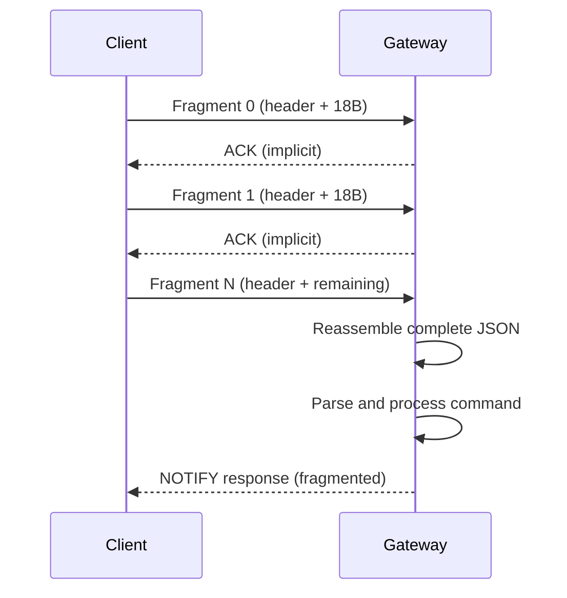
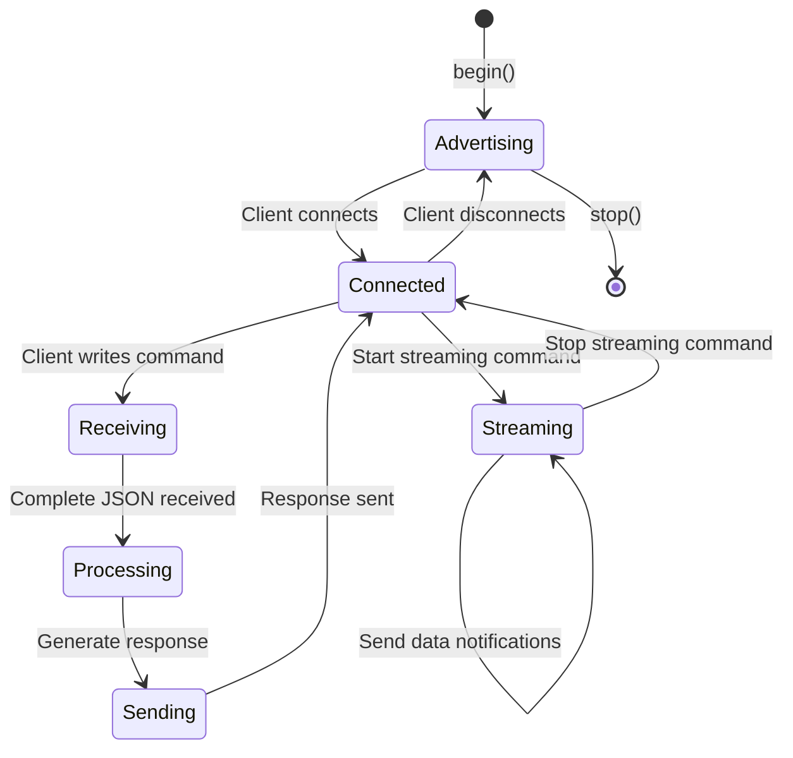
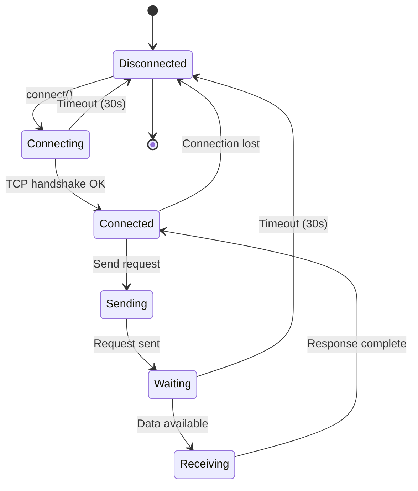
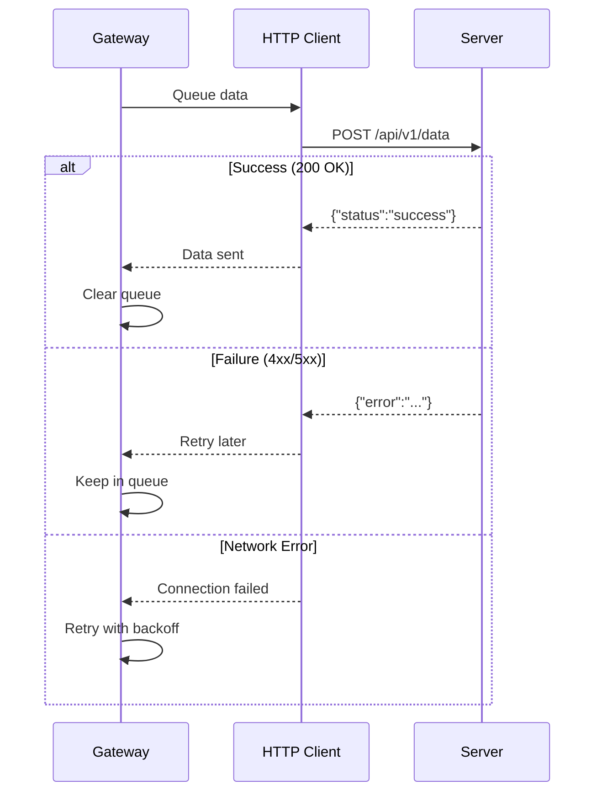

# 📡 Protocol Specifications

**SRT-MGATE-1210 Modbus IIoT Gateway**
Communication Protocol Reference

---

## 📋 Table of Contents

- [BLE Protocol](#ble-protocol)
- [Modbus RTU Protocol](#modbus-rtu-protocol)
- [Modbus TCP Protocol](#modbus-tcp-protocol)
- [MQTT Protocol](#mqtt-protocol)
- [HTTP Protocol](#http-protocol)
- [Data Type Encoding](#data-type-encoding)
- [Error Handling](#error-handling)

---

## 📱 BLE Protocol

### Overview

The gateway uses **Bluetooth Low Energy (BLE) 5.0** for configuration and real-time data streaming via a custom GATT service.

### Service Characteristics

| Property                 | Value                                            |
| ------------------------ | ------------------------------------------------ |
| **Service UUID**         | `12345678-1234-1234-1234-123456789abc`           |
| **Service Name**         | `SURIOTA GW`                                     |
| **MTU Size**             | 23 bytes (minimum), up to 512 bytes (negotiable) |
| **Connection Interval**  | 7.5ms - 4000ms                                   |
| **Advertising Interval** | 100ms                                            |

### GATT Characteristics

#### 1. Command Characteristic
```
UUID: 12345678-1234-1234-1234-123456789abd
Properties: WRITE
Max Length: 512 bytes
Purpose: Receive JSON commands from BLE client
```

**Supported Operations:**
- Device CRUD (create, read, update, delete)
- Server configuration
- Logging configuration
- Data streaming control
- System status queries

#### 2. Response Characteristic
```
UUID: 12345678-1234-1234-1234-123456789abe
Properties: NOTIFY
Max Length: 512 bytes (fragmented)
Purpose: Send JSON responses to BLE client
```

**Response Types:**
- Success/error acknowledgments
- Configuration data
- Real-time sensor data
- System metrics

### Fragmentation Protocol

Due to BLE MTU limitations, large JSON payloads are fragmented.

**Fragment Structure:**
```
┌──────────────────────────────────────────────────┐
│ Byte 0     │ Byte 1-2   │ Byte 3-4    │ Payload  │
│ Fragment # │ Total      │ Payload Len │ (18 B)   │
│ (1 byte)   │ (2 bytes)  │ (2 bytes)   │          │
└──────────────────────────────────────────────────┘
     5 bytes header + 18 bytes data = 23 bytes total
```

**Header Fields:**
- **Fragment Number** (1 byte): Current fragment (0-255)
- **Total Fragments** (2 bytes): Total number of fragments (LE)
- **Payload Length** (2 bytes): Length of payload in this fragment (LE)
- **Payload** (18 bytes): Actual JSON data chunk

**Example:**
```cpp
// Sending "Hello World" in 1 fragment
Fragment: [0x00] [0x01, 0x00] [0x0B, 0x00] "Hello World"
          └─────┘ └─────────┘ └─────────┘ └──────────┘
          Frag #0  Total: 1   Len: 11     Payload
```

**Reassembly Process:**


### Command Protocol

All commands are JSON-based with a consistent structure:

```json
{
  "op": "create|read|update|delete|batch",
  "type": "device|server|logging",
  "device_id": "string (optional)",
  "config": { }
}
```

**Timing Constraints:**
- **Inter-fragment delay**: 50ms (prevents buffer overflow)
- **Command timeout**: 30 seconds (no activity → disconnect)
- **Response timeout**: 10 seconds (after command sent)

### BLE State Machine



### Data Streaming

Real-time sensor data can be streamed over BLE for monitoring.

**Start Streaming:**
```json
{
  "op": "read",
  "type": "data",
  "device_id": "D12345"
}
```

**Streaming Response (continuous):**
```json
{
  "status": "data",
  "data": {
    "device_id": "D12345",
    "timestamp": 1704067200,
    "registers": {
      "temperature": 25.6,
      "humidity": 60.2
    }
  }
}
```

**Stop Streaming:**
```json
{
  "op": "read",
  "type": "data",
  "device_id": "stop"
}
```

**Race Condition Prevention:**
- Streaming task checks flag before AND after dequeue
- Transmission mutex protects `sendFragmented()`
- Atomic counter tracks in-flight transmissions
- `waitForTransmissionsComplete()` ensures clean stop

---

## 🔌 Modbus RTU Protocol

### Overview

Modbus RTU is a serial communication protocol running over RS-485.

**Standard:** [Modbus over Serial Line V1.02](https://modbus.org/docs/Modbus_over_serial_line_V1_02.pdf)

### Physical Layer

| Parameter     | Specification                      |
| ------------- | ---------------------------------- |
| **Interface** | RS-485 (differential)              |
| **Ports**     | 2× independent (Serial1, Serial2)  |
| **Baudrate**  | 1200 - 115200 (dynamic per-device) |
| **Data Bits** | 8                                  |
| **Stop Bits** | 1                                  |
| **Parity**    | None (8N1)                         |
| **Max Cable** | 1200m @ 9600 baud                  |
| **Max Nodes** | 32 per bus (247 theoretical)       |

### Supported Baudrates

```cpp
const uint32_t validBaudrates[] = {
  1200, 2400, 4800, 9600,    // Standard
  19200, 38400, 57600, 115200 // High-speed
};
```

**Dynamic Switching:**
- Per-device baudrate configuration
- Smart caching (only reconfigure if changed)
- 50ms stabilization delay after switch
- Automatic validation

### Frame Format

```
┌────────┬──────────┬────────────┬──────────┬─────────┐
│ Slave  │ Function │ Data       │ CRC Low  │ CRC High│
│ ID     │ Code     │ (N bytes)  │          │         │
│ 1 byte │ 1 byte   │ Variable   │ 1 byte   │ 1 byte  │
└────────┴──────────┴────────────┴──────────┴─────────┘
```

**Inter-frame Delay:** 3.5 character times (silence between frames)

### Supported Function Codes

| Code     | Name                     | Purpose               | Max Registers |
| -------- | ------------------------ | --------------------- | ------------- |
| **0x01** | Read Coils               | Read discrete outputs | 2000          |
| **0x02** | Read Discrete Inputs     | Read discrete inputs  | 2000          |
| **0x03** | Read Holding Registers   | Read 16-bit registers | 125           |
| **0x04** | Read Input Registers     | Read 16-bit inputs    | 125           |
| **0x05** | Write Single Coil        | Write 1 coil          | 1             |
| **0x06** | Write Single Register    | Write 1 register      | 1             |
| **0x0F** | Write Multiple Coils     | Write N coils         | 1968          |
| **0x10** | Write Multiple Registers | Write N registers     | 123           |

**Function Code Mapping:**
```cpp
uint8_t getFunctionCode(const String& type) {
  if (type == "holding") return 0x03;
  if (type == "input") return 0x04;
  if (type == "coil") return 0x01;
  if (type == "discrete") return 0x02;
  return 0x03; // Default
}
```

### Read Request Example (FC 0x03)

**Request:** Read 2 holding registers from address 0x0000
```
┌────┬────┬─────────┬─────────┬──────┬──────┐
│ 01 │ 03 │ 00  00  │ 00  02  │ CRC  │ CRC  │
│    │    │ Start   │ Count   │ Low  │ High │
└────┴────┴─────────┴─────────┴──────┴──────┘
Slave 1, FC 3, Addr 0, Count 2
```

**Response:** Return 2 registers (4 bytes of data)
```
┌────┬────┬────────┬────────────────────┬──────┬──────┐
│ 01 │ 03 │ 04     │ 12  34  56  78     │ CRC  │ CRC  │
│    │    │ Bytes  │ Data (2 registers) │ Low  │ High │
└────┴────┴────────┴────────────────────┴──────┴──────┘
```

### Error Response (Exception Code)

If an error occurs, slave responds with exception:

```
┌────┬──────────┬──────────────┬──────┬──────┐
│ 01 │ 83       │ 02           │ CRC  │ CRC  │
│    │ FC + 0x80│ Exception    │ Low  │ High │
└────┴──────────┴──────────────┴──────┴──────┘
Exception 02 = Illegal Data Address
```

**Common Exception Codes:**
- **0x01**: Illegal Function
- **0x02**: Illegal Data Address
- **0x03**: Illegal Data Value
- **0x04**: Slave Device Failure
- **0x06**: Slave Device Busy

### Timeout and Retry

**Per-Device Configuration:**
```json
{
  "timeout": 3000,        // 3 seconds per request
  "retry_count": 3,       // Retry 3 times on failure
  "refresh_rate_ms": 1000 // Poll every 1 second
}
```

**Exponential Backoff:**
```cpp
unsigned long calculateBackoffTime(uint8_t retryCount) {
  return min(1000UL * (1 << retryCount), 60000UL); // Max 60s
}
```

**Failure States:**
- **Consecutive failures > 5**: Device disabled temporarily
- **Timeout counter > 3**: Device skipped from polling
- **Recovery**: Automatic retry after backoff period

### Multi-Register Data Types

For data types requiring multiple registers (e.g., FLOAT32, INT64):

**Sequential Read:**
```cpp
// FLOAT32 requires 2 registers
readMultipleRegisters(modbus, 0x03, 0x0000, 2, values);
// values[0] = MSW (Most Significant Word)
// values[1] = LSW (Least Significant Word)
```

**Endianness Variants:**
- `ABCD`: Big-endian (most common)
- `CDAB`: Little-endian
- `BADC`: Mid-big-endian
- `DCBA`: Mid-little-endian

---

## 🌐 Modbus TCP Protocol

### Overview

Modbus TCP encapsulates Modbus protocol in TCP/IP packets.

**Standard:** [Modbus Messaging on TCP/IP](https://modbus.org/docs/Modbus_Messaging_Implementation_Guide_V1_0b.pdf)

### Connection Parameters

| Parameter       | Specification              |
| --------------- | -------------------------- |
| **Protocol**    | TCP/IP                     |
| **Port**        | 502 (standard Modbus)      |
| **Max Clients** | 4 simultaneous connections |
| **Keep-Alive**  | 60 seconds                 |
| **Timeout**     | 30 seconds per request     |
| **MTU**         | 1500 bytes (Ethernet)      |

### MBAP Header Format

Modbus Application Protocol (MBAP) header prepends each message:

```
┌─────────────┬─────────────┬──────────┬────────┐
│ Transaction │ Protocol    │ Length   │ Unit   │
│ ID (2B)     │ ID (2B)     │ (2B)     │ ID (1B)│
└─────────────┴─────────────┴──────────┴────────┘
       MBAP Header (7 bytes)
```

**Fields:**
- **Transaction ID**: Client-generated identifier (0-65535)
- **Protocol ID**: Always 0x0000 for Modbus
- **Length**: Number of bytes following (unit ID + PDU)
- **Unit ID**: Slave address (1-247)

### Complete TCP Frame

```
┌──────────────────────────────────────────────────┐
│ MBAP Header (7 bytes)                            │
├──────────────────────────────────────────────────┤
│ Function Code (1 byte)                           │
├──────────────────────────────────────────────────┤
│ Data (Variable length)                           │
└──────────────────────────────────────────────────┘
```

**Example:** Read 10 holding registers from address 0x0064

**Request:**
```
Transaction ID: 0x0001
Protocol ID:    0x0000
Length:         0x0006 (6 bytes follow)
Unit ID:        0x01
Function Code:  0x03
Start Address:  0x0064
Register Count: 0x000A

Hex: 00 01 00 00 00 06 01 03 00 64 00 0A
```

**Response:**
```
Transaction ID: 0x0001
Protocol ID:    0x0000
Length:         0x0017 (23 bytes follow)
Unit ID:        0x01
Function Code:  0x03
Byte Count:     0x14 (20 bytes = 10 registers)
Register Data:  [20 bytes]

Hex: 00 01 00 00 00 17 01 03 14 [20 bytes data]
```

### TCP Client Pool

Gateway maintains a pool of 4 TCP clients:

```cpp
ModbusTCP *tcpClients[MAX_TCP_CLIENTS]; // 4 clients
uint8_t tcpClientIds[MAX_TCP_CLIENTS];  // Assigned slave IDs
```

**Client Assignment Strategy:**
1. Check existing client with matching slave ID
2. Reuse disconnected client
3. Evict least recently used client if pool full

### Connection State Machine



---

## 📤 MQTT Protocol

### Overview

MQTT (Message Queuing Telemetry Transport) is used for cloud data transmission.

**Version:** MQTT 3.1.1
**Transport:** TCP over WiFi/Ethernet

### Broker Connection

| Parameter         | Default            | Configurable      |
| ----------------- | ------------------ | ----------------- |
| **Broker**        | `mqtt.suriota.com` | ✅ Yes             |
| **Port**          | 1883 (non-TLS)     | ✅ Yes (1883/8883) |
| **Client ID**     | Auto-generated     | ✅ Yes             |
| **Username**      | `gateway`          | ✅ Yes             |
| **Password**      | (empty)            | ✅ Yes             |
| **Keep-Alive**    | 60 seconds         | ✅ Yes             |
| **Clean Session** | true               | ✅ Yes             |
| **QoS**           | 1 (at least once)  | ✅ Yes (0/1/2)     |

### Topic Structure

**Data Publish Topic:**
```
{prefix}/{device_id}/{register_name}

Example:
suriota/devices/D12345/temperature
suriota/devices/D12345/humidity
```

**Status Topic:**
```
{prefix}/status/{gateway_id}

Example:
suriota/status/GW-ESP32-ABCD
```

**Configuration Topic (subscribe):**
```
{prefix}/config/{gateway_id}

Example:
suriota/config/GW-ESP32-ABCD
```

### Payload Format

**Single Data Point (JSON):**
```json
{
  "device_id": "D12345",
  "register": "temperature",
  "value": 25.6,
  "timestamp": 1704067200,
  "unit": "°C"
}
```

**Batch Data (JSON Array):**
```json
{
  "gateway_id": "GW-ESP32-ABCD",
  "timestamp": 1704067200,
  "data": [
    {
      "device_id": "D12345",
      "register": "temperature",
      "value": 25.6
    },
    {
      "device_id": "D12345",
      "register": "humidity",
      "value": 60.2
    }
  ]
}
```

### Connection State Management

**Reconnection Logic:**
```cpp
if (!mqttClient.connected()) {
  if (millis() - lastReconnectAttempt > 5000) {
    if (reconnect()) {
      lastReconnectAttempt = 0;
    } else {
      lastReconnectAttempt = millis();
    }
  }
}
```

**Persistent Queue:**
- Failed messages stored in PSRAM queue
- Max queue size: 1000 messages
- Automatic retry on reconnection
- Priority: High > Normal > Low

### LED NET Integration

MQTT connection triggers LED NET indicator:

```cpp
// On successful connection
LEDManager::getInstance()->setMqttConnectionStatus(true);

// On data transmission
LEDManager::getInstance()->notifyDataTransmission();

// On disconnection
LEDManager::getInstance()->setMqttConnectionStatus(false);
```

---

## 🌐 HTTP Protocol

### Overview

HTTP/HTTPS is used for RESTful API communication with cloud servers.

**Version:** HTTP/1.1
**Transport:** TCP over WiFi/Ethernet

### Endpoint Configuration

| Parameter         | Default                   | Configurable |
| ----------------- | ------------------------- | ------------ |
| **Base URL**      | `https://api.suriota.com` | ✅ Yes        |
| **Port**          | 443 (HTTPS) / 80 (HTTP)   | ✅ Yes        |
| **Timeout**       | 10 seconds                | ✅ Yes        |
| **Max Redirects** | 3                         | ❌ No         |
| **User-Agent**    | `SRT-MGATE-1210/1.0`      | ❌ No         |

### API Endpoints

**1. Data Upload (POST)**
```
POST /api/v1/data
Content-Type: application/json
Authorization: Bearer {token}

Body:
{
  "gateway_id": "GW-ESP32-ABCD",
  "timestamp": 1704067200,
  "data": [
    {
      "device_id": "D12345",
      "register": "temperature",
      "value": 25.6,
      "timestamp": 1704067200
    }
  ]
}

Response:
{
  "status": "success",
  "received": 1,
  "message": "Data uploaded successfully"
}
```

**2. Configuration Sync (GET)**
```
GET /api/v1/config/{gateway_id}
Authorization: Bearer {token}

Response:
{
  "gateway_id": "GW-ESP32-ABCD",
  "config": {
    "data_interval": 5000,
    "server": {
      "protocol": "http",
      "endpoint": "https://api.suriota.com"
    }
  }
}
```

**3. Status Heartbeat (POST)**
```
POST /api/v1/status
Content-Type: application/json
Authorization: Bearer {token}

Body:
{
  "gateway_id": "GW-ESP32-ABCD",
  "uptime": 3600,
  "free_heap": 102400,
  "rssi": -65,
  "ip": "192.168.1.100"
}

Response:
{
  "status": "ok",
  "server_time": 1704067200
}
```

### Request Flow



### Authentication

**Bearer Token:**
```cpp
httpClient.addHeader("Authorization", "Bearer " + serverConfig->getApiToken());
```

**Token Storage:** Stored in `server_config.json`
```json
{
  "api_token": "eyJhbGciOiJIUzI1NiIsInR5cCI6IkpXVCJ9..."
}
```

---

## 🔢 Data Type Encoding

### Supported Modbus Data Types

The gateway supports **40+ data types** with endianness variants.

#### 16-bit Types (Single Register)

| Type       | Size   | Range           | Description      |
| ---------- | ------ | --------------- | ---------------- |
| **INT16**  | 16-bit | -32768 to 32767 | Signed integer   |
| **UINT16** | 16-bit | 0 to 65535      | Unsigned integer |
| **BOOL**   | 16-bit | 0 or 1          | Boolean (coil)   |

**Encoding:**
```cpp
int16_t value = (int16_t)rawValue;
uint16_t value = rawValue;
```

#### 32-bit Types (2 Registers)

| Type              | Size   | Endianness                          | Description             |
| ----------------- | ------ | ----------------------------------- | ----------------------- |
| **INT32_BE**      | 32-bit | Big-endian (ABCD)                   | Signed 32-bit integer   |
| **INT32_LE**      | 32-bit | Little-endian (DCBA)                | Signed 32-bit integer   |
| **INT32_BE_BS**   | 32-bit | Big-endian with byte swap (BADC)    | Signed 32-bit integer   |
| **INT32_LE_BS**   | 32-bit | Little-endian with word swap (CDAB) | Signed 32-bit integer   |
| **UINT32_BE**     | 32-bit | Big-endian (ABCD)                   | Unsigned 32-bit integer |
| **UINT32_LE**     | 32-bit | Little-endian (DCBA)                | Unsigned 32-bit integer |
| **UINT32_BE_BS**  | 32-bit | Big-endian with byte swap (BADC)    | Unsigned 32-bit integer |
| **UINT32_LE_BS**  | 32-bit | Little-endian with word swap (CDAB) | Unsigned 32-bit integer |
| **FLOAT32_BE**    | 32-bit | Big-endian (ABCD)                   | IEEE 754 float          |
| **FLOAT32_LE**    | 32-bit | Little-endian (DCBA)                | IEEE 754 float          |
| **FLOAT32_BE_BS** | 32-bit | Big-endian with byte swap (BADC)    | IEEE 754 float          |
| **FLOAT32_LE_BS** | 32-bit | Little-endian with word swap (CDAB) | IEEE 754 float          |

**Endianness Diagram:**
```
ABCD (Big-endian):
Register 0: [A][B]  Register 1: [C][D]
Memory: A B C D

CDAB (Little-endian):
Register 0: [C][D]  Register 1: [A][B]
Memory: C D A B

BADC (Mid-big-endian):
Register 0: [B][A]  Register 1: [D][C]
Memory: B A D C

DCBA (Mid-little-endian):
Register 0: [D][C]  Register 1: [B][A]
Memory: D C B A
```

**Float32 Encoding (ABCD):**
```cpp
// Example: 25.6°C
uint16_t values[2] = {0x41CC, 0xCCCD};

// Combine with endianness
uint32_t combined = ((uint32_t)values[0] << 16) | values[1];
// combined = 0x41CCCCCD

// Reinterpret as float
float result;
memcpy(&result, &combined, sizeof(float));
// result = 25.6
```

#### 64-bit Types (4 Registers)

| Type               | Size   | Endianness                              | Description             |
| ------------------ | ------ | --------------------------------------- | ----------------------- |
| **INT64_BE**       | 64-bit | Big-endian (ABCDEFGH)                   | Signed 64-bit integer   |
| **INT64_LE**       | 64-bit | Little-endian (HGFEDCBA)                | Signed 64-bit integer   |
| **INT64_BE_BS**    | 64-bit | Big-endian with byte swap (BADCFEHG)    | Signed 64-bit integer   |
| **INT64_LE_BS**    | 64-bit | Little-endian with word swap (CDABGHEF) | Signed 64-bit integer   |
| **UINT64_BE**      | 64-bit | Big-endian (ABCDEFGH)                   | Unsigned 64-bit integer |
| **UINT64_LE**      | 64-bit | Little-endian (HGFEDCBA)                | Unsigned 64-bit integer |
| **UINT64_BE_BS**   | 64-bit | Big-endian with byte swap (BADCFEHG)    | Unsigned 64-bit integer |
| **UINT64_LE_BS**   | 64-bit | Little-endian with word swap (CDABGHEF) | Unsigned 64-bit integer |
| **DOUBLE64_BE**    | 64-bit | Big-endian (ABCDEFGH)                   | IEEE 754 double         |
| **DOUBLE64_LE**    | 64-bit | Little-endian (HGFEDCBA)                | IEEE 754 double         |
| **DOUBLE64_BE_BS** | 64-bit | Big-endian with byte swap (BADCFEHG)    | IEEE 754 double         |
| **DOUBLE64_LE_BS** | 64-bit | Little-endian with word swap (CDABGHEF) | IEEE 754 double         |

**Double64 Encoding (ABCDEFGH):**
```cpp
uint16_t values[4];
uint64_t combined = ((uint64_t)values[0] << 48) |
                    ((uint64_t)values[1] << 32) |
                    ((uint64_t)values[2] << 16) |
                    values[3];

double result;
memcpy(&result, &combined, sizeof(double));
```

### Scaling and Offset

Apply linear transformation to raw values:

```json
{
  "register_name": "temperature",
  "data_type": "INT16",
  "scale": 0.1,
  "offset": -40.0
}
```

**Formula:**
```cpp
double finalValue = (rawValue * scale) + offset;
// Example: rawValue = 256
// finalValue = (256 * 0.1) + (-40.0) = 25.6 - 40.0 = -14.4
```

### Data Type Configuration Example

```json
{
  "registers": [
    {
      "name": "temperature",
      "address": 0,
      "data_type": "FLOAT32_BE",
      "scale": 1.0,
      "offset": 0.0,
      "unit": "°C"
    },
    {
      "name": "pressure",
      "address": 2,
      "data_type": "INT32_LE_BS",
      "scale": 0.01,
      "offset": 0.0,
      "unit": "bar"
    }
  ]
}
```

---

## ⚠️ Error Handling

### BLE Error Codes

| Code                     | Message                   | Description             |
| ------------------------ | ------------------------- | ----------------------- |
| `ERR_INVALID_JSON`       | Invalid JSON format       | Malformed JSON command  |
| `ERR_MISSING_FIELD`      | Missing required field    | Required key missing    |
| `ERR_INVALID_OP`         | Invalid operation         | Unsupported operation   |
| `ERR_DEVICE_NOT_FOUND`   | Device not found          | Device ID doesn't exist |
| `ERR_CONFIG_SAVE_FAILED` | Configuration save failed | SPIFFS write error      |
| `ERR_TIMEOUT`            | Operation timeout         | Command took too long   |

**Error Response Format:**
```json
{
  "status": "error",
  "code": "ERR_INVALID_JSON",
  "message": "Invalid JSON format: Unexpected token",
  "details": {
    "line": 5,
    "column": 12
  }
}
```

### Modbus Error Handling

**Exception Responses:**
```cpp
uint8_t result = modbus->readHoldingRegisters(address, count);
switch (result) {
  case 0xE0: // Success
    break;
  case 0xE1: // Illegal function
    Serial.println("[RTU] Exception: Illegal function");
    break;
  case 0xE2: // Illegal data address
    Serial.println("[RTU] Exception: Illegal data address");
    break;
  case 0xE3: // Illegal data value
    Serial.println("[RTU] Exception: Illegal data value");
    break;
  case 0xE4: // Slave device failure
    Serial.println("[RTU] Exception: Slave device failure");
    break;
  default:
    Serial.printf("[RTU] Unknown error: 0x%02X\n", result);
}
```

**Timeout Handling:**
```cpp
// Device-specific timeout
if (millis() - startTime > deviceTimeout->timeoutMs) {
  handleReadTimeout(deviceId);
  deviceTimeout->consecutiveTimeouts++;

  if (deviceTimeout->consecutiveTimeouts >= deviceTimeout->maxConsecutiveTimeouts) {
    disableDevice(deviceId); // Disable after 3 consecutive timeouts
  }
}
```

### Network Error Handling

**MQTT Reconnection:**
```cpp
bool MqttManager::reconnect() {
  for (int i = 0; i < 3; i++) {
    if (mqttClient.connect(clientId.c_str(), username.c_str(), password.c_str())) {
      Serial.println("[MQTT] Connected successfully");
      return true;
    }
    delay(2000 * (i + 1)); // Exponential backoff
  }
  return false;
}
```

**HTTP Retry Logic:**
```cpp
int retryCount = 0;
while (retryCount < 3) {
  int httpCode = http.POST(payload);
  if (httpCode == 200) {
    return true; // Success
  } else if (httpCode >= 500) {
    retryCount++;
    delay(1000 * (1 << retryCount)); // Exponential backoff
  } else {
    return false; // Client error, don't retry
  }
}
```

---

## 📚 Protocol References

### Standards

- **Modbus RTU**: [Modbus over Serial Line V1.02](https://modbus.org/docs/Modbus_over_serial_line_V1_02.pdf)
- **Modbus TCP**: [Modbus Messaging on TCP/IP](https://modbus.org/docs/Modbus_Messaging_Implementation_Guide_V1_0b.pdf)
- **MQTT 3.1.1**: [OASIS MQTT Specification](http://docs.oasis-open.org/mqtt/mqtt/v3.1.1/mqtt-v3.1.1.html)
- **BLE 5.0**: [Bluetooth Core Specification v5.0](https://www.bluetooth.com/specifications/specs/)
- **HTTP/1.1**: [RFC 7230-7235](https://tools.ietf.org/html/rfc7230)

### Libraries Used

- **ModbusMaster**: [GitHub](https://github.com/4-20ma/ModbusMaster)
- **ModbusTCP-ESP32**: [GitHub](https://github.com/emelianov/modbus-esp8266)
- **PubSubClient**: [GitHub](https://github.com/knolleary/pubsubclient)
- **ArduinoJson**: [GitHub](https://github.com/bblanchon/ArduinoJson)
- **BLE Library**: ESP32 Arduino Core

---

**© 2025 PT Surya Inovasi Prioritas (SURIOTA) - R&D Team**
*For technical support: support@suriota.com*
