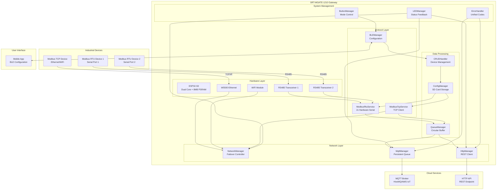
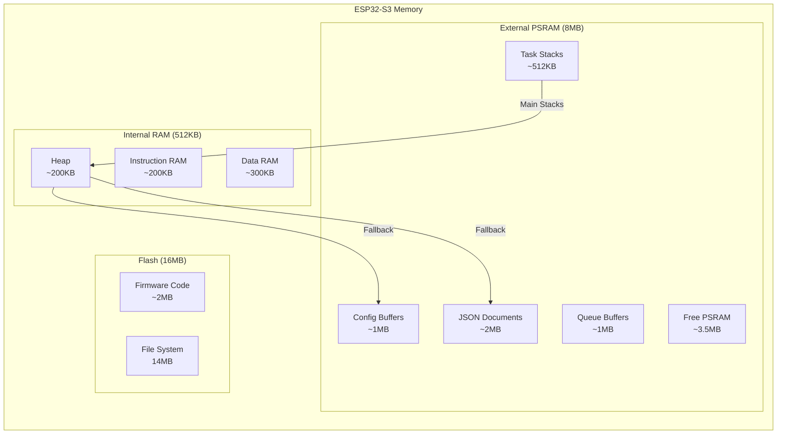

# 🌐 SRT-MGATE-1210 Modbus IIoT Gateway


**Industrial IoT Gateway for Modbus RTU/TCP Data Acquisition**

Developed by **PT Surya Inovasi Prioritas (SURIOTA)** - R&D Team
**Developer:** Kemal | **Last Updated:** November 21, 2025

---

## 📋 Table of Contents

- [Overview](#-overview)
- [Key Features](#-key-features)
- [Hardware Specifications](#-hardware-specifications)
- [Quick Start](#-quick-start)
- [Architecture](#-architecture)
- [Documentation](#-documentation)
- [Contributing](#-contributing)
- [Support](#-support)
- [License](#-license)
- [Credits](#-credits)

---

## 🎯 Overview

**SRT-MGATE-1210** is an advanced Industrial IoT Gateway designed for seamless Modbus RTU/TCP data acquisition and cloud connectivity. Built on ESP32-S3 with 8MB PSRAM, it provides reliable, high-performance data bridging between industrial devices and cloud platforms via MQTT/HTTP protocols.

### 🏭 Use Cases

- **Industrial Automation**: Connect PLCs, sensors, and actuators to cloud platforms
- **Energy Monitoring**: Monitor power meters, solar inverters, and battery systems
- **Environmental Monitoring**: Collect data from temperature, humidity, and air quality sensors
- **Building Automation**: Integrate HVAC, lighting, and access control systems

### ✨ Why Choose SRT-MGATE-1210?

| Feature                            | Benefit                                                  |
| ---------------------------------- | -------------------------------------------------------- |
| 🔄 **Dual Modbus Support**          | Simultaneous RTU (2 ports) and TCP connectivity          |
| 📱 **BLE Configuration**            | Easy setup via smartphone app (no web interface needed)  |
| 🔐 **Production/Development Modes** | Secure production deployment with debug capabilities     |
| ⚡ **High Performance**             | FreeRTOS multitasking with PSRAM optimization            |
| 🌐 **Dual Network**                 | Ethernet (primary) + WiFi (fallback) with auto-switching |
| 📊 **Flexible Data Types**          | 40+ Modbus data types including custom endianness        |
| 💾 **Persistent Storage**           | Atomic file operations with crash recovery               |
| 🔁 **Retry Mechanisms**             | Exponential backoff for failed devices                   |

---

## 🚀 Key Features

### 🔌 Connectivity

- **Modbus RTU**: 2x RS485 ports with dynamic baudrate switching (1200-115200 baud)
- **Modbus TCP**: Multiple simultaneous connections
- **MQTT**: Publish/subscribe with persistent queue and auto-reconnect
- **HTTP**: RESTful API for data publishing (POST/PUT/PATCH)
- **BLE**: Configuration interface with button-controlled access

### 🎛️ Configuration Management

- **BLE CRUD Operations**: Create, Read, Update, Delete devices via smartphone
- **Backup & Restore**: Complete configuration backup/restore system via BLE (up to 200KB)
- **Factory Reset**: One-command device reset to factory defaults
- **Device Control**: Enable/disable devices with health metrics and auto-recovery
- **Batch Operations**: Sequential, parallel, and atomic batch processing
- **Priority Queue**: High/normal/low priority command execution
- **Atomic Updates**: Crash-safe configuration writes with WAL (Write-Ahead Logging)
- **Hot Reload**: Configuration changes applied without restart

### 📡 Data Acquisition

- **Multi-level Refresh Rates**:
  - Device-level refresh (default interval)
  - Register-level refresh (per-register override)
  - Global minimum interval protection
- **Smart Polling**: Skip disabled/failed devices automatically
- **Register Streaming**: Real-time data streaming via BLE
- **Queue Management**: Circular buffer with PSRAM optimization

### 🛡️ Reliability & Error Handling

- **Exponential Backoff**: Automatic retry with increasing delays
- **Device Failure Tracking**: Disable devices after max retries
- **Network Failover**: Auto-switch Ethernet ↔ WiFi
- **Persistent MQTT Queue**: Survive network outages
- **Atomic File Operations**: Prevent configuration corruption
- **Unified Error Codes**: Standardized error handling across modules

### 💡 User Interface

- **LED NET**: Network status indicator (OFF/Slow blink/Fast blink)
- **LED STATUS**: System mode indicator (Running/Config mode)
- **Button Control**:
  - Long press → Enter config mode (BLE ON)
  - Double click → Exit config mode (BLE OFF)

### 🔧 Developer Features

- **Production/Development Toggle**: Single `#define` switch
- **Comprehensive Logging**: Modular debug output with clean formatting
- **FreeRTOS Tasks**: 15+ dedicated tasks for parallel processing
- **Memory Management**: PSRAM allocation with fallback to internal RAM
- **Performance Metrics**: BLE MTU, queue depth, connection stats

---

## 🔩 Hardware Specifications

### ESP32-S3 MCU

| Specification         | Value                         |
| --------------------- | ----------------------------- |
| **CPU**               | Xtensa LX7 dual-core @ 240MHz |
| **RAM**               | 512KB SRAM + 8MB PSRAM        |
| **Flash**             | 16MB                          |
| **Connectivity**      | WiFi 802.11 b/g/n, BLE 5.0    |
| **Operating Voltage** | 3.3V                          |

### GPIO Pinout Summary

| Pin                     | Function   | Description                     |
| ----------------------- | ---------- | ------------------------------- |
| **GPIO 0**              | BUTTON     | Config mode button (Active LOW) |
| **GPIO 3**              | ETH_RST    | W5500 Ethernet reset            |
| **GPIO 4**              | RTC_SQW    | DS3231 RTC interrupt            |
| **GPIO 5**              | I2C_SDA    | I2C data line (RTC)             |
| **GPIO 6**              | I2C_SCL    | I2C clock line (RTC)            |
| **GPIO 7**              | LED_STATUS | System status indicator         |
| **GPIO 8**              | LED_NET    | Network status indicator        |
| **GPIO 9**              | ETH_INT    | W5500 Ethernet interrupt        |
| **GPIO 15**             | RTU1_RX    | Modbus RTU Port 1 Receive       |
| **GPIO 16**             | RTU1_TX    | Modbus RTU Port 1 Transmit      |
| **GPIO 17**             | RTU2_RX    | Modbus RTU Port 2 Receive       |
| **GPIO 18**             | RTU2_TX    | Modbus RTU Port 2 Transmit      |
| **GPIO 14, 21, 47, 48** | ETH_SPI    | W5500 SPI3 (MOSI/MISO/SCK/CS)   |
| **GPIO 10-13**          | SD_SPI     | MicroSD card SPI (optional)     |

**Complete GPIO mapping**: See [Documentation/Technical_Guides/HARDWARE.md](Documentation/Technical_Guides/HARDWARE.md) for all 25 GPIO assignments

### Power Requirements

- **Input Voltage**: 5V DC (USB-C or external)
- **Current Draw**:
  - Idle: ~150mA
  - Active (WiFi + BLE): ~250mA
  - Peak: ~400mA

---

## 🏁 Quick Start

### Prerequisites

- **Arduino IDE** 2.0 or later
- **ESP32 Board Package** 2.0.11 or later
- **Required Libraries** (see [LIBRARIES.md](Documentation/Technical_Guides/LIBRARIES.md))

### Installation

1. **Clone Repository**
   ```bash
   git clone https://github.com/GifariKemal/GatewaySuriotaPOC.git
   cd GatewaySuriotaPOC
   ```

2. **Install ESP32 Board Support**
   ```
   File → Preferences → Additional Boards Manager URLs:
   https://raw.githubusercontent.com/espressif/arduino-esp32/gh-pages/package_esp32_index.json

   Tools → Board → Boards Manager → Search "esp32" → Install "esp32 by Espressif Systems"
   ```

3. **Install Required Libraries**
   ```
   Tools → Manage Libraries → Search and install:
   - ArduinoJson (v7.4.2+) by Benoit Blanchon
   - RTClib (v2.1.4+) by Adafruit
   - NTPClient (v3.2.1+) by Fabrice Weinberg
   - Ethernet (v2.0.2+) by Arduino
   - TBPubSubClient (v2.12.1+) by ThingsBoard
   - ArduinoHttpClient (v0.6.1+) by Arduino [EXPERIMENTAL]
   - ModbusMaster (v2.0.1+) by Doc Walker
   - OneButton (v2.0+) by Matthias Hertel
   ```

   See [Documentation/Technical_Guides/LIBRARIES.md](Documentation/Technical_Guides/LIBRARIES.md) for detailed installation guide

4. **Configure Mode**
   - Open `Main/Main.ino`
   - Set development mode:
     ```cpp
     #define PRODUCTION_MODE 0  // 0 = Development, 1 = Production
     ```

5. **Board Configuration**
   ```
   Tools → Board → ESP32 Arduino → ESP32-S3 Dev Module
   Tools → Flash Size → 16MB (128Mb)
   Tools → PSRAM → OPI PSRAM
   Tools → Partition Scheme → Default 4MB with spiffs
   Tools → Upload Speed → 921600
   Tools → USB CDC On Boot → Enabled
   ```

6. **Upload Firmware**
   - Connect ESP32-S3 via USB
   - Click **Upload** button
   - Wait for "Done uploading" message

7. **Connect via BLE**
   - Development mode: BLE always ON
   - Production mode: Long-press button to enable BLE
   - Scan for: **"SURIOTA GW"**

### First Device Configuration

```json
{
  "op": "create",
  "type": "device",
  "config": {
    "device_name": "Temperature Sensor",
    "protocol": "RTU",
    "slave_id": 1,
    "serial_port": 1,
    "baud_rate": 9600,
    "timeout": 3000,
    "retry_count": 3,
    "refresh_rate_ms": 5000,
    "registers": [
      {
        "register_name": "Temperature",
        "address": 0,
        "function_code": 3,
        "data_type": "FLOAT32_ABCD"
      }
    ]
  }
}
```

See [Documentation/API_Reference/API.md](Documentation/API_Reference/API.md) for complete CRUD examples.

---

## 🏗️ Architecture

### System Architecture



### Task Architecture (FreeRTOS)

| Task Name          | Core | Priority | Stack | Description                     |
| ------------------ | ---- | -------- | ----- | ------------------------------- |
| `MQTT_TASK`        | 1    | 1        | 8192  | MQTT client loop and publishing |
| `HTTP_TASK`        | 1    | 1        | 8192  | HTTP request processing         |
| `RTU_TASK`         | 1    | 1        | 16384 | Modbus RTU polling (Bus 1 & 2)  |
| `TCP_TASK`         | 1    | 1        | 16384 | Modbus TCP polling              |
| `BLE_CMD_TASK`     | 1    | 1        | 8192  | BLE command processing          |
| `BLE_STREAM_TASK`  | 1    | 1        | 4096  | Real-time data streaming        |
| `BLE_METRICS_TASK` | 1    | 0        | 4096  | BLE performance monitoring      |
| `LED_Blink_Task`   | 1    | 1        | 2048  | LED NET status control          |
| `Button_Task`      | 1    | 2        | 3072  | Button input processing         |
| `CRUD_Processor`   | 1    | 1        | 8192  | Priority queue executor         |
| `Network_Monitor`  | 1    | 1        | 4096  | Failover detection              |

### Memory Architecture



---

## 📚 Documentation

Comprehensive documentation is available in the `Documentation/` directory:

> **Latest Update:** November 20, 2025 by Kemal
> - 📚 **Complete documentation overhaul** - 100% English with consistent navigation
> - 🗂️ **New documentation hub** - Central README with role-based navigation
> - ⚡ **Quick Start Guide** - Get configured in 5 minutes
> - ❓ **FAQ** - 60+ frequently asked questions
> - 📖 **Glossary** - A-Z technical terminology
> - 🎯 **Best Practices** - Production deployment guidelines
> - 🔗 **Cross-references** - Complete documentation linking
> - 🧭 **Breadcrumb navigation** - Easy navigation across all docs

**See:** [Documentation/Changelog/VERSION_HISTORY.md](Documentation/Changelog/VERSION_HISTORY.md) for complete changelog

**See:** [Documentation/Changelog/VERSION_HISTORY.md](Documentation/Changelog/VERSION_HISTORY.md) for complete changelog

### 📖 Core Documentation

| Document                                                                                                                      | Description                                   |
| ----------------------------------------------------------------------------------------------------------------------------- | --------------------------------------------- |
| [**VERSION_HISTORY.md**](Documentation/Changelog/VERSION_HISTORY.md) ⭐                                                        | Changelog and migration guide (v2.3.0)        |
| [**API.md**](Documentation/API_Reference/API.md)                                                                              | Complete BLE CRUD API reference with examples |
| [**BLE_BACKUP_RESTORE.md**](Documentation/API_Reference/BLE_BACKUP_RESTORE.md) 🆕                                             | Complete configuration backup/restore via BLE |
| [**BLE_FACTORY_RESET.md**](Documentation/API_Reference/BLE_FACTORY_RESET.md) 🆕                                               | One-command device reset to factory defaults  |
| [**BLE_DEVICE_CONTROL.md**](Documentation/API_Reference/BLE_DEVICE_CONTROL.md) 🆕                                             | Enable/disable devices with health metrics    |
| [**MQTT_PUBLISH_MODES_DOCUMENTATION.md**](Documentation/Technical_Guides/MQTT_PUBLISH_MODES_DOCUMENTATION.md)                 | MQTT Default & Customize modes                |
| [**REGISTER_CALIBRATION_DOCUMENTATION.md**](Documentation/Technical_Guides/REGISTER_CALIBRATION_DOCUMENTATION.md)             | Scale & offset calibration guide              |

### 🔧 Technical Reference

| Document                                                                         | Description                                    |
| -------------------------------------------------------------------------------- | ---------------------------------------------- |
| [**MODBUS_DATATYPES.md**](Documentation/Technical_Guides/MODBUS_DATATYPES.md)   | 40+ Modbus data types with endianness variants |
| [**PROTOCOL.md**](Documentation/Technical_Guides/PROTOCOL.md)                    | BLE protocol, Modbus implementation details    |
| [**LOGGING.md**](Documentation/Technical_Guides/LOGGING.md)                      | Debug log reference and troubleshooting        |

### 🚀 Performance & Troubleshooting

| Document                                                                       | Description                            |
| ------------------------------------------------------------------------------ | -------------------------------------- |
| [**BUG_STATUS_REPORT.md**](Documentation/Changelog/BUG_STATUS_REPORT.md) 🆕    | Active bug tracking and analysis (Nov 2025) |
| [**CAPACITY_ANALYSIS.md**](Documentation/Changelog/CAPACITY_ANALYSIS.md)      | Gateway capacity limits and benchmarks |
| [**TROUBLESHOOTING.md**](Documentation/Technical_Guides/TROUBLESHOOTING.md)   | Common issues and solutions            |

### 🔌 Hardware & Setup

| Document                                                               | Description                               |
| ---------------------------------------------------------------------- | ----------------------------------------- |
| [**HARDWARE.md**](Documentation/Technical_Guides/HARDWARE.md)          | GPIO pinout, schematics, electrical specs |
| [**LIBRARIES.md**](Documentation/Technical_Guides/LIBRARIES.md)        | Third-party libraries and dependencies    |

---

## 🔧 Configuration Examples

### Server Configuration

```json
{
  "op": "update",
  "type": "server_config",
  "config": {
    "protocol": "mqtt",
    "mqtt": {
      "broker_address": "broker.hivemq.com",
      "broker_port": 1883,
      "topic_publish": "suriota/gateway/data",
      "qos": 1
    },
    "data_interval_ms": 5000
  }
}
```

### Network Configuration

```json
{
  "op": "read",
  "type": "network_config"
}
```

See [Documentation/API_Reference/API.md](Documentation/API_Reference/API.md) for complete examples.

---

## 🐛 Troubleshooting

### BLE Not Visible

**Development Mode:**
- Ensure `PRODUCTION_MODE = 0`
- BLE should start automatically
- Check Serial Monitor for: `[BLE] Advertising started with name: SURIOTA GW`

**Production Mode:**
- Long-press button (>2 seconds)
- LED STATUS should blink very slowly (3s interval)
- Scan for "SURIOTA GW"

### Modbus Communication Failed

1. **Check Serial Connections**
   - RTU: Verify TX/RX wiring and RS485 polarity
   - TCP: Verify Ethernet cable and IP configuration

2. **Verify Baudrate**
   - Ensure device baudrate matches gateway configuration
   - Supported: 1200, 2400, 4800, 9600, 19200, 38400, 57600, 115200

3. **Check Serial Monitor**
   ```
   [RTU] Device XXXXX read failed. Retry 1/5 in 2000ms
   [RTU] Polling device XXXXX (Slave:1 Port:1 Baud:9600)
   ```

See [Documentation/Technical_Guides/TROUBLESHOOTING.md](Documentation/Technical_Guides/TROUBLESHOOTING.md) for detailed solutions.

---

## 📊 Performance Metrics

| Metric                        | Typical Value                |
| ----------------------------- | ---------------------------- |
| **Modbus RTU Polling**        | 50-100 ms per device         |
| **Modbus TCP Polling**        | 30-80 ms per device          |
| **BLE Response Time**         | <200 ms                      |
| **BLE Transmission (v2.1.1)** | 2.1s for 21KB (28x faster) ⚡ |
| **MQTT Publish Rate**         | Up to 10 msg/sec             |
| **HTTP Request Rate**         | Up to 5 req/sec              |
| **Queue Capacity**            | 100 data points (PSRAM)      |
| **Config Write Time**         | <100 ms (atomic)             |
| **Network Failover**          | <5 seconds                   |

**BLE Transmission Benchmark (v2.1.1):**
- 6KB payload: 0.6s (minimal mode, 100 registers)
- 21KB payload: 2.1s (full mode, 100 registers)
- **Improvement:** 28x faster than v2.0 (58s → 2.1s)
- **Impact:** Eliminates mobile app timeout issues

---

## 🔐 Security Considerations

### Production Mode

- **BLE Disabled by Default**: Reduces attack surface
- **Button Authentication**: Physical access required for configuration
- **Serial Logging Disabled**: Prevents information leakage

### Network Security

- **MQTT TLS**: Supported (configure broker certificates)
- **HTTP HTTPS**: Supported for secure endpoints
- **WiFi WPA2**: Enterprise mode compatible

### Recommendations

1. Use strong WiFi passwords (WPA2/WPA3)
2. Enable MQTT authentication (username/password)
3. Use HTTPS endpoints for sensitive data
4. Deploy in secure physical locations
5. Regular firmware updates

---

## 🤝 Support

### Technical Support

- **Email**: support@suriota.com
- **Website**: [www.suriota.com](https://www.suriota.com)
- **GitHub Issues**: [Report Bug](https://github.com/GifariKemal/GatewaySuriotaPOC/issues)

### Documentation Updates

Documentation is continuously updated. Check the repository for the latest version:
```bash
git pull origin main
```

---

## 🤝 Contributing

We welcome contributions from the community! Whether you're fixing bugs, adding features, improving documentation, or sharing hardware designs, your contributions are valuable.

### How to Contribute

Please read our [CONTRIBUTING.md](Documentation/Technical_Guides/CONTRIBUTING.md) for detailed guidelines on:

- Setting up your development environment
- Coding standards and conventions
- Submitting pull requests
- Reporting bugs and suggesting features
- Testing procedures and requirements

### Quick Start for Contributors

1. **Fork the repository**
2. **Create your feature branch**
   ```bash
   git checkout -b feature/AmazingFeature
   ```
3. **Commit your changes**
   ```bash
   git commit -m 'Add some AmazingFeature'
   ```
4. **Push to the branch**
   ```bash
   git push origin feature/AmazingFeature
   ```
5. **Open a Pull Request**

### Code of Conduct

We are committed to providing a welcoming and inclusive environment. Please be respectful and constructive in all interactions with the community.

---

## 📄 License

This project is licensed under the **MIT License** - see the [LICENSE](LICENSE) file for details.

**Copyright © 2025 PT Surya Inovasi Prioritas (SURIOTA)**

### Summary

Permission is hereby granted, free of charge, to any person obtaining a copy of this software and associated documentation files (the "Software"), to deal in the Software without restriction, including without limitation the rights to use, copy, modify, merge, publish, distribute, sublicense, and/or sell copies of the Software, and to permit persons to whom the Software is furnished to do so, subject to the following conditions:

The above copyright notice and this permission notice shall be included in all copies or substantial portions of the Software.

**THE SOFTWARE IS PROVIDED "AS IS", WITHOUT WARRANTY OF ANY KIND, EXPRESS OR IMPLIED, INCLUDING BUT NOT LIMITED TO THE WARRANTIES OF MERCHANTABILITY, FITNESS FOR A PARTICULAR PURPOSE AND NONINFRINGEMENT. IN NO EVENT SHALL THE AUTHORS OR COPYRIGHT HOLDERS BE LIABLE FOR ANY CLAIM, DAMAGES OR OTHER LIABILITY, WHETHER IN AN ACTION OF CONTRACT, TORT OR OTHERWISE, ARISING FROM, OUT OF OR IN CONNECTION WITH THE SOFTWARE OR THE USE OR OTHER DEALINGS IN THE SOFTWARE.**

### Commercial Support

For commercial support, custom development, or enterprise licensing inquiries, contact: **sales@suriota.com**

---

## 👥 Credits

### Development Team

**PT Surya Inovasi Prioritas (SURIOTA) - R&D Team**

- **Lead Developer**: SURIOTA Engineering Team
- **Firmware Architecture**: ESP32 Specialist Team
- **Protocol Implementation**: Industrial IoT Team
- **Quality Assurance**: Testing & Validation Team

### Third-Party Libraries

This project uses several open-source libraries. See [Documentation/Technical_Guides/LIBRARIES.md](Documentation/Technical_Guides/LIBRARIES.md) for complete attributions.

### Special Thanks

- Espressif Systems for ESP32-S3 platform
- Arduino community for extensive library ecosystem
- Beta testers and early adopters for valuable feedback

---

## 📈 Changelog

### Version 2.3.0 (2025-11-21) - Current ⭐

**Advanced Configuration Management Release**

**Developer:** Kemal | **Release Date:** November 21, 2025

#### 🎯 New BLE Configuration Features
- ✅ **Backup & Restore System** - Complete configuration backup/restore via BLE
  - Export all devices, registers, server config, and logging config as single JSON
  - Atomic snapshot with metadata (timestamp, firmware version, statistics)
  - PSRAM optimized for large configurations (100KB+)
  - Automatic BLE fragmentation for responses up to **200KB** (20x increase from 10KB)
  - Full documentation: [BLE_BACKUP_RESTORE.md](Documentation/API_Reference/BLE_BACKUP_RESTORE.md)

- ✅ **Factory Reset Command** - One-command device reset to factory defaults
  - Clears all device configurations (devices.json)
  - Resets server config to defaults (WiFi, Ethernet, MQTT, HTTP)
  - Resets logging config to defaults
  - Automatic device restart after reset
  - Full documentation: [BLE_FACTORY_RESET.md](Documentation/API_Reference/BLE_FACTORY_RESET.md)

- ✅ **Device Control API** - Enable/disable devices with health metrics
  - Manual enable/disable devices remotely via BLE
  - Real-time health metrics (success rate, avg response time, min/max tracking)
  - Auto-recovery system for auto-disabled devices (every 5 minutes)
  - Disable reason tracking (NONE, MANUAL, AUTO_RETRY, AUTO_TIMEOUT)
  - Protocol-agnostic (works for both RTU and TCP devices)
  - Full documentation: [BLE_DEVICE_CONTROL.md](Documentation/API_Reference/BLE_DEVICE_CONTROL.md)

#### ⚡ Performance Optimizations
- ✅ **BLE Response Size Limit** - Increased from 10KB to 200KB (commit 618b53d)
  - Supports large configuration backups
  - Handles complex multi-device setups

- ✅ **DRAM Warning Threshold** - Optimized to reduce log noise (commit ca12aab)
  - Improved memory monitoring efficiency

#### 📚 Documentation Updates
- ✅ **Bug Status Report** - Active bug tracking and analysis added
  - [BUG_STATUS_REPORT.md](Documentation/Changelog/BUG_STATUS_REPORT.md) with 8 bugs analyzed
  - Priority classification (High/Medium/Low)
  - Root cause analysis and fix recommendations

**Migration:** No breaking changes. All new features are additive and backward compatible.

**See:** [Documentation/Changelog/VERSION_HISTORY.md](Documentation/Changelog/VERSION_HISTORY.md) for complete details

---

### Version 2.2.0 (2025-11-20)

**Documentation Excellence Release**

**Developer:** Kemal | **Release Date:** November 20, 2025

#### 📚 Comprehensive Documentation Overhaul
- ✅ **100% English documentation** - Complete translation from Indonesian
- ✅ **Documentation hub** - New [Documentation/README.md](Documentation/README.md) with role-based navigation
- ✅ **11 new documentation files** created:
  - Documentation/README.md - Main documentation hub
  - QUICKSTART.md - 5-minute setup guide
  - FAQ.md - 60+ frequently asked questions
  - GLOSSARY.md - A-Z technical terminology
  - BEST_PRACTICES.md - Production deployment guidelines
  - 4 subdirectory README files for easy navigation

#### 🧭 Enhanced Navigation & Organization
- ✅ **Breadcrumb navigation** - Added to all technical guides
- ✅ **Footer navigation** - Back to index and top of page links
- ✅ **Cross-references** - Comprehensive linking between documents
- ✅ **Document metadata** - Version, date, firmware version on every page
- ✅ **Standardized formatting** - Consistent structure across all docs

#### 📝 Major Documentation Updates
- ✅ **MQTT_PUBLISH_MODES_DOCUMENTATION.md** - Translated from 70% to 100% English
- ✅ **REGISTER_CALIBRATION_DOCUMENTATION.md** - Complete 1,422-line translation
- ✅ **NETWORK_CONFIGURATION.md** - Translation and formatting improvements
- ✅ **PROTOCOL.md** - Added navigation and related docs
- ✅ **MODBUS_DATATYPES.md** - Standardized footer and links
- ✅ **TROUBLESHOOTING.md** - Enhanced with comprehensive references
- ✅ **LOGGING.md** - Updated with navigation and cross-links

#### 🗂️ Archive Management
- ✅ **Deprecation warnings** - Added to 7 archived documents
- ✅ **Archive README** - Explains archival policy and alternatives

#### 🎯 User Experience Improvements
- ✅ **Role-based navigation** - Start Here paths for different user types
- ✅ **Quick references** - Common tasks and shortcuts
- ✅ **Troubleshooting index** - Easy problem-solution lookup
- ✅ **Related Documentation** - Context-aware suggestions

**Migration:** No breaking changes. All existing functionality preserved.

**See:** [Documentation/Changelog/VERSION_HISTORY.md](Documentation/Changelog/VERSION_HISTORY.md) for complete details

---

### Version 2.1.1 (2025-11-14)

**Performance & API Enhancement Release**

**Developer:** Kemal | **Release Date:** November 20, 2025 - WIB (GMT+7)

#### 🚀 BLE Transmission Optimization (Critical Fix)
- ✅ **28x faster BLE transmission** - Eliminates mobile app timeout issues
  - CHUNK_SIZE: 18 → 244 bytes (1356% increase)
  - FRAGMENT_DELAY_MS: 50ms → 10ms (80% reduction)
  - **Impact:** 21KB payload transmission time: 58s → 2.1s
  - **Minimal mode:** 6KB payload in 0.6s (71% size reduction)

#### ✨ Enhanced CRUD Responses
- ✅ **All CREATE operations** now return created object in `data` field
- ✅ **All UPDATE operations** now return updated object in `data` field
- ✅ **All DELETE operations** now return deleted object in `deleted_data` field
- ✅ **Mobile app benefit:** Immediate UI updates without additional API calls

#### 🆕 New API Endpoint
- ✅ **`devices_with_registers`** - Hierarchical data retrieval
  - Solves N+1 query problem
  - Supports `minimal=true` for 71% payload reduction
  - Performance monitoring with processing time logs
  - Empty data warnings for debugging

#### 📊 Performance Monitoring
- ✅ BLE transmission time tracking
- ✅ Processing time monitoring for large datasets
- ✅ Warning system for slow operations (>10s)
- ✅ Register count logging for diagnostics

#### 📚 Documentation Updates
- ✅ Complete VERSION_HISTORY.md with migration guide
- ✅ Updated API.md with new response formats
- ✅ Enhanced CAPACITY_ANALYSIS.md with BLE benchmarks
- ✅ Updated TROUBLESHOOTING.md with timeout solutions
- ✅ Archived 7 outdated streaming fix documents
- ✅ All docs updated with v2.1.1, developer credits, and correct dates

**See:** [Documentation/Changelog/VERSION_HISTORY.md](Documentation/Changelog/VERSION_HISTORY.md) for complete details

---

### Version 2.0.0 (2025-01-03)

**Major Release - Documentation & Libraries Update**

- ✅ Complete documentation suite (7 technical documents)
- ✅ MIT License (open source)
- ✅ MODBUS_DATATYPES.md: 40+ data types with endianness guide
- ✅ LIBRARIES.md: Complete Arduino IDE setup guide
- ✅ Contributing guidelines (CONTRIBUTING.md)
- ✅ Data type format v2.0 (BE/LE/BE_BS/LE_BS notation)
- ✅ Hardware documentation with 25 GPIO pins
- ✅ Manufacturer-specific endianness reference

### Version 1.0.0 (2024-12-15)

**Initial Release**

- ✅ Modbus RTU/TCP dual protocol support
- ✅ BLE configuration with CRUD operations
- ✅ MQTT/HTTP cloud connectivity
- ✅ Dynamic baudrate switching (1200-115200)
- ✅ Network failover (Ethernet/WiFi)
- ✅ Production/Development modes
- ✅ 40+ Modbus data types
- ✅ Atomic configuration updates
- ✅ Exponential backoff retry
- ✅ LED status indicators
- ✅ Button mode control

---

## 🚦 Roadmap

### Completed (v2.2.0 - Current)

- [x] **Documentation Excellence**: Complete English docs with navigation (v2.2.0 - Kemal)
- [x] **Documentation Hub**: Central README with role-based navigation (v2.2.0 - Kemal)
- [x] **Quick Start Guide**: 5-minute setup guide (v2.2.0 - Kemal)
- [x] **FAQ & Glossary**: 60+ Q&A and A-Z terminology (v2.2.0 - Kemal)
- [x] **BLE Optimization**: 28x faster transmission (v2.1.1 - Kemal)
- [x] **Enhanced CRUD API**: Full data responses (v2.1.1 - Kemal)
- [x] **Hierarchical Data API**: devices_with_registers endpoint (v2.1.1 - Kemal)
- [x] **Complete Documentation**: 16+ technical documents with guides (v2.0.0)
- [x] **Open Source**: MIT License with contribution guidelines (v2.0.0)
- [x] **Data Type Reference**: 40+ Modbus types with manufacturer configs (v2.0.0)
- [x] **Library Guide**: Complete Arduino IDE setup instructions (v2.0.0)

### Planned Features

- [ ] **OTA Updates**: Over-the-air firmware updates via MQTT
- [ ] **Modbus Write Operations**: Support for actuator control (FC 05, 06, 15, 16)
- [ ] **Local Dashboard**: Web interface for real-time monitoring
- [ ] **SD Card Logging**: Historical data storage with CSV export
- [ ] **Alarm System**: Configurable threshold alerts with notifications
- [ ] **Multi-protocol**: CANbus and Profibus support

### Community Requests

Submit feature requests via [GitHub Issues](https://github.com/GifariKemal/GatewaySuriotaPOC/issues) with tag `feature-request`.

---

## ⚠️ Disclaimer

This firmware is provided "AS IS" without warranty of any kind, express or implied. SURIOTA shall not be liable for any damages arising from the use of this firmware in industrial or commercial applications. Users are responsible for validating the firmware's suitability for their specific applications and ensuring compliance with local regulations.

**Industrial Safety Notice**: This gateway is not certified for safety-critical applications. Do not use in life-support systems, nuclear facilities, aircraft navigation, or any application where failure could result in injury or death.

---

## 📞 Contact Information

**PT Surya Inovasi Prioritas (SURIOTA)**

- **Address**: Batam Centre, Jl. Legenda Malaka, Baloi Permai, Kec. Batam Kota, Kota Batam, Kepulauan Riau 29431
- **Phone**: 0858-3567-2476
- **Email**: admin@suriota.com
- **Website**: www.suriota.com
- **Support**: support@suriota.com
- **Sales**: sales@suriota.com

---

<p align="center">
  <strong>Made with ❤️ by SURIOTA R&D Team</strong><br>
  <sub>Empowering Industrial IoT Solutions</sub>
</p>

<p align="center">
  <a href="#-table-of-contents">Back to Top ⬆️</a>
</p>
